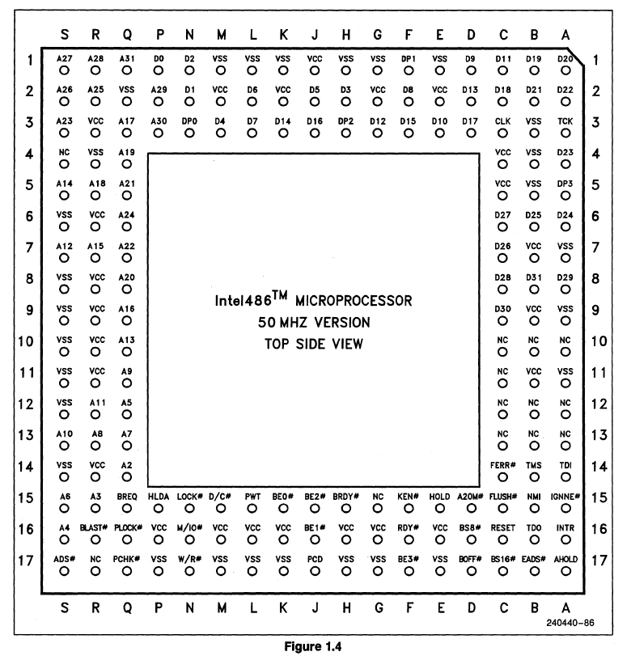
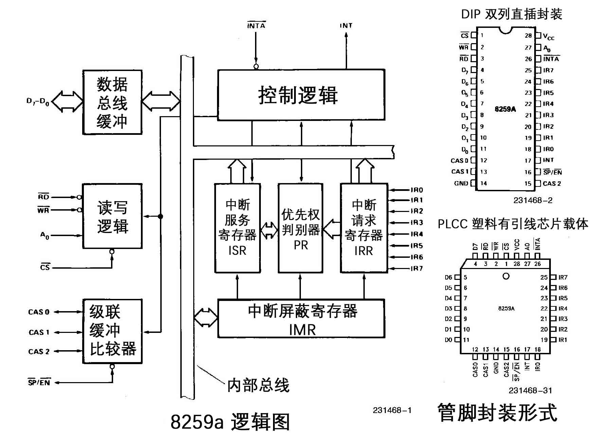
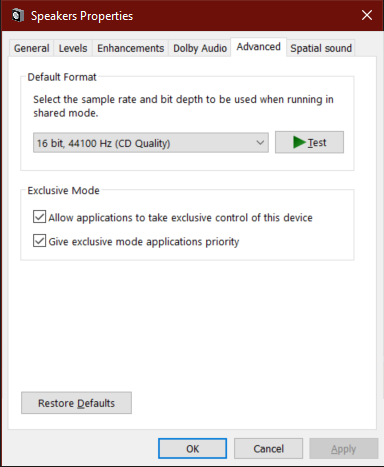

# 1. 内核全局描述符表

## GDT介绍

全局描述符表（Global Descriptor Table，GDT）是x86架构计算机内存管理的一部分，用于定义内存段（segments）的基础结构。GDT中的每个条目称为描述符，包含一个内存段的基本信息，如基地址、段界限、访问权限和属性。

### GDT的主要作用
- 段管理：GDT用于定义代码段、数据段和堆栈段等。每个段可以具有不同的访问权限和大小。
- 内存保护：通过设置GDT中的访问权限，可以限制不同程序或内存区域之间的访问，从而提供内存保护。
- 任务切换：在一些操作系统中，GDT还可以用于任务状态段（Task State Segment，TSS）的管理，以支持多任务操作。

### GDT中的关键字段
- 基地址（Base Address）：内存段的起始地址。
- 段界限（Limit）：定义内存段的大小。
- 访问权限（Access Rights）：定义段的权限级别，如是否可读、可写、可执行。
- 标志位（Flags）：控制段的其他属性，如段是否可扩展。

### 使用场景
- 操作系统启动时，会设置GDT来初始化内存管理，并在需要时修改GDT以实现特权级别的切换或保护模式下的内存访问。
- GDT是保护模式下的核心数据结构，实模式下则没有类似GDT的结构。

## 主要内容
```c++
descriptor_t gdt[GDT_SIZE]; // 内核全局描述符表
pointer_t gdt_ptr;          // 内核全局描述符表指针
```

```s
lgdt [gdt_ptr]; 加载 gdt
sgdt [gdt_ptr]; 保存 gdt
```

## 代码展示

### global.h
```c++
#ifndef XOS_GLOBAL_H
#define XOS_GLOBAL_H

#include "./types.h"

#define GDT_SIZE 128

#define KERNEL_CODE_IDX 1
#define KERNEL_DATA_IDX 2
#define KERNEL_TSS_IDX 3

#define USER_CODE_IDX 4
#define USER_DATA_IDX 5

#define KERNEL_CODE_SELECTOR (KERNEL_CODE_IDX << 3)
#define KERNEL_DATA_SELECTOR (KERNEL_DATA_IDX << 3)
#define KERNEL_TSS_SELECTOR (KERNEL_TSS_IDX << 3)

#define USER_CODE_SELECTOR (USER_CODE_IDX << 3 | 0b11)
#define USER_DATA_SELECTOR (USER_DATA_IDX << 3 | 0b11)

// 全局描述符
typedef struct descriptor_t /* 共 8 个字节 */
{
    unsigned short limit_low;      // 段界限 0 ~ 15 位
    unsigned int base_low : 24;    // 基地址 0 ~ 23 位 16M
    unsigned char type : 4;        // 段类型
    unsigned char segment : 1;     // 1 表示代码段或数据段，0 表示系统段
    unsigned char DPL : 2;         // Descriptor Privilege Level 描述符特权等级 0 ~ 3
    unsigned char present : 1;     // 存在位，1 在内存中，0 在磁盘上
    unsigned char limit_high : 4;  // 段界限 16 ~ 19;
    unsigned char available : 1;   // 该安排的都安排了，送给操作系统吧
    unsigned char long_mode : 1;   // 64 位扩展标志
    unsigned char big : 1;         // 32 位 还是 16 位;
    unsigned char granularity : 1; // 粒度 4KB 或 1B
    unsigned char base_high;       // 基地址 24 ~ 31 位
} _packed descriptor_t;

// 段选择子
typedef struct selector_t
{
    u8 RPL : 2; // Request Privilege Level
    u8 TI : 1;  // Table Indicator
    u16 index : 13;
} selector_t;

// 全局描述符表指针
typedef struct pointer_t
{
    u16 limit;
    u32 base;
} _packed pointer_t;

typedef struct tss_t
{
    u32 backlink; // 前一个任务的链接，保存了前一个任状态段的段选择子
    u32 esp0;     // ring0 的栈顶地址
    u32 ss0;      // ring0 的栈段选择子
    u32 esp1;     // ring1 的栈顶地址
    u32 ss1;      // ring1 的栈段选择子
    u32 esp2;     // ring2 的栈顶地址
    u32 ss2;      // ring2 的栈段选择子
    u32 cr3;
    u32 eip;
    u32 flags;
    u32 eax;
    u32 ecx;
    u32 edx;
    u32 ebx;
    u32 esp;
    u32 ebp;
    u32 esi;
    u32 edi;
    u32 es;
    u32 cs;
    u32 ss;
    u32 ds;
    u32 fs;
    u32 gs;
    u32 ldtr;          // 局部描述符选择子
    u16 trace : 1;     // 如果置位，任务切换时将引发一个调试异常
    u16 reversed : 15; // 保留不用
    u16 iobase;        // I/O 位图基地址，16 位从 TSS 到 IO 权限位图的偏移
    u32 ssp;           // 任务影子栈指针
} _packed tss_t;

void gdt_init();

#endif
```
**代码解释**
- 宏定义`#define GDT_SIZE 128`：定义了全局描述符表的大小为128个条目。

- 
    ```c++
    #define KERNEL_CODE_IDX 1
    #define KERNEL_DATA_IDX 2
    #define KERNEL_TSS_IDX 3
    #define USER_CODE_IDX 4
    #define USER_DATA_IDX 5
    ```
    定义了内核代码段、数据段、任务状态段（TSS）以及用户代码段和数据段的索引。

- 
    ```c++
    #define KERNEL_CODE_SELECTOR (KERNEL_CODE_IDX << 3)
    #define KERNEL_DATA_SELECTOR (KERNEL_DATA_IDX << 3)
    #define KERNEL_TSS_SELECTOR (KERNEL_TSS_IDX << 3)
    #define USER_CODE_SELECTOR (USER_CODE_IDX << 3 | 0b11)
    #define USER_DATA_SELECTOR (USER_DATA_IDX << 3 | 0b11)
    ```
    根据索引计算段选择子（Selector）的值。段选择子格式为`| index (13 bits) | TI (1 bit) | RPL (2 bits) |`，其中`TI`表示GDT/LDT，`RPL`表示特权级别。

### global.c
```c++
#include "../include/Xos/global.h"
#include "../include/Xos/string.h"
#include "../include/Xos/debug.h"


descriptor_t gdt[GDT_SIZE]; // 内核全局描述符表
pointer_t gdt_ptr;          // 内核全局描述符表指针

// 初始化内核全局描述符表
void gdt_init()
{
    DEBUGK("init gdt!!!\n");

    asm volatile("sgdt gdt_ptr");

    memcpy(&gdt, (void *)gdt_ptr.base, gdt_ptr.limit + 1);

    gdt_ptr.base = (u32)&gdt;
    gdt_ptr.limit = sizeof(gdt) - 1;
    asm volatile("lgdt gdt_ptr\n");
    BMB;
}
```
**代码解释**
- GDT 表和指针
    ```c++
    descriptor_t gdt[GDT_SIZE]; // 内核全局描述符表
    pointer_t gdt_ptr;          // 内核全局描述符表指针
    ```
    定义了GDT的实际数组 `gdt` 和指向该表的指针 `gdt_ptr`。

- `gdt_init` 函数
    - 调试信息：`DEBUGK("init gdt!!!\n");` 用于输出调试信息，表明GDT初始化开始。
    - 获取当前GDT：
    `asm volatile("sgdt gdt_ptr");` 使用`sgdt`指令将当前GDT的基地址和界限加载到`gdt_ptr`结构体中。
    - 复制旧GDT内容：
    `memcpy(&gdt, (void *)gdt_ptr.base, gdt_ptr.limit + 1);` 将旧GDT的内容复制到新的GDT数组中。
    - 设置新的GDT指针：
    `gdt_ptr.base = (u32)&gdt;` 设置新的GDT基地址为内核中的GDT数组。
    `gdt_ptr.limit = sizeof(gdt) - 1;` 更新GDT的界限大小。
    - 加载新的GDT：
    `asm volatile("lgdt gdt_ptr\n");` 使用lgdt指令加载新的GDT指针。
    - 防止指令重排：
    `BMB;` 是一个内存屏障宏，用于防止编译器指令重排序，确保GDT的更改在代码的正确顺序下生效。

    这个函数通过复制旧GDT并加载新的GDT来重新设置内核的GDT，用于管理内核和用户段的内存访问控制。


# 2. 任务及上下文

## 任务

任务就是进程或者线程，协程，就是一个执行流；

- 程序入口地址
- 堆栈 - 内核栈
- 寄存器信息

## ABI 调用约定

Application Binary Interface

System V ABI

调用方保存：

- eax
- ecx
- edx

实现方保存，调用完成后寄存器值不变：

- ebx
- esi
- edi
- ebp
- esp

## 内存分页

4G / 4K = 1M

## 任务内存分布


## 代码展示

### task.h
```c++
#ifndef XOS_TASK_H
#define XOS_TASK_H

#include "./types.h"

typedef u32 target_t();

typedef struct task_t
{
    u32 *stack; // 内核栈指针
} task_t;

typedef struct task_frame_t
{
    u32 edi;
    u32 esi;
    u32 ebx;
    u32 ebp;
    void (*eip)(void);
} task_frame_t;

void task_init();

#endif
```
**代码解释**
- 宏定义和类型定义：
    - `target_t` 是一个函数指针类型，返回`u32`，表示任务的入口函数。

    - `task_t` 结构体包含一个栈指针 `stack`，用于保存当前任务的栈顶指针。

    - `task_frame_t` 结构体用于保存任务的寄存器上下文，包括 `edi`、`esi`、`ebx`、`ebp`，以及任务的入口地址 `eip`（函数指针）。

- 函数声明：
    - `task_init()` 函数用于初始化任务。
    
### task.c
```c++
#include "../include/Xos/Xos.h"
#include "../include/Xos/types.h"
#include "../include/Xos/io.h"
#include "../include/Xos/string.h"
#include "../include/Xos/console.h"
#include "../include/Xos/printk.h"
#include "../include/Xos/assert.h"
#include "../include/Xos/debug.h"
#include "../include/Xos/global.h"
#include "../include/Xos/task.h"

#define PAGE_SIZE 0x1000

task_t *a = (task_t *)0x1000;
task_t *b = (task_t *)0x2000;

extern void task_switch(task_t *next);

task_t *running_task()
{
    asm volatile(
        "movl %esp, %eax\n"
        "andl $0xfffff000, %eax\n"
    );
}

void schedule()
{
    task_t *current = running_task();
    task_t *next = current == a ? b : a;
    task_switch(next); 
}

u32 thread_a()
{
    while(true)
    {
        printk("A");
        schedule();
    }
}

u32 thread_b()
{
    while(true)
    {
        printk("B");
        schedule();
    }
}

static void task_create(task_t *task, target_t target)
{
    u32 stack =(u32)task + PAGE_SIZE;

    stack -= sizeof(task_frame_t);
    task_frame_t *frame =(task_frame_t *)stack;
    frame->ebx = 0x11111111;
    frame->esi = 0x22222222;
    frame->edi = 0x33333333;
    frame->ebp = 0x44444444;
    frame->eip =(void *)target;
    
    task->stack =(u32 *)stack;
}

void task_init()
{
task_create(a, thread_a);
task_create(b, thread_b);
schedule();
}
```
**代码解释**
- 变量定义：
    - `task_t *a` 和 `task_t *b` 是两个任务，分别存储在0x1000和0x2000地址处。
    - `PAGE_SIZE` 定义为0x1000 (4KB)，代表页面的大小。

- 函数`running_task()`：
    该函数通过 `ESP` 寄存器计算当前运行的任务。由于任务栈被对齐到页面边界（4KB），所以通过 `and` 操作屏蔽掉栈指针的低12位，从而得到当前任务的基地址。

- 函数`schedule()`：
    `schedule()` 函数负责任务调度，根据当前任务 `current` 确定下一个要运行的任务 `next`，并调用 `task_switch(next)` 来进行任务切换。

- 线程函数 `thread_a()` 和 `thread_b()`：
    `thread_a()` 和 `thread_b()` 是两个简单的线程函数，分别在死循环中打印字母"A"和"B"，然后调用 `schedule()` 函数进行任务切换。

- 函数`task_create()`:
    - `task_create()` 函数用于初始化任务的栈帧。
    - 计算栈顶位置（任务结构体起始地址 + 页面大小）。
    - 在栈顶位置创建 `task_frame_t`，并初始化 `ebx`、`esi`、`edi`、`ebp` 以及 `eip`（即任务的入口函数地址）。
    - 最后将栈顶指针保存到 `task->stack`。

- 函数`task_init()`
    `task_init()` 函数用于初始化任务系统。它创建两个任务 `a` 和 `b`，并调用 `schedule()` 函数开始任务调度。

### schedule.asm
```s
[bits 32]

section .text

global task_switch
task_switch:
    push ebp
    mov ebp, esp

    push ebx
    push esi
    push edi

    mov eax, esp;
    and eax, 0xfffff000; current

    mov [eax], esp

    mov eax, [ebp + 8]; next
    mov esp, [eax]

    pop edi
    pop esi
    pop ebx
    pop ebp

    ret
```
**代码解释**
函数 task_switch ：
- 保存上下文：
    - `push ebp` 和 `mov ebp, esp`：保存 `ebp` 寄存器，建立新的栈帧。
    - `push ebx`, `push esi`, `push edi`：保存 `ebx`、`esi` 和 `edi` 寄存器的值，这些寄存器将被恢复到下一个任务。

- 保存当前任务的栈指针：
    - `mov eax, esp`：将当前 `esp` 保存到 `eax`。
    - `and eax, 0xfffff000`：屏蔽掉栈指针的低12位，从而得到当前任务结构体的基地址。
    - `mov [eax], esp`：将当前栈顶指针 `esp` 保存到任务结构体中。

- 加载下一个任务的栈指针：
    - `mov eax, [ebp + 8]`：从参数中获取下一个任务的基地址。
    - `mov esp, [eax]`：将下一个任务的栈指针加载到 `esp`。

- 恢复上下文：
    - `pop edi`, `pop esi`, `pop ebx`, `pop ebp`：恢复下一个任务的 `edi`、`esi`、`ebx`、`ebp` 寄存器。
    - `ret`：从栈中弹出返回地址，并跳转到该地址，即切换到下一个任务的代码位置继续执行。

### 总结
这段代码实现了一个简单的任务切换机制，通过 `task_init()` 初始化两个任务 `thread_a` 和 `thread_b`，并通过 `schedule()` 函数进行任务切换。汇编文件 `schedule.asm` 中的 `task_switch` 函数保存当前任务的上下文，然后切换到下一个任务。


## 参考文献

- <https://en.wikipedia.org/wiki/Application_binary_interface>
- <https://stackoverflow.com/questions/2171177/what-is-an-application-binary-interface-abi>
- <https://wiki.osdev.org/System_V_ABI>


# 3. 中断函数

## 简介

- 内中断
    - 软中断：
        - 系统调用：读写文件
    - 异常：
        - 除零
        - 指令错误
        - 缺页错误
- 外中断：
    - 时钟中断
    - 键盘中断
    - 硬盘中断：
        - 同步端口IO
        - 异步端口IO
        - DMA Direct Memory Access


## 中断函数
普通函数：
* call / ret
    * eip

中断函数：
* int(interrupt) / iret (interrupt return)
    - eip
    - cs
    - eflags

## 中断向量表 实模式

中断向量就是中断函数的指针

> `0x000` ~ `0x3ff` （共1k的内存）

4 个字节表示一个中断向量，总共有 256 个中断函数指针

实模式的寻址方式：段地址 << 4 + 偏移地址

* 偏移地址 (ip)
* 段地址 (cs)

触发中断的方式：
- int nr; 
    - nr:中断函数编号 0 ~ 255
    - invoke # 调用，引发，触发

## 内存分段

16bit 能访问的64K内存，

32bit 访问所有的 4G 内存，也就是可以不分段，所以分段的概念就延续了下来；

> 奥卡姆剃刀原则！！！

## 实模式中断代码

```s
; 将程序链接到内存地址 0x7c00 处。BIOS通常将主引导扇区（MBR）加载到这个地址。
[org 0x7c00]

; 设置屏幕模式为文本模式，清除屏幕
mov ax, 3 ; 将寄存器AX的值设置为3，这个值对应于标准的80x25文本模式
int 0x10 ; 调用BIOS视频中断0x10来设置视频模式

; 初始化段寄存器
mov ax, 0
mov ds, ax
mov es, ax
mov ss, ax
mov sp, 0x7c00 ; 将堆栈指针寄存器（SP）设置为 0x7c00，这与程序的加载地址相同

xchg bx, bx
; call interrupt ; 普通调用

; 设置中断向量：将中断向量表中的第一个向量设置为 interrupt 标签的地址。地址是通过将中断服务程序的段地址和偏移地址存储到中断向量表的首个位置（向量0）来实现的
mov word [0 * 4], interrupt
mov word [0 * 4 + 2], 0

; int 0x80; linux 系统调用号 invoke

; 除零错误
mov dx, 0
mov ax, 1
mov bx, 0
div bx ; dx : ax / bx


; 阻塞
jmp $

interrupt:
    mov si, string
    call print
    xchg bx, bx
    ; ret ;  普通返回
    iret ; 中断返回

print:
    mov ah, 0x0e
.next:
    mov al, [si]
    cmp al, 0
    jz .done
    int 0x10
    inc si
    jmp .next
.done:
    ret

string:
    db ".", 0

; 填充 0
times 510 - ($ - $$) db 0

; 主引导扇区的最后两个字节必须是 0x55 0xaa
; dw 0xaa55
db 0x55, 0xaa
```

## 对指令IRET的理解

### 详细解释
- 当处理器执行中断时（无论是软件中断还是硬件中断），它会保存当前的处理器状态（如指令指针EIP、代码段选择器CS和标志寄存器EFLAGS）到堆栈中，然后跳转到中断服务例程（ISR）进行处理。
- `IRET`指令用于从这个中断处理程序返回。执行`IRET`时，处理器会从堆栈中弹出之前保存的EIP、CS和EFLAGS值，恢复中断发生前的状态，继续执行被中断的程序。

### 使用场景
在编写中断处理程序时，通常会在处理完中断后使用IRET来返回到中断前的代码执行。与RET（用于普通的子程序返回）不同，IRET不仅恢复指令指针和段寄存器，还会恢复被中断时的处理器标志状态。

# 4. 中断描述符

## 中断向量表

所谓中断处理，归根结底就是处理器要执行一段与该中断有关的函数。处理器可以识别 256 个中断，那么理论上就需要 256 个函数。这些程序的位置并不重要，重要的是，在实模式下，处理器要求将它们的入口点集中存放到内存中从物理地址 0x000 开始，到 0x3ff 结束，共 1 KB 的空间内，这就是所谓的中断向量表(Interrupt Vector Table, IVT)，或者 **中断函数指针数组**。

中断向量的意思是中断函数的 **指向中断函数的指针**，也就是说中断向量表中并不存储具体的中断函数，而只存储中断函数的指针，意味着中断编程就是要自己写中断函数，然后将具体中断向量表中某一项指针修改成自己的中断函数指针，

在实模式下，一个函数指针总共 4B，包含两部分，前两个字节是 **段内偏移**，后两个字节是 **段地址**；

## 中断类型

但是，在 32 位保护模式下，这些就不适用了；但是中断处理的技术思想还是一样的，通过某种方式引发中断，然后调用中断处理函数；

引发中断的方式有三种:

- 外中断
- 内中断：
    - 异常
    - 软中断

外中断就是由外部中断控制器通知 CPU 需要执行的，CPU 在当前指令执行完成之后，回去检测是否有中断产生，如果有，并且 `IF` 位有效，也就是允许中断，那么就会执行中断处理函数，这种方式直接的体验就是，CPU 可以在任意两个指令间插入一个中断函数调用，中断函数调用与普通函数调用稍有区别，在调用时栈中多压了一些数据，在中断返回时，会弹出；

异常和软中断统称为 内中断，也就是这个中断是 CPU 和 软件内部产生的，与外部硬件无关；

异常是 CPU 在执行过程中，执行不下去了，引发的中断调用，比如 除零异常，缺页异常，一般保护错误，有一些异常在处理后程序是可以继续执行的，比如缺页异常；而有一些异常就不行了，比如一般保护，这种情况下一般是软件访问了不该访问的内存或者寄存器，自己没有权限，于是CPU会调用一般保护异常函数，这个函数中，一般会终止该进程的执行，试图访问自己没有权限的内容，应该是危险的程序，可能是恶意程序，或者是程序有漏洞；

软中断，可以认为是应用程序和操作系统沟通的一种方式，应用程序运行在较低的特权级，一般来说没有直接访问硬件的权限，当应用程序想要访问硬件的时候，比如典型的读写文件，就需要调用系统调用，系统调用就是用软中断实现的，也就是应用程序调用软中断函数来请求操作系统，以访问硬件，访问硬件的函数是操作系统实现的，于是被认为是安全的，就这样。

## 中断描述符

在保护模式下，处理器对中断的管理是相似的，但并非使用传统的中断向量表来保存中断处理函数的地址；

中断向量 --> 中断描述符
中断向量表 --> 中断描述符表 

Interrupt Descriptor Table (IDT)

- 代码段 (cs)
- 段内偏移地址 (eip)
- 一些属性

```c++
typedef struct gate_t
{
    u16 offset0;    // 段内偏移 0 ~ 15 位
    u16 selector;   // 代码段选择子
    u8 reserved;    // 保留不用
    u8 type : 4;    // 任务门/中断门/陷阱门
    u8 segment : 1; // segment = 0 表示系统段
    u8 DPL : 2;     // 使用 int 指令访问的最低权限
    u8 present : 1; // 是否有效
    u16 offset1;    // 段内偏移 16 ~ 31 位
} _packed gate_t;
```

### type segment = 0

- 0b0101 - 任务门 (Task Gate)：很复杂，而且很低效，x64 就去掉了这种门
- 0b1110 - **中断门** (Interrupt Gate) `IF` 位自动置为 0
- 0b1111 - 陷阱门 (Trap Gate)

## 中断描述符表 Interrupt Descriptor Table (IDT)

```c++
gate_t idt[IDT_SIZE];
```

- idtr / 中断描述符表的起始位置和长度

```s
lidt [idt_ptr]; 加载 idt
sidt [idt_ptr]; 保存 idt
```

```cpp
typedef struct pointer
{
    unsigned short limit; // size - 1
    unsigned int base;
} __attribute__((packed)) pointer;
```

## 代码展示

### interrupt.h
```c++
#ifndef ONIX_INTERRUPT_H
#define ONIX_INTERRUPT_H

#include "./types.h"

#define IDT_SIZE 256

typedef struct gate_t
{
    u16 offset0;    // 段内偏移 0 ~ 15 位
    u16 selector;   // 代码段选择子
    u8 reserved;    // 保留不用
    u8 type : 4;    // 任务门/中断门/陷阱门
    u8 segment : 1; // segment = 0 表示系统段
    u8 DPL : 2;     // 使用 int 指令访问的最低权限
    u8 present : 1; // 是否有效
    u16 offset1;    // 段内偏移 16 ~ 31 位
} _packed gate_t;

void interrupt_init();

#endif
```
**代码解释**
- `gate_t` 结构体定义了一个中断描述符（Gate）的格式。它用于设置IDT中的各个条目。各字段解释如下：
    - `offset0` 和 `offset1`：分两部分存储中断处理程序的地址。
    - `selector`：选择子，指向包含中断处理程序的代码段。
    - `reserved`：保留位，一般设为0。
    - `type`：描述门的类型，例如任务门、中断门或陷阱门。这里应该设置为 `0b1110`，表示32位的中断门。
    - `segment`：如果为0，表示系统段（即非用户段）。
    - `DPL`：描述符特权级别，表示允许调用这个中断的最低特权级别（0为最高权限，3为最低权限）。
    - `present`：表示这个描述符是否有效。

- `IDT_SIZE` 定义了IDT的大小，通常为256，这样可以支持256个中断。

- `interrupt_init()` 声明了一个初始化函数，用于设置IDT。

### interrupt.c
```c++
#include "../include/Xos/interrupt.h"
#include "../include/Xos/global.h"
#include "../include/Xos/debug.h"

gate_t idt[IDT_SIZE];
pointer_t idt_ptr;

extern void interrupt_handler();

void interrupt_init()
{
    for (size_t i = 0; i < IDT_SIZE; i++)
    {
        gate_t *gate = &idt[i];
        gate->offset0 = (u32)interrupt_handler & 0xffff;
        gate->offset1 = ((u32)interrupt_handler >> 16) & 0xffff;
        gate->selector = 1 << 3; // 代码段
        gate->reserved = 0;      // 保留不用
        gate->type = 0b1110;     // 中断门
        gate->segment = 0;       // 系统段
        gate->DPL = 0;           // 内核态
        gate->present = 1;       // 有效

    }
    idt_ptr.base = (u32)idt;
    idt_ptr.limit = sizeof(idt) - 1;
    BMB;
    asm volatile("lidt idt_ptr\n");
}
```
**代码解释**
- `idt` 是中断描述符表（IDT），包含了256个`gate_t`类型的元素，每个元素代表一个中断或异常。

- `idt_ptr` 是一个指针，指向IDT的起始地址，同时包含IDT的大小，用于 `lidt` 指令加载IDT。

- `interrupt_handler` 是一个外部定义的函数，作为所有中断的通用处理程序。

- `interrupt_init()` 函数完成以下操作：
    - 循环遍历IDT的每一个条目，并为每个条目设置对应的中断处理程序地址、代码段选择子、描述符特性等。
    - 将 `interrupt_handler` 的地址分成高16位和低16位分别存储在 `offset1` 和 `offset0` 中。
    - `selector` 设置为 `1 << 3`，指向代码段。这个值对应于GDT中的某个代码段选择子。
    - 设置 `type` 为 `0b1110`，表示这是一个32位中断门。
    - `segment` 设置为0，表示这是一个系统段。
    - `DPL` 设置为0，表示只有内核态能够访问这个中断门。
    - `present` 设置为1，表示这个中断门有效。
    - 初始化完IDT后，将 `idt` 的地址和大小存储在 idt_ptr 中，并通过 lidt 指令加载这个新的IDT。

### handler.asm
```s
[bits 32]
; 中断处理函数入口 

section .text

extern printk

global interrupt_handler
interrupt_handler:
    push message
    call printk 
    add esp, 4

    iret

section .data

message:
    db "default interrupt", 10, 0
```
**代码解释**
- 这是一个简单的中断处理程序，使用汇编语言实现。
- `interrupt_handler` 是中断处理程序的入口。每当中断发生时，CPU会跳转到这个地址开始执行。
- 在进入处理程序后，它首先将 `message` 推入堆栈，并调用 `printk` 函数来打印这个消息。
- 打印完成后，调整堆栈指针 `esp`，然后使用 `iret` 指令返回到被中断的代码位置。

### start.asm
```s
[bits 32]

extern kernel_init

global _start
_start:
    ; ; mov byte [0xb8000], 'K'     ; 表示进入了内核
    ; xchg bx, bx
    call kernel_init
    ; xchg bx, bx
    int 0x80 ; 调用 0x80 中断函数 系统调用
    jmp $                       ; 阻塞
```
**代码解释**
- 这个汇编文件是系统启动后的入口点，`_start` 是链接器会默认使用的入口点符号。
- `call kernel_init` 调用一个外部定义的 `kernel_init` 函数，通常用于初始化内核。
- 使用 `int 0x80` 发起一个系统调用，通常这是Linux系统调用的入口中断号。
- `jmp $` 是一个无限循环，用于阻塞当前执行流。

## 参考文献

1. <https://wiki.osdev.org/Interrupt_Descriptor_Table>
2. 赵炯 - 《Linux 内核完全注释》
3. 郑刚 - 《操作系统真象还原》
4. 李忠 - 《x86 汇编语言》

# 5. 异常

- 故障
- 陷阱
- 终止

## 故障 Fault

这种错误是可以被修复的一种类型，属于最轻的一种异常；

## 陷阱 Trap

此异常通常用于调试

## 终止 Abort

是最严重的异常类型，一旦出现由于 错误无法修复，程序将无法继续运行；

## 异常列表

| 编号              | 名称           | 类型      | 助记符  | 错误码    |
| ----------------- | -------------- | --------- | ------- | --------- |
| 0 (0x0)           | 除零错误       | 故障      | #DE     | 无        |
| 1 (0x1)           | 调试           | 故障/陷阱 | #DB     | 无        |
| 2 (0x2)           | 不可屏蔽中断   | 中断      | -       | 无        |
| 3 (0x3)           | 断点           | 陷阱      | #BP     | 无        |
| 4 (0x4)           | 溢出           | 陷阱      | #OF     | 无        |
| 5 (0x5)           | 越界           | 故障      | #BR     | 无        |
| 6 (0x6)           | 指令无效       | 故障      | #UD     | 无        |
| 7 (0x7)           | 设备不可用     | 故障      | #NM     | 无        |
| 8 (0x8)           | 双重错误       | 终止      | #DF     | 有 (Zero) |
| 9 (0x9)           | 协处理器段超限 | 故障      | -       | 无        |
| 10 (0xA)          | 无效任务状态段 | 故障      | #TS     | 有        |
| 11 (0xB)          | 段无效         | 故障      | #NP     | 有        |
| 12 (0xC)          | 栈段错误       | 故障      | #SS     | 有        |
| 13 (0xD)          | 一般性保护异常 | 故障      | #GP     | 有        |
| 14 (0xE)          | 缺页错误       | 故障      | #PF     | 有        |
| 15 (0xF)          | 保留           | -         | -       | 无        |
| 16 (0x10)         | 浮点异常       | 故障      | #MF     | 无        |
| 17 (0x11)         | 对齐检测       | 故障      | #AC     | 有        |
| 18 (0x12)         | 机器检测       | 终止      | #MC     | 无        |
| 19 (0x13)         | SIMD 浮点异常  | 故障      | #XM/#XF | 无        |
| 20 (0x14)         | 虚拟化异常     | 故障      | #VE     | 无        |
| 21 (0x15)         | 控制保护异常   | 故障      | #CP     | 有        |
| 22-31 (0x16-0x1f) | 保留           | -         | -       | 无        |

说明：

0. 当进行除以零的操作时产生
1. 当进行程序单步跟踪调试时，设置了标志寄存器 eflags 的 T 标志时产生这个中断
2. 由不可屏蔽中断 NMI 产生
3. 由断点指令 int3 产生，与 debug 处理相同
4. eflags 的溢出标志 OF 引起
5. 寻址到有效地址以外时引起
6. CPU 执行时发现一个无效的指令操作码
7. 设备不存在，指协处理器，在两种情况下会产生该中断：
    1. CPU 遇到一个转意指令并且 EM 置位时，在这种情况下处理程序应该模拟导致异常的指令
    2. MP 和 TS 都在置位状态时，CPU 遇到 WAIT 或一个转移指令。在这种情况下，处理程序在必要时应该更新协处理器的状态
8. 双故障出错
9.  协处理器段超出，只有 386 会产生此异常
10. CPU 切换时发觉 TSS 无效
11. 描述符所指的段不存在
12. 堆栈段不存在或寻址堆栈段越界
13. 没有符合保护机制（特权级）的操作引起
14. 页不在内存或不存在
15. 保留
16. 协处理器发出的出错信号引起
17. 对齐检测只在 CPL 3 执行，于 486 引入
18. 与模型相关，于奔腾处理器引入
19. 与浮点操作相关，于奔腾 3 引入
20. 只在可以设置 EPT - violation 的处理器上产生
21. ret, iret 等指令可能会产生该异常

## 调试器

- 不能影响程序执行
- 可以在断点的地方停下来

## GP(0x0D) 异常错误码


| 索引  | 长度 | 名称              | 描述           |
| ----- | ---- | ----------------- | -------------- |
| E     | 1    | 外部(External)    | 异常由外部触发 |
| TBL   | 2    | IDT/GDT/LDT Table | 见下列表       |
| INDEX | 13   | 选择子索引        |

TBL:

- 00 GDT
- 01 IDT
- 10 LDT
- 11 IDT

```console
0x402;
0b_0100_0000_0010
0b_10000000_01_0
```

## 代码展示

### interrupt.c
```c++
#include "../include/Xos/interrupt.h"
#include "../include/Xos/global.h"
#include "../include/Xos/debug.h"
#include "../include/Xos/printk.h"

#define ENTRY_SIZE 0x20

#define PIC_M_CTRL 0x20 // 主片的控制端口
#define PIC_M_DATA 0x21 // 主片的数据端口
#define PIC_S_CTRL 0xa0 // 从片的控制端口
#define PIC_S_DATA 0xa1 // 从片的数据端口
#define PIC_EOI 0x20    // 通知中断控制器中断结束

gate_t idt[IDT_SIZE];
pointer_t idt_ptr;

handler_t handler_table[IDT_SIZE];
extern handler_t handler_entry_table[ENTRY_SIZE];

static char *messages[] = {
    "#DE Divide Error\0",
    "#DB RESERVED\0",
    "--  NMI Interrupt\0",
    "#BP Breakpoint\0",
    "#OF Overflow\0",
    "#BR BOUND Range Exceeded\0",
    "#UD Invalid Opcode (Undefined Opcode)\0",
    "#NM Device Not Available (No Math Coprocessor)\0",
    "#DF Double Fault\0",
    "    Coprocessor Segment Overrun (reserved)\0",
    "#TS Invalid TSS\0",
    "#NP Segment Not Present\0",
    "#SS Stack-Segment Fault\0",
    "#GP General Protection\0",
    "#PF Page Fault\0",
    "--  (Intel reserved. Do not use.)\0",
    "#MF x87 FPU Floating-Point Error (Math Fault)\0",
    "#AC Alignment Check\0",
    "#MC Machine Check\0",
    "#XF SIMD Floating-Point Exception\0",
    "#VE Virtualization Exception\0",
    "#CP Control Protection Exception\0",
};

// 通知中断控制器，中断处理结束
void send_eoi(int vector)
{
    if (vector >= 0x20 && vector < 0x28)
    {
        outb(PIC_M_CTRL, PIC_EOI);
    }
    if (vector >= 0x28 && vector < 0x30)
    {
        outb(PIC_M_CTRL, PIC_EOI);
        outb(PIC_S_CTRL, PIC_EOI);
    }
}

// 注册异常处理函数
void set_exception_handler(u32 intr, handler_t handler)
{
    assert(intr >= 0 && intr <= 17);
    handler_table[intr] = handler;
}

// 注册中断处理函数
void set_interrupt_handler(u32 irq, handler_t handler)
{
    assert(irq >= 0 && irq < 16);
    handler_table[IRQ_MASTER_NR + irq] = handler;
}

void set_interrupt_mask(u32 irq, bool enable)
{
    assert(irq >= 0 && irq < 16);
    u16 port;
    if (irq < 8)
    {
        port = PIC_M_DATA;
    }
    else
    {
        port = PIC_S_DATA;
        irq -= 8;
    }
    if (enable)
    {
        outb(port, inb(port) & ~(1 << irq));
    }
    else
    {
        outb(port, inb(port) | (1 << irq));
    }
}

// 清除 IF 位，返回设置之前的值
bool interrupt_disable()
{
    asm volatile(
        "pushfl\n"        // 将当前 eflags 压入栈中
        "cli\n"           // 清除 IF 位，此时外中断已被屏蔽
        "popl %eax\n"     // 将刚才压入的 eflags 弹出到 eax
        "shrl $9, %eax\n" // 将 eax 右移 9 位，得到 IF 位
        "andl $1, %eax\n" // 只需要 IF 位
    );
}

// 获得 IF 位
bool get_interrupt_state()
{
    asm volatile(
        "pushfl\n"        // 将当前 eflags 压入栈中
        "popl %eax\n"     // 将压入的 eflags 弹出到 eax
        "shrl $9, %eax\n" // 将 eax 右移 9 位，得到 IF 位
        "andl $1, %eax\n" // 只需要 IF 位
    );
}

// 设置 IF 位
void set_interrupt_state(bool state)
{
    if (state)
        asm volatile("sti\n");
    else
        asm volatile("cli\n");
}

void default_handler(int vector)
{
    send_eoi(vector);
    DEBUGK("[%x] default interrupt called...\n", vector);
}

void exception_handler(int vector)
{
    char *message = NULL;
    if (vector < 22)
    {
        message = messages[vector];
    }
    else
    {
        message = messages[15];
    }

    printfk("Exception : [0x%02x] %s \n", vector, messages[vector]);
    // 阻塞
    while (true)
        ;
}

void interrupt_init()
{
     for (size_t i = 0; i < ENTRY_SIZE; i++)
    {
        gate_t *gate = &idt[i];
        handler_t handler = handler_entry_table[i];

        gate->offset0 = (u32)handler & 0xffff;
        gate->offset1 = ((u32)handler >> 16) & 0xffff;
        gate->selector = 1 << 3; // 代码段
        gate->reserved = 0;      // 保留不用
        gate->type = 0b1110;     // 中断门
        gate->segment = 0;       // 系统段
        gate->DPL = 0;           // 内核态
        gate->present = 1;       // 有效
    }

    for (size_t i = 0; i < 0x20; i++)
    {
        handler_table[i] = exception_handler;
    }

    idt_ptr.base = (u32)idt;
    idt_ptr.limit = sizeof(idt) - 1;

    asm volatile("lidt idt_ptr\n");
}
```
**代码解释**
- IDT 初始化 (`interrupt_init`):
    - 中断向量表：`idt` 数组用于保存 256 个中断处理门。
    - 异常处理器设置：前 `0x20` 个向量用于异常处理，并将其设置为默认的 `exception_handler`。
    - IDT加载：使用 `lidt` 指令将 IDT 注册到 CPU 中。

- 默认处理器 (`default_handler`):
    - 默认中断处理器，发送中断结束信号并打印调试信息。

- 异常处理器 (`exception_handler`):
    - 当异常发生时打印异常信息，并进入死循环阻塞系统。

- 中断结束通知 (`send_eoi`):
    - 通知 PIC（可编程中断控制器）中断已经处理完毕。

### handler.asm
```s
[bits 32]
; 中断处理函数入口 

extern handler_table

section .text

%macro INTERRUPT_HANDLER 2
interrupt_handler_%1:
%ifn %2
    push 0x20222202
%endif
    push %1; 压入中断向量，跳转到中断入口
    jmp interrupt_entry
%endmacro

interrupt_entry:

    mov eax, [esp]

    ; 向中断处理函数传递参数
    push eax

    ; 调用中断处理函数，handler_table 中存储了中断处理函数的指针
    call [handler_table + eax * 4]
    ; 对应 push %1，调用结束恢复栈
    add esp, 8
    iret

INTERRUPT_HANDLER 0x00, 0; divide by zero
INTERRUPT_HANDLER 0x01, 0; debug
INTERRUPT_HANDLER 0x02, 0; non maskable interrupt
INTERRUPT_HANDLER 0x03, 0; breakpoint

INTERRUPT_HANDLER 0x04, 0; overflow
INTERRUPT_HANDLER 0x05, 0; bound range exceeded
INTERRUPT_HANDLER 0x06, 0; invalid opcode
INTERRUPT_HANDLER 0x07, 0; device not avilable

INTERRUPT_HANDLER 0x08, 1; double fault
INTERRUPT_HANDLER 0x09, 0; coprocessor segment overrun
INTERRUPT_HANDLER 0x0a, 1; invalid TSS
INTERRUPT_HANDLER 0x0b, 1; segment not present

INTERRUPT_HANDLER 0x0c, 1; stack segment fault
INTERRUPT_HANDLER 0x0d, 1; general protection fault
INTERRUPT_HANDLER 0x0e, 1; page fault
INTERRUPT_HANDLER 0x0f, 0; reserved

INTERRUPT_HANDLER 0x10, 0; x87 floating point exception
INTERRUPT_HANDLER 0x11, 1; alignment check
INTERRUPT_HANDLER 0x12, 0; machine check
INTERRUPT_HANDLER 0x13, 0; SIMD Floating - Point Exception

INTERRUPT_HANDLER 0x14, 0; Virtualization Exception
INTERRUPT_HANDLER 0x15, 1; Control Protection Exception
INTERRUPT_HANDLER 0x16, 0; reserved
INTERRUPT_HANDLER 0x17, 0; reserved

INTERRUPT_HANDLER 0x18, 0; reserved
INTERRUPT_HANDLER 0x19, 0; reserved
INTERRUPT_HANDLER 0x1a, 0; reserved
INTERRUPT_HANDLER 0x1b, 0; reserved

INTERRUPT_HANDLER 0x1c, 0; reserved
INTERRUPT_HANDLER 0x1d, 0; reserved
INTERRUPT_HANDLER 0x1e, 0; reserved
INTERRUPT_HANDLER 0x1f, 0; reserved

; 下面的数组记录了每个中断入口函数的指针
section .data
global handler_entry_table
handler_entry_table:
    dd interrupt_handler_0x00
    dd interrupt_handler_0x01
    dd interrupt_handler_0x02
    dd interrupt_handler_0x03
    dd interrupt_handler_0x04
    dd interrupt_handler_0x05
    dd interrupt_handler_0x06
    dd interrupt_handler_0x07
    dd interrupt_handler_0x08
    dd interrupt_handler_0x09
    dd interrupt_handler_0x0a
    dd interrupt_handler_0x0b
    dd interrupt_handler_0x0c
    dd interrupt_handler_0x0d
    dd interrupt_handler_0x0e
    dd interrupt_handler_0x0f
    dd interrupt_handler_0x10
    dd interrupt_handler_0x11
    dd interrupt_handler_0x12
    dd interrupt_handler_0x13
    dd interrupt_handler_0x14
    dd interrupt_handler_0x15
    dd interrupt_handler_0x16
    dd interrupt_handler_0x17
    dd interrupt_handler_0x18
    dd interrupt_handler_0x19
    dd interrupt_handler_0x1a
    dd interrupt_handler_0x1b
    dd interrupt_handler_0x1c
    dd interrupt_handler_0x1d
    dd interrupt_handler_0x1e
    dd interrupt_handler_0x1f
    
```
**代码解释**
- 中断处理函数 (`INTERRUPT_HANDLER`):
    - 使用宏 `INTERRUPT_HANDLER` 定义了一系列中断处理函数入口。每个中断处理函数首先将中断向量压入栈，然后跳转到 `interrupt_entry` 进行处理。
- 中断入口 (`interrupt_entry`):
    - 在 `interrupt_entry` 中，中断向量被传递给 `handler_table`，通过这个表调用相应的中断处理函数，处理完毕后恢复栈并返回。

### 总结
这段代码实现了一个基本的中断处理系统，并注册了一些常见的异常处理器。通过 `INTERRUPT_HANDLER` 宏生成了一系列中断处理函数入口，并将这些入口函数保存到 `handler_entry_table` 表中。`interrupt_init` 函数将这些入口函数加载到 IDT 中，并将异常处理函数注册到 `handler_table`。最后，所有的中断和异常处理都通过 IDT 进行调度和处理。

## 参考文献

- <https://wiki.osdev.org/Exceptions>
- Intel® 64 and IA-32 Architectures Software Developer's Manual, Volume 3 (System Programming Guide), Chapter 6 (Interrupt and exception handling)
- <https://en.wikipedia.org/wiki/Second_Level_Address_Translation>


# 6. 外中断原理

## 指令执行流程


- 取指：将 eip 指向的指令读入处理器
- 译码：将指令的微程序写入流水线 (多级 cache)
- 执行：执行指令
- 中断：处理中断

## EFLAGS 程序状态字


- IF: Interrupt Flag 外中断允许标志，CPU 外中断的总开关

```s
sti; 设置 IF 位 (set interrupt)，允许外中断
cli; 清除 IF 位 (clear interrupt)，禁止外中断

pushf; 将 elags 压入栈中
popf; 将栈顶弹出到 eflags
```

## 80486 CPU 引脚图



## 中断机制

PIC Programmable Interrupt Controller 可编程中断控制器

在使用 80x86 组成的 PC 机中，采用了两片 8259a 可编程中断控制芯片。每片可以管理 8 个中断源。通过多片的级联方式，能构成最多管理 64 个中断向量的系统。在 PC/AT 系列兼容机中，使用了两片 8259a 芯片，共可管理 15 个中断向量。其级连示意图下图所示。其中从芯片的 INT 引脚连接到主芯片的 IR2 引脚上。主 8259a 芯片的端口基地址是 0x20，从芯片是 0xa0；


可屏蔽中断是通过 INTR 信号线进入 CPU，一般可独立运行的外部设备，如打印机、声卡等，其发出的中断都是可屏蔽中断，都共享这一根 INTR 信号线通知 CPU。中断控制器 8259a 就是用来作中断仲裁的；

下面是 8259A 内部结构逻辑示意图：



- INT: 8259A 选出优先级最高的中断请求后，发信号通知 CPU；
- INTA: INT Acknowledge，中断响应信号，位于 8259A 中的 INTA 接收来自 CPU 的 INTA 接口的中断响应信号；
- IMR: Interrupt Mask Register，中断屏蔽寄存器，宽度是8 位，用来屏蔽某个外设的中断；
- IRR: Interrupt Request Register，中断请求寄存器，宽度是 8 位。它的作用是接受经过 IMR 寄存器过滤后的中断信号并锁存，此寄存器中全是等待处理的中断；
- PR: Priority Resolver，优先级仲裁器，当有多个中断同时发生，或当有新的中断请求进来时，将它与当前正在处理的中断进行比较，找出优先级更高的中断；
- ISR: In-Service Register，中断服务寄存器，宽度是 8 位，当某个中断正在被处理时，保存在此寄存器中；

以上介绍的寄存器都是 8 位，这是有意这样做的，其原因是 8259A 共 8 个 IRQ 接口，可以用 8 位寄存器中的每一位代表 8259A 的每个 IRQ 接口，类似于接口的位图，这样在后续的操作中，操作寄存器中的位便表示处理来自对应的 IRQ 接口的中断信号。

---

### 中断启动流程

当某个外设发出一个中断信号时，由于主板上已经将信号通路指向了 8259A 芯片的某个 IRQ 接口，所以该中断信号最终被送入了 8259A；

8259A 首先检查 IMR 寄存器中是否已经屏蔽了来自该 IRQ 接口的中断信号。IMR 寄存器中的位，为 1，则表示中断屏蔽，为 0，则表示中断放行；

如果该 IRQ 对应的相应位己经被置 1，即表示来自该 IRQ 接口上的中断已经被屏蔽了，则将该中断信号丢弃；否则，将其送入 IRR 寄存器，将该 IRQ 接口所在 IRR 寄存器中对应的位设为 1。IRR 寄存器的作用**相当于**待处理中断队列；

在某个恰当时机，优先级仲裁器 PR 会从 IRR 寄存器中挑选一个优先级最大的中断，此处的优先级决判很简单，就是 IRQ 接口号越低，优先级越大，所以 IRQ0 优先级最大；

之后，8259A 会在控制电路中，通过 INT 接口向 CPU 发送中断信号，信号被送入了 CPU 的中断接口；

当 CPU 将当前指令执行完后，进入中断检测的阶段，于是检测到有新的中断到来了；

于是，马上通过自己的 INTA 接口向 8259A 的 INTA 接口回复一个中断响应信号，表示现在 CPU 我已准备好啦，8259A 你可以继续后面的工作了；

8259A 在收到这个信号后，立即将刚才选出来的优先级最大的中断在ISR 寄存器中对应的位设为 1，此寄存器表示当前正在处理的中断，同时要将该中断从 **待处理中断队列** 寄存器 IRR 中去掉，也就是在IRR 中将该中断对应的位设为 0；

之后，CPU 将再次发送 INTA 信号给 8259A，这一次是想获取中断对应的中断向量号；

用起始中断向量号 + IRQ 接口号便是该设备的中断向量号，由此可见，外部设备虽然会发中断信号，但它并不知道还有中断向量号这回事，不知道自己会被中断代理 (如8259A) 分配一个这样的整数。

随后， 8259A 将此中断向量号通过系统数据总线发送给 CPU，CPU 从数据总线上拿到该中断向量号后，用它做中断向量表或中断描述符表中的索引，找到相应的中断处理程序井去执行；

----

### 中断处理流程

如果 8259A 的 EOI 通知 (End Of Interrupt) 被设置为非自动模式 (手工模式)，中断处理程序结束前必须向 8259A 发送 EOI；

8259A 在收到 EOI 后，将当前正处理的中断在 ISR 寄存器中对应的位设为 0；

如果 EOI 通知 被设置为自动模式，在刚才 8259A 接收到第二个INTA 信号后，也就是 CPU 向 8259A 要中断向量号的那个 INTA, 8259A 会自动将此中断在 ISR 寄存器中对应的位设为 0；

并不是进入了 ISR 后的中断就可以被 CPU 处理了，它还是有可能被后者换下来的。

比如，在 8259A 发送中断向量号给 CPU 之前，这时候又来了新的中断，如果它的来源 IRQ 接口号比 ISR 中的低，也就是优先级更高，原来 ISR 中准备上 CPU 处理的旧中断，其对应的位就得清 0，同时将它所在的 IRR 中的相应位恢复为 1，随后在 ISR 中将此优先级更高的新中断对应的位设为 1，然后将此新中断的中断向量号发给 CPU。如果新来的中断优先级较低，依然会被放进 IRR 寄存器中等待处理；

## 参考文献

1. [486_DX_Microprocessor_Data_Book_(October_1992)](https://en.wikichip.org/w/images/8/80/486_DX_Microprocessor_Data_Book_%28October_1992%29.pdf)
2. [Intel 8259a Datasheet](https://pdos.csail.mit.edu/6.828/2010/readings/hardware/8259A.pdf)
3. 赵炯 - 《Linux 内核完全注释》
4. 郑刚 - 《操作系统真象还原》

# 7. 外中断控制器

## 目录

- GP 异常码的解释
- 内联汇编的解释
- 80486 的解释
- 中断向量的解释
- 外中断细节调试
    - IF 位
    - 0x206;
    - 0b_0010_0000_0110;
- 中断控制器编程

```c++
void pic_init();
void send_eoi(int vector);
```

## EFLAGS 程序状态字


## PC 中断默认级联图


## 中断控制器编程

在 8259A 内部有两组寄存器：

- 初始化命令寄存器组，保存初始化命令字 (Initialization Command Words, ICW), ICW 共 4 个， ICW1 ~ ICW4；
- 操作命令寄存器组，保存操作命令字 (Operation Command Word, OCW), OCW 共 3 个， OCW1 ~ OCW3；

ICW 做初始化，用来确定是否需要级联，设置起始中断向量号，设置中断结束模式。其编程就是往 8259A 的端口发送一系列 ICW。由于从一开始就要决定 8259A 的工作状态，所以要一次性写入很多设置，某些设置之间是具有关联、依赖性的，也许后面的某个设置会依赖前面某个 ICW 写入的设置，所以这部分要求严格的顺序，必须依次写入 ICW1、ICW2、ICW3、ICW4；

OCW 来操作控制 8259A，前面所说的中断屏蔽和中断结束，就是通过往 8259A 端口发送 OCW 实现的。OCW 的发送顺序不固定，3 个之中先发送哪个都可以。

---

### ICW1 连接 / 触发方式

ICW1 用来初始化 8259A 的 **连接方式** 和中断信号的 **触发方式**；

- 连接方式 是指用单片工作，还是用多片级联工作；
- 触发方式 是指中断请求信号是电平触发，还是边沿触发；

如下表所示，共一个字节；

| 7   | 6   | 5   | 4   | 3    | 2   | 1     | 0   |
| --- | --- | --- | --- | ---- | --- | ----- | --- |
| 0   | 0   | 0   | 1   | LTIM | ADI | SINGL | IC4 |

ICW1 需要写入到主片的 `0x20` 端口和从片的 `0xA0` 端口；

IC4 表示是否要写入 ICW4，这表示，并不是所有的 ICW 初始化控制字都需要用到；IC4 为 1 时表示需要在后面写入 ICW4 ，为 0 ICW1 则不需要。注意，x86 系统 IC4 必须为1

SNGL 表示 single，若 SNGL 为 1 ，表示单片，若 SNGL 为 0，表示级联(Cascade)。若在级联模式下，这要涉及到主片和从片用哪个 sIRQ 接口互相连接的问题，所以当 SNGL 为 0 时，主片和从片也是需要 ICW3 的。

ADI 表示 Call Address Interval，用来设置 8085 的调用时间间隔， x86 不需要设置。

LTIM 表示 Level/Edge Triggered Mode，用来设置中断检测方式，LTIM 为 0 表示边沿触发，LTIM 为 1 表示电平触发；

第 4 位的 1 是固定的，这是 ICW1 的标记；

第 5 ~ 7 位专用于 8085 处理器，x86 不需要，直接置为 0 即可；

---

### ICW2 向量号

ICW2 用来设置 **起始中断向量号**，一般为 `0x20`，如下表所示，共一个字节；

| 7   | 6   | 5   | 4   | 3   | 2   | 1   | 0   |
| --- | --- | --- | --- | --- | --- | --- | --- |
| T7  | T6  | T5  | T4  | T3  | ID2 | ID1 | ID0 |

由于每个 8259A 芯片上的 IRQ 接口是顺序排列的，所以咱们这里的设置就是指定 IRQ0 映射到的中断向量号，其他 IRQ 接口对应的中断向量号会顺着自动排列下去。

ICW2 需要写入到主片的 `0x21` 端口和从片的 `0xA1`；

由于咱们只需要设置 IRQ0 的中断向量号， IRQ1~IRQ7 的中断向量号是 IRQ0 的顺延，所以，只需填写高 5 位 T3~T7，ID0~ID2 这低 3 位不用填。

由于只填写高 5 位，所以任意数字都是 8 的倍数，这个数字表示的便是设定的起始中断向量号。

这是有意设计的，低 3 位能表示 8 个中断向量号，这由 8259A 根据 8 个 IRQ 接口的排列位次自行导入，IRQ0 的值是 000, IRQ1 的值是001, IRQ2 的值便是 010 ... 以此类推，这样高 5 位加低 3 位，便表示了任意一个 IRQ 接口实际分配的中断向量号。

### ICW3 级联方式

ICW3 仅在 **级联的方式** 下才需要 (如果 ICW1 中的 SNGL 为 0)，用来设置主片和从片用哪个 IRQ 接口互连。

由于主片和从片的级联方式不一样，对于这个 ICW3，主片和从片都有自己不同的结构。

对于主片，ICW3 中置 1 的那一位对应的 IRQ 接口用于连接从片，若为 0 则表示接外部设备。比如，若主片 IRQ2 和 IRQ5 接有从片，则主片的 ICW3 为 00100100。

主片如下表所示，共一个字节；

| 7   | 6   | 5   | 4   | 3   | 2   | 1   | 0   |
| --- | --- | --- | --- | --- | --- | --- | --- |
| S7  | S6  | S5  | S4  | S3  | S2  | S1  | S0  |

对于从片，要设置与主片 8259A 的连接方式，不需要指定用自己的哪个 IRQ 接口与主片连接，从片上专门用于级联主片的接口并不是 IRQ。

从片如下表所示，共一个字节；

| 7   | 6   | 5   | 4   | 3   | 2   | 1   | 0   |
| --- | --- | --- | --- | --- | --- | --- | --- |
| 0   | 0   | 0   | 0   | 0   | ID2 | ID1 | ID0 |


如果从片用 IRQ 接口连接主片，若主片只级联一个从片，在从片上指定的 IRQ 接口便默认与主片上做级联的那个 IRQ 接口匹配了。但如果主片级联多个从片时，在从片上还要设置自己用于连接主片的 IRQ 接口与主片上连接从片的哪个 IRQ 接口（有多个）对接，这反而更麻烦。所以，设置从片连接主片的方法是只需要在从片上指定主片用于连接自己的那个 IRQ 接口就行了。

在中断响应时，主片会发送与从片做级联的 IRQ 接口号，所有从片用自己的 ICW3 的低 3 位和它对比，若一致则认为是发给自己的。

比如主片用 IRQ2 接口连接从片 A，用 IRQ5 接口连接从片 B；从片 A 的 ICW3 的值应该设为 0b00000010，就是十进制数 2，从片 B 的 ICW3 的值应该设为 0b00000101，就是十进制数 5；所以，从片 ICW3 中的低 3 位 ID0 ~ ID2 就够了，高 5 位不需要，为 0 即可。

---

### ICW4 工作模式

ICW4 用于设置 8259A 的 **工作模式**，当 ICW1 中的 IC4 为 1 时才需要 ICW4；

如下表所示，共一个字节；

| 7   | 6   | 5   | 4    | 3   | 2   | 1    | 0   |
| --- | --- | --- | ---- | --- | --- | ---- | --- |
| 0   | 0   | 0   | SFNM | BUF | M/S | AEOI | μPM |

ICW4 需要写入主片的 `0x21` 及从片的 `0xA1` 端口；

第 7~5 位未定义，直接置为 0 即可；

SFNM 表示特殊全嵌套模式(Special Fully Nested Mode)，若 SFNM 为 0，则表示全嵌套模式，若 SFNM 为 1，则表示特殊全嵌套模式。

BUF 表示本 8259A 芯片是否工作在缓冲模式。BUF 为 0 ，则工作非缓冲模式，BUF 为 1 ，则工作在缓冲模式。

M/S 用于指定主片和从片；当多个 8259A 级联时，如果工作在缓冲模式下(BUF = 1)，若 M/S 为 1 ，则表示则表示是主片，若 M/S 为0，则表示是从片。若工作在非缓冲模式下(BUF = 0)， M/S 无效。

AEOI 表示自动结束中断 (Auto End Of Interrupt)，8259A 在收到中断结束信号时才能继续处理下一个中断，此项用来设置是否要让 8259A 自动把中断结束。

- 若 AEOI 为 0 ，则表示非自动，即手动结束中断，可以在中断处理程序中手动向 8259A 的主、从片发送 EOI 信号。这种 **操作** 类命令，通过下面要介绍的 OCW 进行；
- 若 AEOI 为 1 ，则表示自动结束中断；

μPM 表示微处理器类型 (microprocessor)，此项是为了兼容老处理器。若 μPM 为 0，则表示 8080 或 8085 处理器，若 μPM 为1 ，则表示 x86 处理器。

---

### OCW1 屏蔽字

OCW1 用来屏蔽连接在 8259A 上的外部设备的中断信号，如下表所示，共一个字节；

| 7   | 6   | 5   | 4   | 3   | 2   | 1   | 0   |
| --- | --- | --- | --- | --- | --- | --- | --- |
| M7  | M6  | M5  | M4  | M3  | M2  | M1  | M0  |

实际上就是把 OCW1 写入了即 IMR 寄存器。这里的屏蔽是说是否把来自外部设备的中断信号转发给 CPU。由于外部设备的中断都是可屏蔽中断，所以最终还是要受标志寄存器 eflags 中的 IF 位的管束，若 IF 为 0，可屏蔽中断全部被屏蔽，也就是说，在 IF 为 0 的情况下，即使 8259A 把外部设备的中断向量号发过来，CPU 也置之不理。

OCW1 要写入主片的 `0x21` 或从片的 `0xA1` 端口；

---

### OCW2 结束方式

OCW2 用来设置中断结束方式和优先级模式，如下表所示，共一个字节；

| 7   | 6   | 5   | 4   | 3   | 2   | 1   | 0   |
| --- | --- | --- | --- | --- | --- | --- | --- |
| R   | SL  | EOI | 0   | 0   | L2  | L1  | L0  |

OCW2 要写入主片的 `0x20` 或从片的 `0xA0` 端口；

高 3 位 R、SL、EOI 可以定义多种 **中断结束方式** 和 **优先级循环方式**。

R (Rotation)，表示是否按照循环方式设置中断优先级。R 为 1 表示优先级自动循环， R 为 0 表示不自动循环，采用固定优先级方式。

- 如果 R 为 0，表示固定优先级方式，即 IRQ 接口号越低，优先级越高。
- 如果 R 为 1，表明用循环优先级方式，这样优先级会在 0~7 内循环，具体解释见下文；

SL (Specific Level)，表示是否指定优先等级。等级是用低 3 位来指定的。此处的 SL 只是开启低 3 位的开关，所以 SL 也表示低3 位的 L2~L0 是否有效。SL 为 1 表示有效，SL 为 0 表示无效。

EOI (End Of Interrupt)，为中断结束命令位。令 EOI 为 1，则会令 ISR 寄存器中的相应位清 0，也就是将当前处理的中断清掉，表示处理结束。向 8259A 主动发送 EOI 是手工结束中断的做法，所以，使用此命令有个前提，就是 ICW4 中的 AEOI 位为 0，非自动结束中断时才用。

在手动结束中断 (AEOI 位为 0) 的情况下，如果中断来自主片，只需要向主片发送 EOI 就行了，如果中断来自从片，除了向从片发送 EOI 以外，还要再向主片发送 EOI。

第 4~3 位的 00 是 OCW2 的标识。

L2~L0 用来确定优先级的编码，这里分两种：

- 用于 EOI 时，表示被中断的优先级别；
- 用于优先级循环时，指定起始最低的优先级别；

---

优先级循环方式的解释：

首先 R 必须是 1；

如果 SL 为 0，初始的优先级次序为：

IR0 > IR1 > IR2 > IR3 > IR4 > IR5 > IR6 > IR7；

当某级别的中断被处理完成后，它的优先级别将变成最低，将最高优先级传给之前较之低一级别的中断请求，其他依次类推。所以，可循环方式多用于各中断源优先级相同的情况，优先级通过这种循环可以实现轮询处理。该循环可总结为如果循环优先级 IR(i) 优先级最低，则 IR(i + 1) 优先级最高；

如果 SL 为 1，若想指定 IR5 为最低的优先级，需要将 L2~L0 置为 101。这样，新的初始优先级循环是：

IR6 > IR7 > IR0 > IR1 > IR2 > IR3 > IR4 > IR5；

---

### OCW3 特殊 / 查询方式

OCW3 用来设定特殊屏蔽方式及查询方式，如下表所示，共一个字节；

| 7   | 6    | 5   | 4   | 3   | 2   | 1   | 0   |
| --- | ---- | --- | --- | --- | --- | --- | --- |
| /   | ESMM | SMM | 0   | 1   | P   | RR  | RIS |

OCW2 要写入主片的 `0x20` 或从片的 `0xA0` 端口；

第 7 位未用到；

ESMM (Enable Special Mask Mode) 和 SMM (Special Mask Mode) 是组合在一起用的，用来启用或禁用特殊屏蔽模式。

ESMM 是特殊屏蔽模式允许位，是个开关。SMM 是特殊屏蔽模式位。只有在启用特殊屏蔽模式时，特殊屏蔽模式才有效。也就是若 ESMM 为 0，则 SMM 无效。若 ESMM 为 1，SMM 为 0，表示未工作在特殊屏蔽模式。若 ESMM 和 SMM 都为 1，这才正式工作在特殊屏蔽模式下。

第 4~3 位的 01 是 OCW3 的标识，8259A 通过这两位判断是哪个控制字。

P(Poll command)，查询命令，当 P 为 1 时，设置 8259A 为中断查询方式，这样就可以通过读取寄存器，如 IRS，来查看当前的中断处理情况。

RR，Read Register，读取寄存器命令。它和 RIS 位是配合在一起使用的。当 RR 为 1 时才可以读取寄存器。

RIS，Read Interrupt register Select，读取中断寄存器选择位，顾名思义，就是用此位选择待读取的寄存器。有点类似显卡寄存器中的索引的意思。若 RIS 为 1，表示选择 ISR 寄存器，若 RIS 为 0，表示选择 IRR 寄存器。这两个寄存器能否读取，前提是 RR 的值为 1。

---

## 其他的问题

8259A 就 2 个端口地址，它是如何识别 4 个 ICW 和 3 个 OCW 的？

ICW1，OCW2，OCW3 是用偶地址端口主片的 `0x20` 或从片的 `0xA0` 写入。

ICW2~ICW4 和 OCW1 是用奇地址端口主片的 `0x21` 或从片的 `0xA1` 写入。

以上 4 个 ICW 要保证一定的次序写入，8259A 就知道写入端口的数据是什么了。

---

OCW 的写入与顺序无关，并且 ICW1 和 OCW2, OCW3 的写入端口是一致的，8259A 怎样来辨识它们呢?

其实就是通过各控制字中的第 4~3 标识位，通过这两位的组合来唯一确定某个控制字，如下表；

| 控制字 | 第 4 位 | 第 3 位 |
| ------ | ------- | ------- |
| ICW1   | 1       | /       |
| OCW2   | 0       | 0       |
| OCW3   | 0       | 1       |

---

OCW1 是怎样确定的呢？

OCW 是在初始化之后才有效的，所以在初始化之后写入奇地址端口的数据便被认为是 OCW1。

---

### 编程步骤

- 无论 8259A 是否级联，ICW1 和 ICW2 是必须要有的，并且要顺序写入；

- 只有当 ICW1 中的 SNGL 位为 0 时，这表示级联，级联就需要设置主片和从片，这才需要在主片和从片中各写入 ICW3；注意， ICW3 的格式在主片和从片中是不同的；

- 只能在 ICW1 中的 IC4 为 1 时，才需要写入 ICW4。不过，x86 系统 IC4 必须为1；

- ICW 写完之后，才可以多 OCW 进行操作；

---

## 关键词

- 全嵌套模式
- Call Address Interval
- 缓冲模式
- 特殊屏蔽模式
- 中断查询方式

## 可能存在的问题

1. IRQ 9 为什么是 重定向的 IRQ 2？<sup><small>[[2]](#irq_9)</small></sup>

早期的 IBM PC/XT 只有一个 8259A，这样就只能处理 8 种 IRQ。但很快就发现这根本不能满足需求。所以到了IBM PC/AT，又以级连的方式增加了一个 8259A，这样就可以多处理 7 种 IRQ。原来的 8259A 被称作 Master PIC，新增的被称作 Slave PIC。但由于 CPU 只有 1 根中断线，Slave PIC 不得不级连在 Master PIC 上，占用了 IRQ2；

那么在 IBM PC/XT 上使用 IRQ2 的设备将无法再使用它；但新的系统又必须和原有系统保持兼容，怎么办？ 

由于新增加的 Slave PIC 在原有系统中不存在，所以，设计者从 Slave PIC 的 IRQ 中挑出 IRQ9，要求软件设计者将原来的 IRQ2 重定向到 IRQ9 上，也就是说 IRQ9 的中断服务程序需要去调用 IRQ2 的中断服务程序。这样，将原来接在 IRQ2 上的设备现在接在 IRQ9 上，在软件上只需要增加 IRQ9 的中断服务程序，由它调用 IRQ2 的中断服务程序，就可以和原有系统保持兼容。而在当时，增加的 IRQ9 中断服务程序是由 PC 开发商开发的 BIOS 提供的，不需要用户进行另外设置。所以就从根本上保证了兼容。

---

2. **边沿触发** 还是 **电平触发**？<sup><small>[[4]](#triggered)</small></sup>

ISA 总线不支持电平触发的中断，电平触发中断模式可能在 ISA 设备上无法使用，这意味着 PC/XT, PC/AT 以及兼容系统的 8259 **必须编程为边沿触发模式**。

一般来说电平触发要比边沿触发快，因为边沿触发依赖于时钟信号的电平变化；

---

## 代码展示

### stdlib.h
```c++
#ifndef ONIX_STDLIB_H
#define ONIX_STDLIB_H

#include "./types.h"

#define MAX(a, b) (a < b ? b : a)
#define MIN(a, b) (a < b ? a : b)
#define ABS(a) (a < 0 ? -a : a)

void delay(u32 count);
void hang();

char toupper(char ch);
char tolower(char ch);

u8 bcd_to_bin(u8 value);
u8 bin_to_bcd(u8 value);

u32 div_round_up(u32 num, u32 size);

bool isdigit(int c);

int atoi(const char *str);

#endif
```
**代码解释**
- 宏定义：
    - 这些宏分别用于计算两个数中的最大值、最小值和绝对值。
- 函数声明：
    - 这些函数提供了一些基本功能，如延迟、挂起、字符转换、BCD与二进制转换、向上取整、判断是否为数字和字符串转换为整数。

### stdlib.c
```c++
#include "../include/Xos/stdlib.h"

void delay(u32 count)
{
    while (count--) // 将count减为0
        ;
}
void hang()
{
    while(true) // 相当于阻塞
        ;
}
```
**代码解释**
- 延迟函数 `delay`:
    - 这是一个简单的延迟函数，通过循环递减 count 来实现。
- 挂起函数 `hang`:
    - 这是一个无限循环函数，用于在程序中实现阻塞。

### handler.asm
```s
[bits 32]
; 中断处理函数入口 

extern handler_table

section .text

%macro INTERRUPT_HANDLER 2
interrupt_handler_%1:
%ifn %2
    push 0x20222202
%endif
    push %1; 压入中断向量，跳转到中断入口
    jmp interrupt_entry
%endmacro

interrupt_entry:

    mov eax, [esp]

    ; 向中断处理函数传递参数
    push eax

    ; 调用中断处理函数，handler_table 中存储了中断处理函数的指针
    call [handler_table + eax * 4]
    ; 对应 push %1，调用结束恢复栈
    add esp, 8
    iret

INTERRUPT_HANDLER 0x00, 0; divide by zero
INTERRUPT_HANDLER 0x01, 0; debug
INTERRUPT_HANDLER 0x02, 0; non maskable interrupt
INTERRUPT_HANDLER 0x03, 0; breakpoint

INTERRUPT_HANDLER 0x04, 0; overflow
INTERRUPT_HANDLER 0x05, 0; bound range exceeded
INTERRUPT_HANDLER 0x06, 0; invalid opcode
INTERRUPT_HANDLER 0x07, 0; device not avilable

INTERRUPT_HANDLER 0x08, 1; double fault
INTERRUPT_HANDLER 0x09, 0; coprocessor segment overrun
INTERRUPT_HANDLER 0x0a, 1; invalid TSS
INTERRUPT_HANDLER 0x0b, 1; segment not present

INTERRUPT_HANDLER 0x0c, 1; stack segment fault
INTERRUPT_HANDLER 0x0d, 1; general protection fault
INTERRUPT_HANDLER 0x0e, 1; page fault
INTERRUPT_HANDLER 0x0f, 0; reserved

INTERRUPT_HANDLER 0x10, 0; x87 floating point exception
INTERRUPT_HANDLER 0x11, 1; alignment check
INTERRUPT_HANDLER 0x12, 0; machine check
INTERRUPT_HANDLER 0x13, 0; SIMD Floating - Point Exception

INTERRUPT_HANDLER 0x14, 0; Virtualization Exception
INTERRUPT_HANDLER 0x15, 1; Control Protection Exception
INTERRUPT_HANDLER 0x16, 0; reserved
INTERRUPT_HANDLER 0x17, 0; reserved

INTERRUPT_HANDLER 0x18, 0; reserved
INTERRUPT_HANDLER 0x19, 0; reserved
INTERRUPT_HANDLER 0x1a, 0; reserved
INTERRUPT_HANDLER 0x1b, 0; reserved

INTERRUPT_HANDLER 0x1c, 0; reserved
INTERRUPT_HANDLER 0x1d, 0; reserved
INTERRUPT_HANDLER 0x1e, 0; reserved
INTERRUPT_HANDLER 0x1f, 0; reserved

INTERRUPT_HANDLER 0x20, 0; clock 时钟中断
INTERRUPT_HANDLER 0x21, 0; keyboard 键盘中断
INTERRUPT_HANDLER 0x22, 0; cascade 级联 8259
INTERRUPT_HANDLER 0x23, 0; com2 串口2
INTERRUPT_HANDLER 0x24, 0; com1 串口1
INTERRUPT_HANDLER 0x25, 0; sb16 声霸卡
INTERRUPT_HANDLER 0x26, 0; floppy 软盘
INTERRUPT_HANDLER 0x27, 0
INTERRUPT_HANDLER 0x28, 0; rtc 实时时钟
INTERRUPT_HANDLER 0x29, 0
INTERRUPT_HANDLER 0x2a, 0
INTERRUPT_HANDLER 0x2b, 0; nic 网卡
INTERRUPT_HANDLER 0x2c, 0
INTERRUPT_HANDLER 0x2d, 0
INTERRUPT_HANDLER 0x2e, 0; harddisk1 硬盘主通道
INTERRUPT_HANDLER 0x2f, 0; harddisk2 硬盘从通道

; 下面的数组记录了每个中断入口函数的指针
section .data
global handler_entry_table
handler_entry_table:
    dd interrupt_handler_0x00
    dd interrupt_handler_0x01
    dd interrupt_handler_0x02
    dd interrupt_handler_0x03
    dd interrupt_handler_0x04
    dd interrupt_handler_0x05
    dd interrupt_handler_0x06
    dd interrupt_handler_0x07
    dd interrupt_handler_0x08
    dd interrupt_handler_0x09
    dd interrupt_handler_0x0a
    dd interrupt_handler_0x0b
    dd interrupt_handler_0x0c
    dd interrupt_handler_0x0d
    dd interrupt_handler_0x0e
    dd interrupt_handler_0x0f
    dd interrupt_handler_0x10
    dd interrupt_handler_0x11
    dd interrupt_handler_0x12
    dd interrupt_handler_0x13
    dd interrupt_handler_0x14
    dd interrupt_handler_0x15
    dd interrupt_handler_0x16
    dd interrupt_handler_0x17
    dd interrupt_handler_0x18
    dd interrupt_handler_0x19
    dd interrupt_handler_0x1a
    dd interrupt_handler_0x1b
    dd interrupt_handler_0x1c
    dd interrupt_handler_0x1d
    dd interrupt_handler_0x1e
    dd interrupt_handler_0x1f
    dd interrupt_handler_0x20
    dd interrupt_handler_0x21
    dd interrupt_handler_0x22
    dd interrupt_handler_0x23
    dd interrupt_handler_0x24
    dd interrupt_handler_0x25
    dd interrupt_handler_0x26
    dd interrupt_handler_0x27
    dd interrupt_handler_0x28
    dd interrupt_handler_0x29
    dd interrupt_handler_0x2a
    dd interrupt_handler_0x2b
    dd interrupt_handler_0x2c
    dd interrupt_handler_0x2d
    dd interrupt_handler_0x2e
    dd interrupt_handler_0x2f
    
```
**代码解释**
- 中断处理宏 `INTERRUPT_HANDLER`:
    ```c++
    %macro INTERRUPT_HANDLER 2
    interrupt_handler_%1:
    %ifn %2
        push 0x20222202
    %endif
        push %1; 压入中断向量，跳转到中断入口
        jmp interrupt_entry
    %endmacro
    ```
    - 这个宏用于定义中断处理函数。`%1` 是中断向量号，`%2` 表示是否需要额外的错误码（1表示需要，0表示不需要）。如果不需要错误码，则压入一个占位符 `0x20222202`。

- 中断入口 `interrupt_entry`:
    ```c++
    interrupt_entry:
        mov eax, [esp]
        push eax
        call [handler_table + eax * 4]
        add esp, 8
        iret

    ```
    - 这是中断处理的公共入口。首先保存中断向量号，然后调用对应的中断处理函数，最后恢复栈并返回。

- 中断处理函数定义:
    ```c++
    INTERRUPT_HANDLER 0x00, 0; divide by zero
    INTERRUPT_HANDLER 0x01, 0; debug
    ...
    ```
    - 这里定义了一系列中断处理函数，从 `0x00` 到 `0x2f`，分别处理不同的中断类型。

### interrupt.c
```c++
#include "../include/Xos/interrupt.h"
#include "../include/Xos/global.h"
#include "../include/Xos/debug.h"
#include "../include/Xos/printk.h"

#define LOGK(fmt, args...) DEBUGK(fmt, ##args)
// #define LOGK(fmt, args...)

#define ENTRY_SIZE 0x30

#define PIC_M_CTRL 0x20 // 主片的控制端口
#define PIC_M_DATA 0x21 // 主片的数据端口
#define PIC_S_CTRL 0xa0 // 从片的控制端口
#define PIC_S_DATA 0xa1 // 从片的数据端口
#define PIC_EOI 0x20    // 通知中断控制器中断结束

gate_t idt[IDT_SIZE];
pointer_t idt_ptr;

handler_t handler_table[IDT_SIZE];
extern handler_t handler_entry_table[ENTRY_SIZE];
extern void syscall_handler();
extern void page_fault();

static char *messages[] = {
    "#DE Divide Error\0",
    "#DB RESERVED\0",
    "--  NMI Interrupt\0",
    "#BP Breakpoint\0",
    "#OF Overflow\0",
    "#BR BOUND Range Exceeded\0",
    "#UD Invalid Opcode (Undefined Opcode)\0",
    "#NM Device Not Available (No Math Coprocessor)\0",
    "#DF Double Fault\0",
    "    Coprocessor Segment Overrun (reserved)\0",
    "#TS Invalid TSS\0",
    "#NP Segment Not Present\0",
    "#SS Stack-Segment Fault\0",
    "#GP General Protection\0",
    "#PF Page Fault\0",
    "--  (Intel reserved. Do not use.)\0",
    "#MF x87 FPU Floating-Point Error (Math Fault)\0",
    "#AC Alignment Check\0",
    "#MC Machine Check\0",
    "#XF SIMD Floating-Point Exception\0",
    "#VE Virtualization Exception\0",
    "#CP Control Protection Exception\0",
};

// 通知中断控制器，中断处理结束
void send_eoi(int vector)
{
    if (vector >= 0x20 && vector < 0x28)
    {
        outb(PIC_M_CTRL, PIC_EOI);
    }
    if (vector >= 0x28 && vector < 0x30)
    {
        outb(PIC_M_CTRL, PIC_EOI);
        outb(PIC_S_CTRL, PIC_EOI);
    }
}

// 注册异常处理函数
void set_exception_handler(u32 intr, handler_t handler)
{
    assert(intr >= 0 && intr <= 17);
    handler_table[intr] = handler;
}

// 注册中断处理函数
void set_interrupt_handler(u32 irq, handler_t handler)
{
    assert(irq >= 0 && irq < 16);
    handler_table[IRQ_MASTER_NR + irq] = handler;
}

void set_interrupt_mask(u32 irq, bool enable)
{
    assert(irq >= 0 && irq < 16);
    u16 port;
    if (irq < 8)
    {
        port = PIC_M_DATA;
    }
    else
    {
        port = PIC_S_DATA;
        irq -= 8;
    }
    if (enable)
    {
        outb(port, inb(port) & ~(1 << irq));
    }
    else
    {
        outb(port, inb(port) | (1 << irq));
    }
}

// 清除 IF 位，返回设置之前的值
bool interrupt_disable()
{
    asm volatile(
        "pushfl\n"        // 将当前 eflags 压入栈中
        "cli\n"           // 清除 IF 位，此时外中断已被屏蔽
        "popl %eax\n"     // 将刚才压入的 eflags 弹出到 eax
        "shrl $9, %eax\n" // 将 eax 右移 9 位，得到 IF 位
        "andl $1, %eax\n" // 只需要 IF 位
    );
}

// 获得 IF 位
bool get_interrupt_state()
{
    asm volatile(
        "pushfl\n"        // 将当前 eflags 压入栈中
        "popl %eax\n"     // 将压入的 eflags 弹出到 eax
        "shrl $9, %eax\n" // 将 eax 右移 9 位，得到 IF 位
        "andl $1, %eax\n" // 只需要 IF 位
    );
}

// 设置 IF 位
void set_interrupt_state(bool state)
{
    if (state)
        asm volatile("sti\n");
    else
        asm volatile("cli\n");
}

void default_handler(int vector)
{
    send_eoi(vector);
    DEBUGK("[%x] default interrupt called...\n", vector);
}

void exception_handler(
    int vector,
    u32 edi, u32 esi, u32 ebp, u32 esp,
    u32 ebx, u32 edx, u32 ecx, u32 eax,
    u32 gs, u32 fs, u32 es, u32 ds,
    u32 vector0, u32 error, u32 eip, u32 cs, u32 eflags)
{
    char *message = NULL;
    if (vector < 22)
    {
        message = messages[vector];
    }
    else
    {
        message = messages[15];
    }

    printk("\nEXCEPTION : %s \n", message);
    printk("   VECTOR : 0x%02X\n", vector);
    printk("    ERROR : 0x%08X\n", error);
    printk("   EFLAGS : 0x%08X\n", eflags);
    printk("       CS : 0x%02X\n", cs);
    printk("      EIP : 0x%08X\n", eip);
    printk("      ESP : 0x%08X\n", esp);

    bool hanging = true;

    // 阻塞
    while (hanging)
        ;
    // 通过 EIP 的值应该可以找到出错的位置
    // 也可以在出错时，可以将 hanging 在调试器中手动设置为 0
    // 然后在下面 return 打断点，单步调试，找到出错的位置
    return;
}

// 初始化中断控制器
void pic_init()
{
    outb(PIC_M_CTRL, 0b00010001); // ICW1: 边沿触发, 级联 8259, 需要ICW4.
    outb(PIC_M_DATA, 0x20);       // ICW2: 起始中断向量号 0x20
    outb(PIC_M_DATA, 0b00000100); // ICW3: IR2接从片.
    outb(PIC_M_DATA, 0b00000001); // ICW4: 8086模式, 正常EOI

    outb(PIC_S_CTRL, 0b00010001); // ICW1: 边沿触发, 级联 8259, 需要ICW4.
    outb(PIC_S_DATA, 0x28);       // ICW2: 起始中断向量号 0x28
    outb(PIC_S_DATA, 2);          // ICW3: 设置从片连接到主片的 IR2 引脚
    outb(PIC_S_DATA, 0b00000001); // ICW4: 8086模式, 正常EOI

    outb(PIC_M_DATA, 0b11111111); // 关闭所有中断
    outb(PIC_S_DATA, 0b11111111); // 关闭所有中断
}

// 初始化中断描述符，和中断处理函数数组
void idt_init()
{
    for (size_t i = 0; i < ENTRY_SIZE; i++)
    {
        gate_t *gate = &idt[i];
        handler_t handler = handler_entry_table[i];

        gate->offset0 = (u32)handler & 0xffff;
        gate->offset1 = ((u32)handler >> 16) & 0xffff;
        gate->selector = 1 << 3; // 代码段
        gate->reserved = 0;      // 保留不用
        gate->type = 0b1110;     // 中断门
        gate->segment = 0;       // 系统段
        gate->DPL = 0;           // 内核态
        gate->present = 1;       // 有效
    }

    for (size_t i = 0; i < 0x20; i++)
    {
        handler_table[i] = exception_handler;
    }

    handler_table[0xe] = page_fault;

    for (size_t i = 0x20; i < ENTRY_SIZE; i++)
    {
        handler_table[i] = default_handler;
    }

    // 初始化系统调用
    gate_t *gate = &idt[0x80];
    gate->offset0 = (u32)syscall_handler & 0xffff;
    gate->offset1 = ((u32)syscall_handler >> 16) & 0xffff;
    gate->selector = 1 << 3; // 代码段
    gate->reserved = 0;      // 保留不用
    gate->type = 0b1110;     // 中断门
    gate->segment = 0;       // 系统段
    gate->DPL = 3;           // 用户态
    gate->present = 1;       // 有效

    idt_ptr.base = (u32)idt;
    idt_ptr.limit = sizeof(idt) - 1;

    asm volatile("lidt idt_ptr\n");
}

void interrupt_init()
{
    pic_init(); // 初始化中断控制器
    idt_init(); // 初始化中断描述符
}

```
**代码解释**
- 通知中断控制器中断处理结束 `send_eoi`:
    ```c++
    void send_eoi(int vector)
    {
        if (vector >= 0x20 && vector < 0x28)
        {
            outb(PIC_M_CTRL, PIC_EOI);
        }
        if (vector >= 0x28 && vector < 0x30)
        {
            outb(PIC_M_CTRL, PIC_EOI);
            outb(PIC_S_CTRL, PIC_EOI);
        }
    }
    ```
    - 根据中断向量号，发送 `EOI` 信号通知中断控制器中断处理结束。

- 注册异常处理函数 `set_exception_handler`:
    ```c++
    void set_exception_handler(u32 intr, handler_t handler)
    {
        assert(intr >= 0 && intr <= 17);
        handler_table[intr] = handler;
    }
    ```
    将异常处理函数注册到 `handler_table` 中。

- 注册中断处理函数 `set_interrupt_handler`:
```c++
void set_interrupt_handler(u32 irq, handler_t handler)
{
    assert(irq >= 0 && irq < 16);
    handler_table[IRQ_MASTER_NR + irq] = handler;
}
```
将中断处理函数注册到 `handler_table` 中。

- 中断初始化 `interrupt_init`:
    ```c++
    void interrupt_init()
    {
        pic_init(); // 初始化中断控制器
        idt_init(); // 初始化中断描述符
    }
    ```

- 初始化中断控制器 `pic_init`:
    ```c++
    void pic_init()
    {
        outb(PIC_M_CTRL, 0b00010001);
        outb(PIC_M_DATA, 0x20);
        outb(PIC_M_DATA, 0b00000100);
        outb(PIC_M_DATA, 0b00000001);

        outb(PIC_S_CTRL, 0b00010001);
        outb(PIC_S_DATA, 0x28);
        outb(PIC_S_DATA, 2);
        outb(PIC_S_DATA, 0b00000001);

        outb(PIC_M_DATA, 0b11111111);
        outb(PIC_S_DATA, 0b11111111);
    }
    ```
    这个函数初始化了主片和从片的 8259A 中断控制器。

- 初始化中断描述符 `idt_init`:
    - 这个函数初始化了中断描述符表（IDT）和中断处理函数表，并设置了系统调用处理函数。

### main.c
```c++
#include "../include/Xos/Xos.h"
#include "../include/Xos/types.h"
#include "../include/Xos/io.h"
#include "../include/Xos/string.h"
#include "../include/Xos/console.h"
#include "../include/Xos/printk.h"
#include "../include/Xos/assert.h"
#include "../include/Xos/debug.h"
#include "../include/Xos/global.h"


void kernel_init()
{
    console_init();
    gdt_init();
    interrupt_init();
    // task_init();

    asm volatile("sti\n");

    u32 counter = 0;
    while(true)
    {
        DEBUGK("looping in kernel init %d...\n", counter++);
        delay(100000000);
    }

    return;
}
```
**代码解释**
这个函数初始化了控制台、GDT和中断，并开启中断，然后进入一个无限循环，不断打印调试信息。

### 总结
这些代码展示了如何初始化和处理中断，包括异常和硬件中断。通过初始化中断控制器（PIC）和中断描述符表（IDT），系统能够正确响应各种中断，并调用相应的中断处理函数。这些处理函数可以是默认的，也可以通过注册机制自定义。

## 参考文献

1. [486_DX_Microprocessor_Data_Book_(October_1992)](https://en.wikichip.org/w/images/8/80/486_DX_Microprocessor_Data_Book_%28October_1992%29.pdf)
2. [Intel 8259a Datasheet](https://pdos.csail.mit.edu/6.828/2010/readings/hardware/8259A.pdf)
3. <https://www.renesas.com/eu/en/document/apn/an109-82c59a-priority-interrupt-controller?language=en>
4. <https://chamilo.grenoble-inp.fr/courses/ENSIMAG4MMPCSEF/document/traps.pdf>
5. 赵炯 - 《Linux 内核完全注释》
6. 郑刚 - 《操作系统真象还原》
7. <a id='irq_9'/><https://zhidao.baidu.com/question/202616135701756405.html>
8. <a id='triggered'/><https://en.wikipedia.org/wiki/Intel_8259#Edge_and_level_triggered_modes>

# 8. 中断上下文

## 目录

- 中断上下文
- 异常信息演示

## 中断上下文

```c++
// 用于省略函数的栈帧
#define _ofp __attribute__((optimize("omit-frame-pointer")))
```


## 代码展示
```c++
interrupt_entry:

    ; 保存上文寄存器信息
    push ds
    push es
    push fs
    push gs
    pusha

    ; 找到前面 push %1 压入的 中断向量
    mov eax, [esp + 12 * 4]

    ; 向中断处理函数传递参数
    push eax

    ; 调用中断处理函数，handler_table 中存储了中断处理函数的指针
    call [handler_table + eax * 4]
    
    ; 对应 push eax，调用结束恢复栈
    add esp, 4

    ; 恢复下文寄存器信息
    popa
    pop gs
    pop fs
    pop es
    pop ds

    ; 对应 push %1
    ; 对应 error code 或 push magic
    add esp, 8
    iret
```
- 保存上文寄存器信息
    ```c++
    push ds
    push es
    push fs
    push gs
    pusha
    ```
    - `push ds`, `push es`, `push fs`, `push gs`：将数据段寄存器`ds`, `es`, `fs`, `gs`的值依次压入栈中。
    - `pusha`：将通用寄存器的值全部压入栈中，这包括`eax`, `ecx`, `edx`, `ebx`, `esp`, `ebp`, `esi`, `edi`。这一步的目的是保存中断发生前的寄存器状态，方便在中断处理完成后恢复。

- 获取中断向量号
    `mov eax, [esp + 12 * 4]`
    - `esp`此时指向的是栈顶，而栈中已经压入了多个寄存器的值，以及中断向量号。这里使用`[esp + 12 * 4]`（即偏移48个字节）来找到栈中保存的中断向量号，并将其放入`eax`寄存器中。

- 向中断处理函数传递参数
    `push eax`
    - 将之前获取到的中断向量号压入栈中，作为参数传递给中断处理函数。

- 调用中断处理函数
    `call [handler_table + eax * 4]`
    `handler_table`是一个中断处理函数指针表，`eax`中保存的中断向量号乘以4得到对应中断处理函数指针在`handler_table`中的偏移量，然后通过`call`指令调用相应的中断处理函数。

- 恢复栈指针
    `add esp, 4`
    - 对应之前push eax压入的中断向量号，现在将其弹出栈，恢复栈指针。

- 恢复下文寄存器信息
    ```c++
    popa
    pop gs
    pop fs
    pop es
    pop ds
    ```
    - `popa`：将`pusha`保存的通用寄存器的值从栈中弹出，恢复之前的寄存器状态。
    - `pop gs`, `pop fs`, `pop es`, `pop ds`：将段寄存器的值从栈中弹出，恢复之前的段寄存器状态。

- 清理栈空间并返回
    ```c++
    add esp, 8
    iret
    ```
    - `add esp, 8`：对应于之前的`push %1`压入的中断向量号和可能存在的错误代码。将其从栈中弹出，调整栈指针。
    - `iret`：从中断返回，恢复处理器的状态，返回到中断发生前的代码执行。

### 总结
这段代码主要用于处理和管理中断，确保在处理中断时不会破坏原有的寄存器状态，并且在处理完中断后能够正确地恢复寄存器状态并返回到中断前的代码继续执行。

## 参考文献

- <https://gcc.gnu.org/onlinedocs/gcc-4.7.0/gcc/Function-Attributes.html>
- <https://pdos.csail.mit.edu/6.828/2018/readings/i386/PUSHA.htm>

# 9. 蜂鸣器

`\a\n`

## 扬声器


音频是录音设备在特定的时刻记录当时空气的张力值。



- 位数：音频张力量化位数，采样的精度。
- 采样率：每秒钟的采样数量，通常为 44100 Hz，或者 48000 Hz，人耳能听到的频率为 20 ~ 20000 Hz，而成年人一般只能听到 20 ~ 15000 Hz，所以根据 **奈奎斯特采样定律** 44100 Hz 的音频完全可以满足人耳的需要。采样率表示了，录音设备每秒采集数据的次数，也就是 bit 位数，每秒采集相应次数的数值，用来记录一秒内声音张力的变化；
- 声道：声轨的数量，一般位为单声道或者立体声；
- 码率（比特率）：每秒播放的字节数，可以估计出缓冲区大小，也就是 位数 * 采样率，一些编码方式可能有压缩，所以码率一般不是恒定的值；

----

PC Speaker 是 PC 兼容机中最原始的声音设备，特点是独特的蜂鸣效果，所以有时也被称为蜂鸣器；

扬声器有两种状态，输入和输出，状态可以通过键盘控制器中的端口号 `0x61` 设置，该寄存器结构如下：

| 位  | 描述            |
| --- | --------------- |
| 0   | 计数器 2 门有效 |
| 1   | 扬声器数据有效  |
| 2   | 通道校验有效    |
| 3   | 奇偶校验有效    |
| 4   | 保留            |
| 5   | 保留            |
| 6   | 通道错误        |
| 7   | 奇偶错误        |

需要将 0 ~ 1 位置为 1，然后计数器 2 设置成 方波模式，就可以播放方波的声音。

## 440 Hz

`A4 = 440Hz` 第一国际高度；

- 小提琴：GDAE
- 吉他：EADGBE
- 二胡：DA
- 琵琶：ADEA

## qemu 音频驱动

- ALSA
- coreaudio
- dsound
- oss
- PulseAudio
- SDL
- spice
- wav

## 参考文献

- <http://blog.ccyg.studio/article/593eaa9a-7457-4561-ad97-7fabacb6c05d/>
- <https://wiki.osdev.org/%228042%22_PS/2_Controller>
- <https://www.cs.usfca.edu/~cruse/cs630f08/lesson15.ppt>
- <https://wiki.osdev.org/PC_Speaker>
- <https://www.kraxel.org/blog/2020/01/qemu-sound-audiodev/>
- <https://www.qemu.org/docs/master/system/qemu-manpage.html>
- <https://www.freedesktop.org/wiki/Software/PulseAudio/>
