# 任务管理

## 创建内核线程

### 步骤：

1. **分配内存**: 操作系统为新线程分配内存，用于存储线程控制块（TCB）和内核栈。TCB包含线程的状态信息，如寄存器内容、线程ID、优先级等。
2. **初始化 TCB**: 操作系统初始化新线程的TCB，设置线程的初始状态、入口函数、优先级等信息。内核栈的初始内容也会被设置，包括模拟函数调用的返回地址等。
3. **设置上下文**: 操作系统将新线程的执行上下文设置为合适的初始值。这包括将程序计数器（PC）设置为线程入口函数的地址，将栈指针（SP）指向分配的内核栈，并设置其他重要的寄存器值。
4. **添加到调度队列**: 初始化完成后，操作系统将新线程添加到调度器的就绪队列中，使其在未来的调度中有机会被选中运行。
5. **启动执行**: 当调度器选择该线程执行时，操作系统将切换到新线程的上下文，并开始执行其入口函数。

### 进程控制块示意图


### 内核线程调度示意图


### 总结

​        创建内核线程的过程涉及到初始化线程控制块、分配内核堆栈、设置入口函数、将线程添加到调度队列等步骤。内核线程通常运行在内核空间，与用户进程不同，它们不涉及用户态内存管理。这些线程通常用于内核内部的异步任务、驱动程序、系统调用处理等场景。

### 代码展示

线程调度：

```c++
void schedule()
{
    assert(!get_interrupt_state()); // 不可中断

    task_t *current = running_task();
    task_t *next = task_search(TASK_READY);

    assert(next != NULL);
    assert(next->magic == ONIX_MAGIC);

    if (current->state == TASK_RUNNING)
    {
        current->state = TASK_READY;
    }

    if (!current->ticks) // 时间片用完了
    { // 将当前任务的时间片重置为其优先级值 这个优先级通常决定了任务在多长时间后可以再次被调度
        current->ticks = current->priority;
    }

    next->state = TASK_RUNNING;
    if (next == current)
        return;

    fpu_disable(current); // 当前进程禁用 FPU
    task_activate(next);  // 激活下一进程
    task_switch(next);    // 调度到下一进程
}
```


任务创建：

```c++
task_t *task_create(target_t target, const char *name, u32 priority, u32 uid)
{
    task_t *task = get_free_task();u32 stack = (u32)task + PAGE_SIZE;

stack -= sizeof(task_frame_t);
task_frame_t *frame = (task_frame_t *)stack;
frame->ebx = 0x11111111;
frame->esi = 0x22222222;
frame->edi = 0x33333333;
frame->ebp = 0x44444444;
frame->eip = (void *)target;

strcpy((char *)task->name, name);

task->stack = (u32 *)stack;
task->priority = priority;
task->ticks = task->priority;
task->jiffies = 0;
task->state = TASK_READY;
task->uid = uid;
task->gid = 0; // TODO: group
task->pgid = 0;
task->sid = 0;
task->vmap = &kernel_map;
task->pde = KERNEL_PAGE_DIR; // page directory entry
task->brk = USER_EXEC_ADDR;
task->text = USER_EXEC_ADDR;
task->data = USER_EXEC_ADDR;
task->end = USER_EXEC_ADDR;
task->iexec = NULL;
task->iroot = task->ipwd = get_root_inode();
task->iroot->count += 2;

task->pwd = (void *)alloc_kpage(1);
strcpy(task->pwd, "/");

task->umask = 0022; // 对应 0755

task->files[STDIN_FILENO] = &file_table[STDIN_FILENO];
task->files[STDOUT_FILENO] = &file_table[STDOUT_FILENO];
task->files[STDERR_FILENO] = &file_table[STDERR_FILENO];
task->files[STDIN_FILENO]->count++;
task->files[STDOUT_FILENO]->count++;
task->files[STDERR_FILENO]->count++;

// 初始化信号
task->signal = 0;
task->blocked = 0;
for (size_t i = 0; i < MAXSIG; i++)
{
    sigaction_t *action = &task->actions[i];
    action->flags = 0;
    action->mask = 0;
    action->handler = SIG_DFL;
    action->restorer = NULL;
}

task->timer = NULL;
task->alarm = NULL;

task->magic = ONIX_MAGIC;

return task;
}
```


## 任务阻塞和就绪

**任务阻塞**: 当一个任务正在等待某个事件的发生（如I/O操作完成、资源可用、信号到达等），而该事件暂时未发生时，操作系统会将该任务设置为阻塞状态。在阻塞状态下，任务不会消耗CPU资源，直到等待的事件发生后，操作系统会将任务的状态改为就绪。

**任务就绪**: 当一个任务已经具备执行条件，但由于CPU正忙于执行其他任务，暂时无法运行时，操作系统会将该任务设置为就绪状态。就绪任务被放置在就绪队列中，等待调度器分配CPU时间。当调度器选中该任务时，它就会被切换到运行状态，开始执行。

### 代码展示

任务阻塞：

```c++
err_t task_block(task_t *task, list_t *blist, task_state_t state, int timeout_ms)
{
    assert(!get_interrupt_state()); // 确保不能被中断
    assert(task->node.next == NULL); // 确保任务不在任何的链表中
    assert(task->node.prev == NULL); // 确保任务不在任何的链表中

    if (blist == NULL)
    {
        blist = &block_list; // 使用默认阻塞任务列表
    }

    assert(state != TASK_READY && state != TASK_RUNNING);

    list_push(blist, &task->node);

    if (timeout_ms > 0)    // 超时
    {
        assert(task->timer == NULL);
        task->timer = timer_add(timeout_ms, NULL, NULL); // 为任务添加一个定时器，定时器在超时后触发
    }

    task->state = state; // 更新任务状态

    task_t *current = running_task();

    if (current == task)
    {
        schedule(); // 当前任务就是要被阻塞的任务，则调用调度函数切换到另一个任务
    }

    return task->status; // 返回任务状态
}
```

****

解除任务阻塞：

```c++
void task_unblock(task_t *task, int reason)
{
    assert(!get_interrupt_state());
if (task->node.next)
{
    list_remove(&task->node); // 从阻塞任务列表中移除
}

if (task->timer)
{
    if (!task->timer->active)
    {
        timer_put(task->timer); // 如果定时器未激活，则将其放入定时器池中
    }
    task->timer = NULL; // 清空任务的定时器
}

assert(task->node.next == NULL);
assert(task->node.prev == NULL);

assert(task->state != TASK_RUNNING);
task->status = reason; // 解除阻塞的原因
task->state = TASK_READY;
}
```


## 基础任务

### 空闲进程 idle

用于在所有进程都阻塞的情况下，调度执行

主要工作为：

1. 开中断

2. 关闭 CPU，等待外中断

3. yield 调度执行其他程序

	### 初始化进程 init

	用于执行初始化操作，进入到用户态等工作，进程 id 为 1

### 代码展示

初始化进程：

```c++
void task_init()
{
    list_init(&block_list);
    list_init(&sleep_list);

    task_setup();

    idle_task = task_create(idle_thread, "idle", 1, KERNEL_USER);
    task_create(init_thread, "init", 5, NORMAL_USER);
}
```

idle进程实现：

```c++
void idle_thread()
{
    set_interrupt_state(true); // 开中断
    u32 counter = 0;
    while (true)
    {
        // LOGK("idle task.... %d\n", counter++);
        // BMB;
        asm volatile(
            "sti\n" // 开中断，允许处理器响应外部中断信号
            "hlt\n" // 关闭 CPU，进入暂停状态，等待外中断的到来
        );
        yield(); // 放弃执行权，调度执行其他任务
    }
}
```


## 任务睡眠和唤醒

​        当任务进入睡眠状态时，它会将自身从就绪队列中移除，并进入等待队列，这通常发生在任务等待某个事件（如I/O操作完成或某个条件满足）时。此时，操作系统保存任务的状态，使其暂停执行，并切换到其他可运行的任务。当被等待的事件发生时，操作系统会将该任务从等待队列中移回就绪队列，这一过程称为唤醒。被唤醒的任务将在调度器再次选择时继续执行。任务睡眠和唤醒机制有助于提高系统资源利用率和响应能力。

### 代码展示

任务睡眠：

```c++
void task_sleep(u32 ms)
{
    assert(!get_interrupt_state()); // 不可中断

    task_t *task = running_task();

    task_block(task, &sleep_list, TASK_SLEEPING, ms);
}
```

任务唤醒：

```c++
void task_activate(task_t *task)
{
    assert(task->magic == ONIX_MAGIC); // 断言检查，确保任务结构体的完整性和正确性

    if (task->pde != get_cr3())
    {
        set_cr3(task->pde); // 切换到任务的页目录表，将 CR3 寄存器设置为任务的 PDE
    }

    if (task->uid != KERNEL_USER)
    {
        tss.esp0 = (u32)task + PAGE_SIZE; // 设置 TSS 中的 esp0 为任务的内核栈顶地址
    }
}
```


## 互斥和信号量

### 原子操作（单处理机）

在单处理机系统中，单个指令总是原子的，所以对于单指令例如 `xchg` 或者 `inc` 等都是原子的。

但如果一个操作需要多个 CPU 指令，由于每条指令结束之后都可能发生中断，而发生上下文切换，那么这个操作就可能不会很好的完成。所以就可能需要加锁机制来防止这种情况发生。但加锁很可能不高效，所以为了执行原子操作的指令序列，有时候禁止中断可能反而更高效。

### 信号量

信号量是一种最古老而且应用最广泛的保证互斥的方法，此概念是由荷兰人 E.W.Dijkstra 在 1965 年提出的，其原型来自于铁路上的信号灯。计算机中信号量是个整数值，由于 Dijkstra 是荷兰人，他用 P(Proberen) 尝试减少 和 V(Verhogen) 增加，来表示信号的变化，但 PV 操作语义并不明显，因此这里使用 `up` 和 `down` 来表示对信号量的增减，当然也有人使用 `wait` 和 `signal` 来表示信号量的操作。

### 互斥量

当信号量使用 0/1 二值来表示时，就是互斥量，表示临界区只能有一个进程可以取得。


### 代码展示

```c++
typedef struct mutex_t
{
    bool value;     // 信号量
    list_t waiters; // 等待队列
} mutex_t;

void mutex_init(mutex_t *mutex)
{
    mutex->value = false; // 初始化时没有被人持有
    list_init(&mutex->waiters);
}

// 尝试持有互斥量
void mutex_lock(mutex_t *mutex)
{
    // 关闭中断，保证原子操作
    bool intr = interrupt_disable();

    task_t *current = running_task();
    while (mutex->value == true)
    {
        // 若 value 为 true，表示已经被别人持有
        // 则将当前任务加入互斥量等待队列
        task_block(current, &mutex->waiters, TASK_BLOCKED, TIMELESS);
    }

    // 无人持有
    assert(mutex->value == false);

    // 持有
    mutex->value++;
    assert(mutex->value == true);

    // 恢复之前的中断状态
    set_interrupt_state(intr);
}

// 释放互斥量
void mutex_unlock(mutex_t *mutex)
{
    // 关闭中断，保证原子操作
    bool intr = interrupt_disable();

    // 已持有互斥量
    assert(mutex->value == true);

    // 取消持有
    mutex->value--;
    assert(mutex->value == false);

    // 如果等待队列不为空，则恢复执行
    if (!list_empty(&mutex->waiters))
    {
        task_t *task = element_entry(task_t, node, mutex->waiters.tail.prev);
        assert(task->magic == ONIX_MAGIC);
        task_unblock(task, EOK);
        // 保证新进程能获得互斥量，不然可能饿死
        task_yield();
    }

    // 恢复之前的中断状态
    set_interrupt_state(intr);
}
```


## 锁

### 互斥锁

互斥锁（mutex）是一种用于保护共享资源的同步机制，确保多个线程或进程在同一时刻只能有一个访问共享资源。当一个线程获得互斥锁时，其他试图获取该锁的线程将被阻塞，直到锁被释放。这样可以防止竞态条件和数据不一致问题。互斥锁通常用于临界区的保护，保证在多线程环境中对共享数据的访问是安全的。线程在完成对资源的操作后，必须释放互斥锁，以便其他线程能够继续执行。

```c++
typedef struct lock_t
{
    struct task_t *holder; // 持有者
    mutex_t mutex;         // 互斥量
    u32 repeat;            // 重入次数
} lock_t;

// 自旋锁初始化
void lock_init(lock_t *lock)
{
    lock->holder = NULL;
    lock->repeat = 0;
    mutex_init(&lock->mutex);
}

// 尝试持有锁
void lock_acquire(lock_t *lock)
{
    task_t *current = running_task();
    if (lock->holder != current)
    {
        mutex_lock(&lock->mutex);
        lock->holder = current;
        assert(lock->repeat == 0);
        lock->repeat = 1;
    }
    else
    {
        lock->repeat++;
    }
}

// 释放锁
void lock_release(lock_t *lock)
{
    task_t *current = running_task();
    assert(lock->holder == current);
    if (lock->repeat > 1)
    {
        lock->repeat--;
        return;
    }

    assert(lock->repeat == 1);

    lock->holder = NULL;
    lock->repeat = 0;
    mutex_unlock(&lock->mutex);
}

```

### 自旋锁

自旋锁最多只能被一个可执行线程持有。如果一个执行线程试图获得一个被已经持有（即所谓的争用）的自旋锁，那么该线程就会一直进行忙循环一旋转一等待锁重新可用。要是锁未被争用，请求锁的执行线程便能立刻得到它，继续执行。在任意时间，自旋锁都可以防止多于一个的执行线程同时进入临界区。同一个锁可以用在多个位置，例如，对于给定数据的所有访问都可以得到保护和同步。

使用 CAS (Compare And Swap) 原语实现，IA32 中是 `cmpxchg` 指令，但在多处理机系统中 `cmpxchg` 指令本身不是原子的，还需要加 `lock` 来锁定内存总线实现原子操作。

### 读写锁

有时，锁的用途可以明确地分为读取和写入两个场景。并且绝大多数是读的情况，由于读并不影响数据内容，所以如果直接加锁就会影响性能，那么可以将读和写区别开来，这种形式的锁就是读写锁；

当对某个数据结构的操作可以像这样被划分为读／写 或者 消费者／生产者 两种类别时，类似读／写锁这样的机制就很有帮助了。这种自旋锁为读和写分别提供了不同的锁。一个或多个读任务可以并发地持有读者锁：相反，用于写的锁最多只能被一个写任务持有，而且此时不能有并发的读操作。有时把读／写锁叫做共享排斥锁，或者 并发／排斥锁，因为这种锁以共享（对读者而言）和排斥（对写者而言）的形式获得使用。

但在实现的时候需要注意，有可能会发生读者过多而饿死写着的情况。如果写的情况比较多就不应该使用这种锁。


## 任务状态段简介

### 任务特权级环 (Protection Rings)



### 任务状态段

一个任务分为两个部分：

- 执行空间
- 状态空间

任务状态段 (TSS Task State Segment) 是 IA32 中一种二进制数据结构，保存了某个任务的信息，保护模式中 TSS 主要用于硬件任务切换，这种情况下，每个任务有自己独立的 TSS，对于软件的任务切换，也通常会有一两个任务状态段，使得任务从在中断时，能从 用户态(Ring3) 转到 内核态(Ring0)；

在硬件任务切换中，任务状态段保存了很多寄存器的信息，任务状态段的结构如下：


硬件任务切换主要和任务门有关，使得任务切换时，CPU 可以自动保存任务上下文，但是这样干会很低效，所以现代操作系统一般不会用这种方法，而且为了更高的可移植性，也更应该使用软件的方式来做任务切换。

### 任务状态段描述符

系统段和门描述符类型，当 segment = 0 时

| 类型 | 描述             |
| ---- | ---------------- |
| 0000 | 保留             |
| 0001 | 16 位 TSS (可用) |
| 0010 | LDT              |
| 0011 | 16 位 TSS (忙)   |
| 0100 | 16 位 调用门     |
| 0101 | 任务门           |
| 0110 | 16 位 中断门     |
| 0111 | 16 位 陷阱门     |
| 1000 | 保留             |
| 1001 | 32 位 TSS (可用) |
| 1010 | 保留             |
| 1011 | 32 位 TSS (忙)   |
| 1100 | 32 位 调用门     |
| 1101 | 保留             |
| 1110 | 32 位 中断门     |
| 1111 | 32 位 陷阱门     |


任务状态段描述符，描述了当前正在执行的任务，B 表示busy 位， B 位为 0 时，表示任务不繁忙， B 位为 1 时，表示任务繁忙。

CPU 提供了 TR(Task Register) 寄存器来存储该描述符，加载描述符到 TR 寄存器中的指令是：

    ltr

我们使用 TSS 的主要作用是利用其中的 `ss0` 和 `esp0`，使得用户态的程序可以转到内核态。


- NT (Nested Task)
- IOPL (IO Privilege Level)

### 代码展示

```c++
typedef struct tss_t
{
    u32 backlink; // 前一个任务的链接，保存了前一个任状态段的段选择子
    u32 esp0;     // ring0 的栈顶地址
    u32 ss0;      // ring0 的栈段选择子
    u32 esp1;     // ring1 的栈顶地址
    u32 ss1;      // ring1 的栈段选择子
    u32 esp2;     // ring2 的栈顶地址
    u32 ss2;      // ring2 的栈段选择子
    u32 cr3;
    u32 eip;
    u32 flags;
    u32 eax;
    u32 ecx;
    u32 edx;
    u32 ebx;
    u32 esp;
    u32 ebp;
    u32 esi;
    u32 edi;
    u32 es;
    u32 cs;
    u32 ss;
    u32 ds;
    u32 fs;
    u32 gs;
    u32 ldtr;          // 局部描述符选择子
    u16 trace : 1;     // 如果置位，任务切换时将引发一个调试异常
    u16 reversed : 15; // 保留不用
    u16 iobase;        // I/O 位图基地址，16 位从 TSS 到 IO 权限位图的偏移
    u32 ssp;           // 任务影子栈指针
} _packed tss_t;

// 段选择子
typedef struct selector_t
{
    u16 index : 13;
    u8 TI : 1;  // Table Indicator 0-全局描述符 1-局部描述符
    u8 RPL : 2; // Request Privilege Level
} selector_t;

// 用户代码段描述符初始化段
desc = gdt + USER_CODE_IDX;
descriptor_init(desc, 0, 0xFFFFF); // 初始化描述符，基地址为0，段限长为0xFFFFF
desc->segment = 1;     // 代码段
desc->granularity = 1; // 粒度为4KB
desc->big = 1;         // 32位段
desc->long_mode = 0;   // 不是64位段
desc->present = 1;     // 描述符在内存中
desc->DPL = 3;         // 用户特权级
desc->type = 0b1010;   // 代码段 / 非依从 / 可读 / 没有被访问过

// 用户数据段描述符初始化段
desc = gdt + USER_DATA_IDX;
descriptor_init(desc, 0, 0xFFFFF); // 初始化描述符，基地址为0，段限长为0xFFFFF
desc->segment = 1;     // 数据段
desc->granularity = 1; // 粒度为4KB
desc->big = 1;         // 32位段
desc->long_mode = 0;   // 不是64位段
desc->present = 1;     // 描述符在内存中
desc->DPL = 3;         // 用户特权级
desc->type = 0b0010;   // 数据段 / 向上增长 / 可写 / 没有被访问过


void tss_init()
{
    memset(&tss, 0, sizeof(tss)); // 将 TSS 结构体清零，初始化为默认值

    tss.ss0 = KERNEL_DATA_SELECTOR; // 设置 TSS 的 ss0 字段为内核数据段选择子
    tss.iobase = sizeof(tss); // 设置 TSS 中的 I/O 位图基址为 TSS 结构体的末尾

    descriptor_t *desc = gdt + KERNEL_TSS_IDX; // 获取 GDT 中 TSS 描述符的地址
    descriptor_init(desc, (u32)&tss, sizeof(tss) - 1); // 初始化 GDT 中的 TSS 描述符
    desc->segment = 0;     // 系统段，表示这是一个系统段而不是代码或数据段
    desc->granularity = 0; // 粒度为字节
    desc->big = 0;         // 固定为 0，表示这是 16 位的 TSS
    desc->long_mode = 0;   // 固定为 0，不使用 64 位模式
    desc->present = 1;     // 描述符在内存中存在
    desc->DPL = 0;         // 描述符特权级为 0（最高特权级）
    desc->type = 0b1001;   // 32 位可用 TSS 类型代码

    asm volatile(
        "ltr %%ax\n" ::"a"(KERNEL_TSS_SELECTOR)); // 加载 TSS 描述符选择子到任务寄存器（TR）
}

```


## 进入用户模式

### 任务特权级环


### 任务状态段

- ss0
- esp0

### 中断门处理过程

如果处理程序运行在低特权级，那么栈切换就会发生：

- 内核特权级的 栈段选择子 和 栈顶指针 将会从当前的 TSS 段中获得，在内核栈中将会压入用户态的 栈段选择子 和 栈顶指针；
- 保存当前的状态 eflags, cs, eip 到内核栈
- 如果存在错误码的话，压入错误码

如果处理器运行在相同的特权级，那么相同特权级的中断代码将被执行：

- 保存当前的状态 eflags, cs, eip 到内核栈
- 如果存在错误码的话，压入错误码

### 进入用户模式

- 内核栈 Return Oriented Programming 
- 用户栈
- 中断返回


### 参考文献

1. <https://wiki.osdev.org/TSS>
2. Intel® 64 and IA-32 Architectures Software Developer's Manual Volume 3 Chapter 6 Interrupt and Exception Handling
3. [郑刚 / 操作系统真象还原 / 人民邮电出版社 / 2016](https://book.douban.com/subject/26745156/)


## 任务 ID

### 代码展示

```c++
// 获取进程 id
pid_t sys_getpid()
{
    task_t *task = running_task();
    return task->pid;
}

// 获取父进程 id
pid_t sys_getppid()
{
    task_t *task = running_task();
    return task->ppid;
}
```


## 错误处理

### 定义错误

```c++
#define TIMELESS -1 // 无限时间

#define ERROR 99        // 一般错误
#define EOK 0           // 没错
#define EPERM 1         // 操作没有许可
#define ENOENT 2        // 文件或目录不存在
#define ESRCH 3         // 指定的进程不存在
#define EINTR 4         // 中断的函数调用
#define EIO 5           // 输入输出错误
#define ENXIO 6         // 指定设备或地址不存在
#define E2BIG 7         // 参数列表太长
#define ENOEXEC 8       // 执行程序格式错误
#define EBADF 9         // 文件描述符错误
#define ECHILD 10       // 子进程不存在
#define EAGAIN 11       // 资源暂时不可用
#define ENOMEM 12       // 内存不足
#define EACCES 13       // 没有许可权限
#define EFAULT 14       // 地址错
#define ENOTBLK 15      // 不是块设备文件
#define EBUSY 16        // 资源正忙
#define EEXIST 17       // 文件已存在
#define EXDEV 18        // 非法连接
#define ENODEV 19       // 设备不存在
#define ENOTDIR 20      // 不是目录文件
#define EISDIR 21       // 是目录文件
#define EINVAL 22       // 参数无效
#define ENFILE 23       // 系统打开文件数太多
#define EMFILE 24       // 打开文件数太多
#define ENOTTY 25       // 不恰当的 IO 控制操作(没有 tty 终端)
#define ETXTBSY 26      // 不再使用
#define EFBIG 27        // 文件太大
#define ENOSPC 28       // 设备已满（设备已经没有空间）
#define ESPIPE 29       // 无效的文件指针重定位
#define EROFS 30        // 文件系统只读
#define EMLINK 31       // 连接太多
#define EPIPE 32        // 管道错
#define EDOM 33         // 域(domain)出错
#define ERANGE 34       // 结果太大
#define EDEADLK 35      // 避免资源死锁
#define ENAMETOOLONG 36 // 文件名太长
#define ENOLCK 37       // 没有锁定可用
#define ENOSYS 38       // 功能还没有实现
#define ENOTEMPTY 39    // 目录不空
#define ETIME 62        // 超时
```


## 任务会话

### 任务会话

- 一个会话包含多个进程组
- 一个进程组包含多个进程
- 一个进程包含多个线程

会话通常与 shell 联系在一起，每一次打开 shell 产生一个会话。

组通常与管道联系在一起，多个由管道连接的进程属于一个组。

会话可以有一个控制 tty。一个会话中最多只能有一个进程组是前台进程组。Linux 中 `jobs`, `fg`, `bg`, `CTRL + Z` 可以用来控制进程。

### 相关系统调用

```c++
pid_t setsid(void);
```

- 如果调用进程不是进程组首领，`setsid()` 函数将创建一个新会话；
- 返回时，调用进程应该是这个新会话的会话首领，也是一个新进程组的进程组首领，并且应该没有控制终端。
- 调用进程的进程组 ID 必须与调用进程的进程 ID 相等；
- 调用进程必须是新进程组中唯一的进程，也是新会话中唯一的进程；

----

```c++
pid_t setpgrp();
```

- 如果调用进程不是会话首领，`setpgrp()` 将调用进程的进程组 ID 设置为调用进程 ID，如果 `setpgrp()` 创建了一个新会话，此新会话没有控制终端；
- 当调用进程是会话首领时，`setpgrp()` 函数不起作用；

---

```c++
int setpgid(pid_t pid, pid_t pgid);
```

- `setpgid()` 函数应该加入一个现有的进程组，或者在调用进程的会话中创建一个新的进程组；
- 会话领导者的进程组 ID 不能改变；
- 进程号与 `pid` 匹配的进程的进程组 ID 将被设置为 `pgid`；
- 特殊情况下，pid 为 0，表示调用进程应使用的进程号；
- 如果 pgid 为 0，则表示指定进程应使用的进程 ID；

---

```c++
pid_t getpgrp(void);
```

- 返回调用进程的进程组 ID

	### 代码展示

```c++
int sys_setpgid(int pid, int pgid)
{
    task_t *current = running_task();

    if (!pid)
        pid = current->pid;

    if (!pgid)
        pgid = current->pid;

    for (int i = 0; i < TASK_NR; i++)
    {
        task_t *task = task_table[i];
        if (!task)
            continue;
        if (task->pid != pid)
            continue;
        if (task_leader(task))
            return -EPERM;
        if (task->sid != current->sid)
            return -EPERM;
        task->pgid = pgid;
        return EOK;
    }
    return -ESRCH;
}

int sys_getpgrp()
{
    task_t *task = running_task();
    return task->pgid;
}

int sys_setsid()
{
    task_t *task = running_task();
    if (task_leader(task))
        return -EPERM;
    task->sid = task->pgid = task->pid;
    return task->sid;
}
```

---

### 参考

- <https://www.win.tue.nl/~aeb/linux/lk/lk-10.html>
- <https://pubs.opengroup.org/onlinepubs/9699919799>
- <https://en.wikipedia.org/wiki/Process_group>


## 信号

### 信号简介

在 UNIX 系统中，信号是一种 **软件中断** 处理机制。信号机制提供了一种处理异步事件的方法。例如，

1. 用户在终端键盘上键入 `CTRL+C` 组合键来终止一个程序的执行。该操作就会产生一个 `SIGINT` (SIGnal INTerrupt) 信号，并被发送到当前前台执行的进程中；
2. 当进程设置了一个报警时钟，到期时，系统就会向进程发送一个 `SIGALRM` 信号；
3. 当发生硬件异常时，系统也会向正在执行的进程发送相应的信号；
4. 另外，一个进程也可以向另一个进程发送信号，使用 `kill()` 函数向同组的子进程发送终止执行信号。

通常使用一个 32 位无符号长整数，中的比特位表示各种不同信号（一种位图结构），因此最多可表示 32 个不同的信号。

### 信号处理方式

对于进程来说，当收到一个信号时，可以由三种不同的处理或操作方式。

1. 忽略该信号：
	大多数信号都可以被进程忽略。但有两个信号忽略不掉：`SIGKILL` 和 `SIGSTOP`。不能被忽略掉的原因是能为超级用户提供一个确定的方法来终止或停止指定的任何进程。另外，若忽略掉某些硬件异常而产生的信号（如除0错误），则进程的行为或状态就可能变得不可知了。
2. 捕获该信号：
	为了进行该操作，我们必须首先告诉内核在指定的信号发生时调用我们自定义的信号处理函数。在该处理函数中，我们可以做任何操作，当然也可以什么不做，起到忽略该信号的同样作用。自定义信号处理函数来捕获信号的一个例子是：如果我们在程序执行过程中创建了一些临时文件，那么我们就可以定义一个函数来捕获 `SIGTERM`（终止执行）信号，并在该函数中做一些清理临时文件的工作。`SIGTERM` 信号是 `kill` 命令发送的默认信号。
3. 执行默认操作：
	内核为每种信号都提供一种默认操作。通常这些默认操作就是终止进程的执行。

### 信号处理流程

```c++
 // 信号处理函数
void sig_handler(int signr)
{
    // 为处理下一次信号发生
    // 重新设置自己的处理函数
    signal(SIGINT, sig_handler); 
    // 信号处理的内容
}

int main ()
{
    // 主程序中设置自己的信号处理函数
    signal(SIGINT, sig_handler); 
    // 主程序其他内容
}
```

### 进程退出的信号（task.c）

```c++
// 如果进程是会话首领则向会话中所有进程发送信号 SIGHUP
static void task_kill_session(task_t *task)
{
    if (!task_leader(task))
        return;

    for (size_t i = 0; i < TASK_NR; i++)
    {
        task_t *child = task_table[i];
        if (!child)
            continue;
        if (task == child || task->sid != child->sid)
            continue;
        child->signal |= SIGMASK(SIGHUP);
    }
}

// 释放 TTY 设备
static void task_free_tty(task_t *task)
{
    if (task_leader(task) && task->tty > 0)
    {
        device_t *device = device_get(task->tty);
        tty_t *tty = (tty_t *)device->ptr;
        tty->pgid = 0;
    }
}

// 子进程退出，通知父进程
static void task_tell_father(task_t *task)
{
    if (!task->ppid)
        return;
    for (size_t i = 0; i < TASK_NR; i++)
    {
        task_t *parent = task_table[i];
        if (!parent)
            continue;
        if (parent->pid != task->ppid)
            continue;
        parent->signal |= SIGMASK(SIGCHLD);
        return;
    }
    panic("No Parent found!!!");
}
```

### 发送KILL信号（tty.c）

```c++
// 向前台组进程发送 SIGINT 信号
int tty_intr()
{
    tty_t *tty = &typewriter;
    if (!tty->pgid)
    {
        return 0;
    }
    for (size_t i = 0; i < TASK_NR; i++)
    {
        task_t *task = task_table[i];
        if (!task)
            continue;
        if (task->pgid != tty->pgid)
            continue;
        kill(task->pid, SIGINT);
    }
    return 0;
}
```

### （signal.c）


### 参考

- 赵炯 / Linux内核完全注释 / 机械工业出版社 / 2005


## 闹钟

利用信号 `SIGALRM` [^alarm] 实现闹钟。使得程序可以在特定的时间之后执行某函数。

```c++
static void task_alarm(timer_t *timer)
{
    timer->task->alarm = NULL;               // 清除任务的 alarm 字段，表示闹钟已触发
    sys_kill(timer->task->pid, SIGALRM);     // 发送 SIGALRM 信号给任务
}


int sys_alarm(int sec)
{
    task_t *task = running_task();   // 获取当前运行的任务（进程）
    if (task->alarm)
    {
        timer_put(task->alarm);  // 如果任务已经有一个闹钟在设置中，先取消它
    }
    task->alarm = timer_add(sec * 1000, task_alarm, 0);  // 添加一个新的定时器，设置为 sec 秒后触发
}

```

### 参考

[^alarm]: <https://man7.org/linux/man-pages/man2/alarm.2.html>


# 系统调用

## 系统调用

系统调用是用户进程与内核沟通的方式。可以将 CPU 从用户态转向内核态；

用中断门来实现系统调用，与 linux 兼容，使用 `0x80` 号中断函数；

其中 linux 32 位

- eax 存储系统调用号
- ebx 存储第一个参数
- ecx 存储第二个参数
- edx 存储第三个参数
- esi 存储第四个参数
- edi 存储第五个参数
- ebp 存储第六个参数
- eax 存储返回值

系统调用的过程

```asm
    mov eax, 系统调用号
    mov ebx, 第一个参数
    mov ecx, 第二个参数
    mov edx, 第三个参数
    int 0x80;
```

## 系统调用 yield

yield() 系统调用，进程主动交出执行权，调度执行其他进程。(本质实现还是schedule())

在操作系统或内核开发中，yield() 是用于调度器的一个调用，通知调度器当前任务自愿放弃 CPU。这个函数通常会让出当前的 CPU 时间片，并把当前任务重新放入调度队列中。


## 系统调用 brk

`brk` 系统调用用于调整进程的堆区大小，即动态分配内存。堆区是用于动态分配内存的区域，它位于已初始化数据段（BSS段）之后，通过调用`malloc`()、free()等库函数来分配和释放。


brk的工作原理：

- `brk` 改变了进程的“程序断点”（program break），它指向进程的堆空间的末尾。
- 增加程序断点可以扩展堆空间，用于分配更多的动态内存；减少程序断点则减少堆空间，释放内存。

### 代码展示

```c++
int32 sys_brk(void *addr)
{
    LOGK("task brk 0x%p\n", addr);
    u32 brk = (u32)addr;          // 将传入的指针地址转换为32位无符号整数类型
    ASSERT_PAGE(brk);             // 断言检查brk是否对齐到页面边界

    task_t *task = running_task(); // 获取当前正在运行的任务（即当前进程）
    assert(task->uid != KERNEL_USER);  // 确保当前任务不是内核用户

    assert(task->end <= brk && brk <= USER_MMAP_ADDR);  // 确保新的堆边界在允许的范围内

    u32 old_brk = task->brk;  // 保存当前的堆边界

    if (old_brk > brk)  // 如果新的堆边界比当前的堆边界小，意味着需要释放内存
    {
        for (u32 page = brk; page < old_brk; page += PAGE_SIZE)
        {
            unlink_page(page);  // 解除页面链接，释放内存
        }
    }
    else if (IDX(brk - old_brk) > free_pages)  // 如果新的堆边界比当前的堆边界大，检查是否有足够的空闲页面
    {
        // 如果没有足够的内存，返回错误
        return -1;
    }

    task->brk = brk;  // 更新堆的边界
    return 0;  // 返回成功
}
```


## 系统调用 fork

`fork` 系统调用用于在操作系统中创建一个新的进程。这个新进程是调用 `fork` 的原始进程的一个副本，称为子进程。`fork` 是分时操作系统中实现多任务的重要机制之一，是创建多进程程序的基础，用于构建服务器、守护进程以及各种并发应用程序。


fork的工作原理：

- 当 `fork` 被调用时，操作系统会为子进程分配新的进程控制块（PCB）以及所需的资源，但子进程的虚拟内存空间是父进程的一个拷贝。
- 子进程继承了父进程的大部分属性，包括文件描述符、环境变量、和代码执行点等。
- `fork` 调用返回两次：在父进程中返回子进程的PID，在子进程中返回0。
- 如果 `fork` 失败，则返回 -1 并设置适当的错误码。

### 代码展示

```c++
pid_t task_fork()// 创建子进程
{
    // LOGK("fork is called\n");
    task_t *task = running_task();

    // 当前进程没有阻塞，且正在执行
    assert(task->node.next == NULL && task->node.prev == NULL && task->state == TASK_RUNNING);

    // 拷贝内核栈 和 PCB
    task_t *child = get_free_task();
    pid_t pid = child->pid;
    memcpy(child, task, PAGE_SIZE); // 拷贝当前进程的内核栈和 PCB（即进程的控制信息）到新任务中

    child->pid = pid;
    child->ppid = task->pid;

    child->ticks = child->priority;
    child->state = TASK_READY;

    // 拷贝用户进程虚拟内存位图
    child->vmap = kmalloc(sizeof(bitmap_t));
    memcpy(child->vmap, task->vmap, sizeof(bitmap_t));

    // 拷贝虚拟位图缓存
    void *buf = (void *)alloc_kpage(1);
    memcpy(buf, task->vmap->bits, PAGE_SIZE);
    child->vmap->bits = buf;

    // 拷贝 FPU 状态
    if (task->fpu)
    {
        child->fpu = kmalloc(sizeof(fpu_t));
        memcpy(child->fpu, task->fpu, sizeof(fpu_t));
    }

    // 拷贝页目录，使得子进程拥有与父进程相同的内存映射
    child->pde = (u32)copy_pde();

    // 拷贝 pwd
    child->pwd = (char *)alloc_kpage(1);
    strncpy(child->pwd, task->pwd, PAGE_SIZE);

    // 工作目录引用加一
    task->ipwd->count++;
    task->iroot->count++;
    if (task->iexec)
        task->iexec->count++;

    // 文件引用加一
    for (size_t i = 0; i < TASK_FILE_NR; i++)
    {
        file_t *file = child->files[i];
        if (file)
            file->count++;
    }

    // 构造 child 内核栈
    task_build_stack(child); // ROP
    // schedule();

    return child->pid;
}
```


## 系统调用 exit

exit系统调用用于终止一个进程的执行并返回状态信息给操作系统，释放各种资源。


exit的工作原理：

- **资源释放**: `exit` 会关闭所有打开的文件描述符、释放进程占用的内存（包括堆、栈等）、解除内存映射，并释放其他分配的系统资源。

- **信号发送**: 终止进程时，`exit` 会向其父进程发送 `SIGCHLD` 信号，通知父进程子进程已终止。

- **状态保存**: 操作系统会将进程的退出状态保存，以便父进程通过 `wait` 或 `waitpid` 系统调用来检索。

- **进程终止**: 最终，`exit` 将进程标记为终止状态，操作系统将其从调度队列中移除，并等待父进程处理其终止状态。

	### 代码展示

```c++
void task_exit(int status)
{
    task_t *task = running_task();

    // 当前进程没有阻塞，且正在执行
    assert(task->node.next == NULL && task->node.prev == NULL && task->state == TASK_RUNNING);

    task->state = TASK_DIED;         // 设置任务状态为已终止
    task->status = status;           // 保存退出状态

    task_kill_session(task);         // 终止与任务相关的会话（如终端）
    task_tell_father(task);          // 通知父进程子进程已退出
    task_free_tty(task);             // 释放与任务关联的终端资源

    timer_remove(task);              // 移除与任务相关的定时器

    free_pde();                      // 释放页目录表
    free_kpage((u32)task->vmap->bits, 1); // 释放任务的虚拟内存位图
    kfree(task->vmap);               // 释放虚拟内存映射结构

    // 释放 FPU 状态
    if (task->fpu)
    {
        kfree(task->fpu);            // 释放与任务关联的 FPU 状态
        task->fpu = NULL;
        task->flags = 0;
    }

    free_kpage((u32)task->pwd, 1);   // 释放当前工作目录的页表
    iput(task->ipwd);                // 释放当前工作目录的 inode
    iput(task->iroot);               // 释放根目录的 inode
    iput(task->iexec);               // 释放执行文件的 inode

    // 关闭进程打开的文件
    for (size_t i = 0; i < TASK_FILE_NR; i++)
    {
        file_t *file = task->files[i];
        if (file)
        {
            close(i);                // 关闭文件描述符
        }
    }

    // 将子进程的父进程赋值为当前进程的父进程
    for (size_t i = 2; i < TASK_NR; i++)
    {
        task_t *child = task_table[i];
        if (!child)
            continue;
        if (child->ppid != task->pid)
            continue;
        child->ppid = task->ppid;    // 重新设置子进程的父进程 ID
    }
    LOGK("task %s 0x%p exit....\n", task->name, task);

    // 检查父进程是否在等待当前任务
    task_t *parent = task_table[task->ppid];
    if (parent->state == TASK_WAITING &&
        (parent->waitpid == -1 || parent->waitpid == task->pid))
    {
        task_unblock(parent, EOK);  // 解除父进程的阻塞状态
    }

    schedule();                      // 切换到下一个任务
}
```


## 系统调用 waitpid

`waitpid` 是一个系统调用，用于等待特定子进程的结束，并获取其终止状态。它是 `wait` 系统调用的一个变体，允许父进程精确地控制它想要等待的子进程，从而进行资源清理或根据子进程的退出状态采取相应行动。

waitpid的工作原理：

- 函数签名为 `pid_t waitpid(pid_t pid, int *status, int options);`，其中 `pid` 指定要等待的子进程，`status` 是一个指针，用于存储子进程的退出状态，`options` 提供额外的选项来控制等待的行为。
- `pid` 参数可以设为特定的子进程ID、-1（等待任何子进程）、0（等待与调用进程属于同一进程组的子进程）或负数（等待某个特定进程组中的任一子进程）。
- `status` 返回子进程的退出状态，包括正常退出和被信号终止等情况。可以使用宏 `WIFEXITED`, `WEXITSTATUS`, `WIFSIGNALED` 等宏来检查和获取详细的退出信息。
- `options` 允许使用标志，如 `WNOHANG`（非阻塞等待）和 `WUNTRACED`（也等待停止的子进程）。

### 代码展示

```c++
pid_t task_waitpid(pid_t pid, int32 *status)
{
    task_t *task = running_task();  // 获取当前正在运行的任务（进程）
    task_t *child = NULL;           // 用于存储找到的目标子进程

    while (true)
    {
        bool has_child = false;
        for (size_t i = 2; i < TASK_NR; i++)
        {
            task_t *ptr = task_table[i];  // 遍历任务表中的所有任务
            if (!ptr)
                continue;

            if (ptr->ppid != task->pid)   // 检查任务是否为当前任务的子进程
                continue;
            if (pid != ptr->pid && pid != -1) // 检查是否匹配指定的pid或者等待任意子进程
                continue;

            if (ptr->state == TASK_DIED)  // 如果子进程已结束
            {
                child = ptr;              // 记录结束的子进程
                task_table[i] = NULL;     // 从任务表中移除该任务
                goto rollback;            // 跳到处理子进程结束状态的部分
            }

            has_child = true;             // 标记存在子进程但尚未结束
        }
        if (has_child)
        {
            task->waitpid = pid;          // 设置当前任务的等待pid
            task_block(task, NULL, TASK_WAITING, TIMELESS);  // 将当前任务阻塞，直到子进程状态发生变化
            continue;
        }
        break;
    }

    // 如果没有找到符合条件的子进程，返回-1表示错误
    return -1;

rollback:
    *status = child->status;        // 将子进程的退出状态存储在status指针指向的变量中
    u32 ret = child->pid;           // 获取子进程的pid
    free_kpage((u32)child, 1);      // 释放子进程的内存资源
    return ret;                     // 返回子进程的pid
}

```


## 系统调用 time

`time` 系统调用用于获取当前的系统时间，即自Unix纪元（1970年1月1日00:00:00 UTC）以来的秒数。常用于获取简单的时间戳，适合需要测量时间间隔或记录当前时间的场景。

### 代码展示

```c++
time_t sys_time()// 获取当前时间戳 从 1970-01-01 00:00:00 开始的秒数
{
    return startup_time + (jiffies * JIFFY) / 1000;
}

```


## 系统调用 mmap,munmap

`mmap` 系统调用将一个文件或设备的内容映射到进程的虚拟内存空间中，这样进程就可以像访问内存一样访问文件内容。它可以实现文件与内存之间的高效交互，减少数据在内存和磁盘之间的复制次数。例如，一个程序可以使用 `mmap` 将一个文件映射到内存，然后通过直接操作内存来读取或修改文件内容，而不需要通过 `read` 或 `write` 系统调用来显式地进行文件操作。

`munmap` 系统调用则用于解除先前通过 `mmap` 映射的内存区域。这意味着进程不再访问该内存区域，并且系统可以回收这些资源。比如，当一个进程不再需要访问映射到内存的文件时，可以使用 `munmap` 来释放映射的内存区域。

目前的内存布局：


实现系统调用，以调整文件映射内存。

### 代码展示

6参数系统调用的实现：

```c++
static _inline u32 _syscall6(u32 nr, u32 arg1, u32 arg2, u32 arg3, u32 arg4, u32 arg5, u32 arg6) 
{
    u32 ret;
    asm volatile(
        "pushl %%ebp\n"        // 保存当前的栈帧指针（ebp）到栈中
        "movl %7, %%ebp\n"     // 将第七个参数（arg6）放入 ebp 寄存器
        "int $0x80\n"          // 触发 0x80 中断，执行系统调用
        "popl %%ebp\n"         // 恢复原来的栈帧指针（ebp）
        : "=a"(ret)            // 将 eax 中的返回值存储到 ret 变量中
        : "a"(nr),             // 系统调用号放入 eax 寄存器
          "b"(arg1),           // 第一个参数放入 ebx 寄存器
          "c"(arg2),           // 第二个参数放入 ecx 寄存器
          "d"(arg3),           // 第三个参数放入 edx 寄存器
          "S"(arg4),           // 第四个参数放入 esi 寄存器
          "D"(arg5),           // 第五个参数放入 edi 寄存器
          "m"(arg6)            // 第六个参数通过内存传递
    );
    return ret;                // 返回系统调用的结果
}
```

```c++
void *sys_mmap(void *addr, size_t length, int prot, int flags, int fd, off_t offset)
{
    ASSERT_PAGE((u32)addr);

    u32 count = div_round_up(length, PAGE_SIZE); // 要映射的页数
    u32 vaddr = (u32)addr; // 虚拟地址

    task_t *task = running_task();
    if (!vaddr)
    {
        vaddr = scan_page(task->vmap, count); // 在进程的虚拟地址空间 vmap 中扫描一块空闲区域，分配给该映射
    }

    assert(vaddr >= USER_MMAP_ADDR && vaddr < USER_STACK_BOTTOM); // 合法性检查

    for (size_t i = 0; i < count; i++)
    {
        u32 page = vaddr + PAGE_SIZE * i;
        link_page(page);
        bitmap_set(task->vmap, IDX(page), true);

        page_entry_t *entry = get_entry(page, false); // 更新虚拟地址空间映射位图 vmap，表示该页已经被占用
        entry->user = true;
        entry->write = false;
        entry->readonly = true;

        if (prot & PROT_WRITE)
        {
            entry->readonly = false;
            entry->write = true;
        }
        if (flags & MAP_SHARED)
        {
            entry->shared = true;
        }
        if (flags & MAP_PRIVATE)
        {
            entry->privat = true;
        }
        flush_tlb(page); //  用于刷新 TLB（Translation Lookaside Buffer），确保新的页表设置生效
    }

    if (fd != EOF) 
    { // 将文件内容从偏移量 offset 处读入映射的虚拟地址空间
        lseek(fd, offset, SEEK_SET);
        read(fd, (char *)vaddr, length);
    }

    return (void *)vaddr;
}

int sys_munmap(void *addr, size_t length)
{
    task_t *task = running_task();  // 获取当前正在运行的任务（进程）
    u32 vaddr = (u32)addr;          // 将地址转为 32 位无符号整数
    assert(vaddr >= USER_MMAP_ADDR && vaddr < USER_STACK_BOTTOM);  // 确认地址在用户映射区域内

    ASSERT_PAGE(vaddr);  // 确保 vaddr 是页面对齐的
    u32 count = div_round_up(length, PAGE_SIZE);  // 计算需要解除映射的页数

    for (size_t i = 0; i < count; i++)  // 遍历每一页
    {
        u32 page = vaddr + PAGE_SIZE * i;  // 计算每一页的虚拟地址
        unlink_page(page);  // 解除虚拟地址与物理页的映射
        assert(bitmap_test(task->vmap, IDX(page)));  // 确认该页在位图中是标记为已分配的
        bitmap_set(task->vmap, IDX(page), false);  // 更新位图，标记该页为未分配
    }

    return 0;  // 返回 0 表示成功
}
```

### 参考

- <https://man7.org/linux/man-pages/man2/mmap.2.html>
- <https://www.open-std.org/jtc1/sc22/open/n4217.pdf>


# 用户程序

## printf

`printf`函数是C语言中的一个标准库函数，用于格式化输出数据到标准输出（通常是屏幕）。它允许将多种类型的数据（如`%d`表示整数，`%f`表示浮点数，`%s`表示字符串等）按照指定的格式进行组合和显示。

`printf`可以通过格式控制符来控制输出内容的格式，并且可以接收可变数量的参数。它常用于向用户显示程序的执行结果、调试信息或其他文本输出。

### 代码展示

```c++
int32 write(fd_t fd, char *buf, u32 len);

int printf(const char *fmt, ...)
{
    va_list args;  // 定义一个 va_list 类型的变量，用于访问可变参数列表
    int i;

    va_start(args, fmt);  // 初始化 args，使其指向 fmt 之后的第一个可变参数

    i = vsprintf(buf, fmt, args);  // 使用 vsprintf 将格式化字符串写入 buf

    va_end(args);  // 清理 args

    write(STDOUT_FILENO, buf, i);  // 将格式化后的字符串写入标准输出

    return i;  // 返回输出的字符数
}

```


## 系统交互 osh

实现一些简单的 shell 命令：（这些指令的实现都在builtin的osh.c中）

- ls
- cd
- pwd
- mkdir
- rmdir
- rm
- cat
- clear
- exit

以及一些系统调用：

```c++
// 读取目录
int readdir(fd_t fd, void *dir, int count);
```


```c++
int main()
{
    memset(cmd, 0, sizeof(cmd)); // 存储用户输入的命令
    memset(cwd, 0, sizeof(cwd)); // 存储当前工作目录

    builtin_logo();

    while (true)
    {
        print_prompt();
        readline(cmd, sizeof(cmd));
        if (cmd[0] == 0)
        {
            continue;
        }
        int argc = cmd_parse(cmd, args); // 解析用户输入的命令，将其分解为命令和参数，并返回参数的数量
        if (argc < 0 || argc >= MAX_ARG_NR)
        {
            continue;
        }
        execute(argc, args); // 根据解析出的命令和参数来执行相应的操作
    }
    return 0;
}
```

### 参考

- 史蒂文斯 (w.richard Stevens) & 拉戈 (stephen A.rago) - UNIX 环境高级编程（第三版）
- <https://man7.org/linux/man-pages/man2/readdir.2.html>


## ELF 文件解析

在二进制基础部分，已经对 ELF [^elf] 文件作了简介，ELF 是 Executable and Linking Format 的缩写，可以分为三种类型：

- 可执行文件 
- 可重定位文件 `.o`
- 共享的目标文件(动态链接库) `.so`

### 可执行文件

可执行文件的内容主要分成三个部分：

- text: 代码段，存储运行时的代码
- data: 数据端，内容不为 0 的数据，需要存储到可执行文件中；
- bss: bss 段，未初始化的数据，内容全部为 0，没有必要存储到文件中，只需要标记占用的大小；

### 文件格式


以上两种视图，给出了 ELF 文件的两种视角：

- 链接视图，从编译器/链接器角度出发，方便将代码组织成可重定位文件或者可执行文件；
- 执行视图，从加载器/运行时角度出发，方便将 ELF 文件加载到内存中执行之；

其中包括：

- ELF 文件头
- 程序头表：程序加载器使用的内容
- 若干段：
	- .text // 可执行代码段
	- .data // 已初始化的数据段
	- .bss // 未初始化的数据段
- 节头表：编译器/汇编器/链接器使用的内容

### ELF 文件头

```c++
typedef struct ELFIdent
{
    u8 ei_magic[4];    // 内容为 0x7F, E, L , F
    u8 ei_class;       // 文件种类 1-32位，2-64 位
    u8 ei_data;        // 标记大小端 1-小端，2-大端
    u8 ei_version;     // 与 e_version 一样，必须为 1
    u8 ei_pad[16 - 7]; // 占满 16 个字节
} _packed ELFIdent;

typedef struct Elf32_Ehdr
{
    ELFIdent e_ident;       // ELF 文件标记，文件最开始的 16 个字节
    Elf32_Half e_type;      // 文件类型，见 Etype
    Elf32_Half e_machine;   // 处理器架构类型，标记运行的 CPU，见 EMachine
    Elf32_Word e_version;   // 文件版本，见 EVersion
    Elf32_Addr e_entry;     // 程序入口地址
    Elf32_Off e_phoff;      // program header offset 程序头表在文件中的偏移量
    Elf32_Off e_shoff;      // section header offset 节头表在文件中的偏移量
    Elf32_Word e_flags;     // 处理器特殊标记
    Elf32_Half e_ehsize;    // ELF header size ELF 文件头大小
    Elf32_Half e_phentsize; // program header entry size 程序头表入口大小
    Elf32_Half e_phnum;     // program header number 程序头数量
    Elf32_Half e_shentsize; // section header entry size 节头表入口大小
    Elf32_Half e_shnum;     // section header number 节头表数量
} Elf32_Ehdr;

enum Etype
{
    ET_NONE = 0,        // 无类型
    ET_REL = 1,         // 可重定位文件
    ET_EXEC = 2,        // 可执行文件
    ET_DYN = 3,         // 动态链接库
    ET_CORE = 4,        // core 文件，未说明，占位
    ET_LOPROC = 0xff00, // 处理器相关低值
    ET_HIPROC = 0xffff, // 处理器相关高值
};

enum EMachine
{
    EM_NONE = 0,  // No machine
    EM_M32 = 1,   // AT&T WE 32100
    EM_SPARC = 2, // SPARC
    EM_386 = 3,   // Intel 80386
    EM_68K = 4,   // Motorola 68000
    EM_88K = 5,   // Motorola 88000
    EM_860 = 7,   // Intel 80860
    EM_MIPS = 8,  // MIPS RS3000
};

enum EVersion
{
    EV_NONE = 0,    // 不可用版本
    EV_CURRENT = 1, // 当前版本
};
```

### 程序头

加载和执行程序需要的部分；

```c++
// 程序头
typedef struct Elf32_Phdr
{
    Elf32_Word p_type;   // 段类型，见 SegmentType
    Elf32_Off p_offset;  // 段在文件中的偏移量
    Elf32_Addr p_vaddr;  // 加载到内存中的虚拟地址
    Elf32_Addr p_paddr;  // 加载到内存中的物理地址
    Elf32_Word p_filesz; // 文件中占用的字节数
    Elf32_Word p_memsz;  // 内存中占用的字节数
    Elf32_Word p_flags;  // 段标记，见 SegmentFlag
    Elf32_Word p_align;  // 段对齐
} Elf32_Phdr;
```

### 参考

[^elf]: <https://refspecs.linuxfoundation.org/elf/elf.pdf>


## ELF 符号解析

ELF [^elf] 文件是 System V ABI(Application Binary Interface) 的一部分，最新的说明可以参考 [^specs]。

其中，最新文档 [^abi] 中定义了 ABI 的信息。以及一些补充信息，比如 cpu 的架构类型。

### 节头表

节头表在解析 ELF 文件时非常重要，它提供了文件中各个节的位置和属性信息。通过读取节头表，可以知道 ELF 文件的各个部分（如代码段、数据段、符号表等）在哪里以及如何使用它们。


为了支持一些语言特性，比如 C++ 的异常机制，需要在运行时存储了一些调用帧信息，以便在发生异常是使用，这些信息通常存储在 `eh_frame` [^eh_frame], `eh_framehdr` 节中。其中的信息与 `.debug_frame` 的信息类似，是 DWARF [^dwarf3] 格式的信息。

```c++
typedef struct Elf32_Shdr
{
    Elf32_Word sh_name;      // 节名
    Elf32_Word sh_type;      // 节类型，见 SectionType
    Elf32_Word sh_flags;     // 节标记，见 SectionFlag
    Elf32_Addr sh_addr;      // 节地址
    Elf32_Off sh_offset;     // 节在文件中的偏移量
    Elf32_Word sh_size;      // 节大小
    Elf32_Word sh_link;      // 保存了头表索引链接，与节类型相关
    Elf32_Word sh_info;      // 额外信息，与节类型相关
    Elf32_Word sh_addralign; // 地址对齐约束
    Elf32_Word sh_entsize;   // 子项入口大小
} Elf32_Shdr;

enum SectionType
{
    SHT_NULL = 0,            // 不可用
    SHT_PROGBITS = 1,        // 程序信息
    SHT_SYMTAB = 2,          // 符号表
    SHT_STRTAB = 3,          // 字符串表
    SHT_RELA = 4,            // 有附加重定位
    SHT_HASH = 5,            // 符号哈希表
    SHT_DYNAMIC = 6,         // 动态链接信息
    SHT_NOTE = 7,            // 标记文件信息
    SHT_NOBITS = 8,          // 该节文件中无内容
    SHT_REL = 9,             // 无附加重定位
    SHT_SHLIB = 10,          // 保留，用于非特定的语义
    SHT_DYNSYM = 11,         // 符号表
    SHT_LOPROC = 0x70000000, // 以下与处理器相关
    SHT_HIPROC = 0x7fffffff,
    SHT_LOUSER = 0x80000000,
    SHT_HIUSER = 0xffffffff,
};

enum SectionFlag
{
    SHF_WRITE = 0x1,           // 执行时可写
    SHF_ALLOC = 0x2,           // 执行时占用内存，有些节执行时可以不在内存中
    SHF_EXECINSTR = 0x4,       // 包含可执行的机器指令，节里有代码
    SHF_MASKPROC = 0xf0000000, // 保留，与处理器相关
};
```

### 符号表

```c++
typedef struct Elf32_Sym
{
    Elf32_Word st_name;  // 符号名称，在字符串表中的索引
    Elf32_Addr st_value; // 符号值，与具体符号相关
    Elf32_Word st_size;  // 符号的大小
    u8 st_info;          // 指定符号类型和约束属性，见 SymbolBinding
    u8 st_other;         // 为 0，无意义
    Elf32_Half st_shndx; // 符号对应的节表索引
} Elf32_Sym;

// 通过 info 获取约束
#define ELF32_ST_BIND(i) ((i) >> 4)
// 通过 info 获取类型
#define ELF32_ST_TYPE(i) ((i)&0xF)
// 通过 约束 b 和 类型 t 获取 info
#define ELF32_ST_INFO(b, t) (((b) << 4) + ((t)&0xf))

// 符号约束
enum SymbolBinding
{
    STB_LOCAL = 0,   // 外部不可见符号，优先级最高
    STB_GLOBAL = 1,  // 外部可见符号
    STB_WEAK = 2,    // 弱符号，外部可见，如果符号重定义，则优先级更低
    STB_LOPROC = 13, // 处理器相关低位
    STB_HIPROC = 15, // 处理器相关高位
};

// 符号类型
enum SymbolType
{
    STT_NOTYPE = 0,  // 未定义
    STT_OBJECT = 1,  // 数据对象，比如 变量，数组等
    STT_FUNC = 2,    // 函数或可执行代码
    STT_SECTION = 3, // 节，用于重定位
    STT_FILE = 4,    // 文件，节索引为 SHN_ABS，约束为 STB_LOCAL，
                     // 而且优先级高于其他 STB_LOCAL 符号
    STT_LOPROC = 13, // 处理器相关
    STT_HIPROC = 15, // 处理器相关
}
```

### 参考

[^elf]: <https://refspecs.linuxfoundation.org/elf/elf.pdf>
[^specs]: <http://www.sco.com/developers/gabi/latest/contents.html>
[^abi]: <http://www.sco.com/developers/gabi/latest/ch4.eheader.html>
[^section]: <http://www.sco.com/developers/gabi/latest/ch4.sheader.html>
[^eh_frame]: <https://refspecs.linuxfoundation.org/LSB_3.0.0/LSB-Core-generic/LSB-Core-generic/ehframechpt.html>
[^dwarf3]: <https://dwarfstd.org/doc/Dwarf3.pdf>


## C 运行时环境

ISO C 标准定义了 `main` 函数 [^main] 可以定义为没有参数的函数，或者带有两个参数 `argc` 和 `argv` 的函数，表示命令行参数的数量和字符指针：

```c++
int main (int argc, char *argv[])
```

而对于 UNIX 系统，`main` 函数的定义有第三种方式 [^unix_main]：

```c++
int main (int argc, char *argv[], char *envp[])
```

其中，第三个参数 `envp` 表示系统环境变量的字符指针数组，环境变量字符串是形如 `NAME=value` 这样以 `=` 连接的字符串，比如 `SHELL=/bin/sh`。

在执行 `main` 函数之前，`libc` C 函数库需要首先为程序做初始化，比如初始化堆内存，初始化标准输入输出文件，程序参数和环境变量等，

在 main 函数结束之后，还需要做一些收尾的工作，比如执行 `atexit` [^atexit] 注册的函数，和调用 `exit` 系统调用，让程序退出。

所以 ld 默认的入口地址在 `_start`，而不是 `main`。

### 代码展示

```asm
_start:
    xor ebp, ebp; 清除栈底，表示程序开场
    pop esi; 栈顶参数为 argc
    mov ecx, esp; 其次为 argv

    and esp, -16; 栈对齐，SSE 需要 16 字节对齐
    push eax; 
    push esp; 用户程序栈最大地址
    push edx; 动态链接器
    push _fini; libc 析构函数
    push _init; libc 构造函数
    push ecx; argv
    push esi; argc
    push main; 主函数

    call __libc_start_main

    ud2; 程序不可能走到这里，不然可能是其他什么地方有问题
```

```c++
int __libc_start_main(
    int (*main)(int argc, char **argv, char **envp),
    int argc, char **argv,
    void (*_init)(),
    void (*_fini)(),
    void (*ldso)(), // 动态连接器的入口函数指针，通常在动态链接的程序中使用
    void *stack_end)
{
    char **envp = argv + argc + 1; // 环境变量的指针数组
    _init();
    int i = main(argc, argv, envp); // 这里执行main函数
    _fini();
    exit(i);
}
```

### 参考

[^main]: <https://en.cppreference.com/w/c/language/main_function>
[^unix_main]: <https://www.gnu.org/software/libc/manual/2.36/html_mono/libc.html#Program-Arguments>
[^atexit]: <https://en.cppreference.com/w/c/program/atexit>


## 参数和环境变量

**参数**：通常指的是命令行参数，在启动进程时由用户或脚本提供。参数通过 `argv` 数组传递给进程的主函数（如 `main(int argc, char *argv[])`），用于在程序运行时配置其行为。

**环境变量**：是操作系统中用于存储有关运行时环境信息的变量。环境变量以键值对的形式存储，并通过 `envp` 数组传递给进程。环境变量可以包含诸如路径配置、用户信息、系统设置等内容，进程可以通过读取环境变量来获取这些信息。


调用 `execve` 系统调用时，操作系统会把参数 `argv` 和环境变量 `envp` 拷贝到用户栈顶，然后跳转到程序入口地址。


参数和环境变量的内存布局如下图所示：


### 一些基础命令

- echo: 将命令行的参数，输出到标准输出；
- cat: 打印文件内容
- ls: 显示目录内容

将命令行参数和环境变量从内核空间复制到用户空间，以便新进程能够正确获取这些信息

### 代码展示

拷贝argv和envp到用户栈顶：

```c++
static u32 copy_argv_envp(char *filename, char *argv[], char *envp[])
{
    // 计算参数数量
    int argc = count_argv(argv) + 1;
    int envc = count_argv(envp);

    // 分配内核内存，用于临时存储参数
    u32 pages = alloc_kpage(4);
    u32 pages_end = pages + 4 * PAGE_SIZE;

    // 内核临时栈顶地址
    char *ktop = (char *)pages_end;
    // 用户栈顶地址
    char *utop = (char *)USER_STACK_TOP;

    // 内核参数
    char **argvk = (char **)alloc_kpage(1);
    // 以 NULL 结尾
    argvk[argc] = NULL;

    // 内核环境变量
    char **envpk = argvk + argc + 1;
    // 以 NULL 结尾
    envpk[envc] = NULL;

    int len = 0;
    // 拷贝 envp
    for (int i = envc - 1; i >= 0; i--)
    {
        // 计算长度
        len = strlen(envp[i]) + 1;
        // 得到拷贝地址
        ktop -= len;
        utop -= len;
        // 拷贝字符串到内核
        memcpy(ktop, envp[i], len);
        // 数组中存储的是用户态栈地址
        envpk[i] = utop;
    }

    // 拷贝 argv
    for (int i = argc - 1; i > 0; i--)
    {
        // 计算长度
        len = strlen(argv[i - 1]) + 1;

        // 得到拷贝地址
        ktop -= len;
        utop -= len;
        // 拷贝字符串到内核
        memcpy(ktop, argv[i - 1], len);
        // 数组中存储的是用户态栈地址
        argvk[i] = utop;
    }

    // 拷贝 argv[0]，程序路径
    len = strlen(filename) + 1;
    ktop -= len;
    utop -= len;
    memcpy(ktop, filename, len);
    argvk[0] = utop;

    // 将 envp 数组拷贝内核
    ktop -= (envc + 1) * 4;
    memcpy(ktop, envpk, (envc + 1) * 4);

    // 将 argv 数组拷贝内核
    ktop -= (argc + 1) * 4;
    memcpy(ktop, argvk, (argc + 1) * 4);

    // 为 argc 赋值
    ktop -= 4;
    *(int *)ktop = argc;

    assert((u32)ktop > pages);

    // 将参数和环境变量拷贝到用户栈
    len = (pages_end - (u32)ktop);
    utop = (char *)(USER_STACK_TOP - len);
    memcpy(utop, ktop, len);

    // 释放内核内存
    free_kpage((u32)argvk, 1);
    free_kpage(pages, 4);

    return (u32)utop;
}
```

### 参考

- <https://www.gnu.org/software/libc/manual/2.36/html_mono/libc.html#Program-Arguments>
- <https://www.gnu.org/software/coreutils/>


## 管道序列

shell 中可以用 `|` 来表示管道 [^pipe]，格式如下：

    command1 | command2

表示将 `command1` 的输出重定向到 `command2` 的输入。

### 代码展示

```c++
void builtin_exec(int argc, char *argv[])
{
    bool p = true;
    int status;

    char **bargv = NULL;
    char *name = buf;

    fd_t dupfd[3];
    if (dupfile(argc, argv, dupfd) == EOF)
        return;

    fd_t infd = dupfd[0];
    fd_t pipefd[2];
    int count = 0;
    pid_t pgid = 0;

    for (int i = 0; i < argc; i++)
    {
        if (!argv[i])
        {
            continue;
        }
        if (!p && !strcmp(argv[i], "|"))
        {
            argv[i] = NULL;
            int ret = pipe(pipefd);
            builtin_command(name, bargv, infd, pipefd[1], EOF, &pgid);
            count++;
            infd = pipefd[0]; // 更新输入文件描述符为管道的读端，用于下一个命令从这个管道读取数据
            int len = strlen(name) + 1;
            name += len; // 移动指针 name 来准备处理下一个命令
            p = true;
            continue;
        }
        if (!p)
        {
            continue;
        }

        stat_t statbuf;
        sprintf(name, "/bin/%s.out", argv[i]);
        if (stat(name, &statbuf) < EOK)
        {
            printf("osh: command not found: %s\n", argv[i]);
            return;
        }
        bargv = &argv[i + 1];
        p = false;
    }

    int pid = builtin_command(name, bargv, infd, dupfd[1], dupfd[2], &pgid);

    // 等待所有子进程运行结束
    for (size_t i = 0; i <= count;)
    {
        pid_t child = waitpid(-1, &status);
        if (child > 0)
            i++;
        // printf("child %d exit\n", child);
    }

    // 设置 TTY 进程组为 osh
    ioctl(STDIN_FILENO, TIOCSPGRP, getpid());
}
```

### 参考

[^pipe]: <https://www.gnu.org/savannah-checkouts/gnu/bash/manual/bash.html#Pipelines>


## 基础浮点运算

为了避免 gcc 生成 SSE 指令，可以限定处理器类型为 奔腾处理器 [^options]：

```makefile
CFLAGS+= -march=pentium # pentium 处理器
```

### 基础浮点函数 [^manual]

设 $x=ST0, y=ST1$

| 指令    | 描述                               |
| ------- | ---------------------------------- |
| F2XM1   | $x = 2^x - 1$                      |
| FABS    | $x = \|x\|$                        |
| FCHS    | $x = -x$                           |
| FCOS    | $x = \cos(x)$                      |
| FPATAN  | $y = \arctan({y \over x})$         |
| FPREM   | $x = fmodf(x, y)$ [^fmodf]         |
| FPREM1  | $x = reminderf(x, y)$ [^remainder] |
| FPTAN   | $y = \tan(x), x = 1$               |
| FRNDINT | $x = \lfloor x \rfloor$            |
| FSCALE  | $x = x \cdot 2^{[y]}$              |
| FSIN    | $x = \sin(x)$                      |
| FSINCOS | $x = \cos(x), y =\sin(x)$          |
| FSQRT   | $x = \sqrt{x}$                     |
| FYL2X   | $y = y \cdot \log_2(x)$            |
| FYL2XP1 | $y = y \cdot \log_2(x + 1)$        |

### 代码展示


```c++
（以sin的实现为例）
double sin(double x)
{
    asm volatile(
        "fldl %0 \n"  // 将变量 x 压入浮点堆栈
        "fsin \n"     // 计算堆栈顶部值的正弦
        "fstpl %0\n"  // 将堆栈顶部值弹出，并存储到 x 中
        : "+m"(x));   // x 是输入输出变量（同时作为输入和输出）
    return x;        // 返回计算结果
}

if (flags & DOUBLE)
    {
        u32 ival = (u32)(*(double *)num);
        u32 fval = (u32)(((*(double *)num) - ival) * 1000000);

        int mantissa = 6;
        while (mantissa --)
        {
            index = (fval) % base;
            (fval) /= base;
            tmp[i++] = digits[index];
        }

        tmp[i++] = '.';

        do
        {
            index = (ival) % base;
            (ival) /= base;
            tmp[i++] = digits[index];
        } while (ival);
    }
    else if ((*num) == 0)
    {
        tmp[i++] = '0';
    }
    else
    {
        while ((*num) != 0)
        {
            index = (*num) % base;
            (*num) /= base;
            tmp[i++] = digits[index];
        }
    }
```

### 参考

[^options]: <https://gcc.gnu.org/onlinedocs/gcc/x86-Options.html>
[^manual]: <Intel® 64 and IA-32 Architectures Software Developer's Manual>
[^fmodf]: <https://en.cppreference.com/w/c/numeric/math/fmod>
[^remainder]: <https://en.cppreference.com/w/c/numeric/math/remainder>
