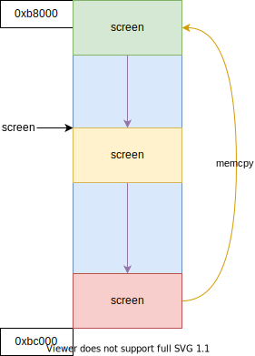

# 1. 输入和输出

### CPU 外部设备寄存器和端口号解释

在计算机系统中，CPU通过访问外部设备的寄存器来与硬件设备进行通信。这些寄存器通常通过I/O端口进行访问，每个寄存器都有一个特定的端口号。下述这些端口号和寄存器与传统的VGA（Video Graphics Array）文本模式显示器的控制有关，特别是与显示器的光标控制功能相关。

### 寄存器与端口号解释

#### 1. CRT 地址寄存器（0x3D4）和 CRT 数据寄存器（0x3D5）

- **CRT 地址寄存器（0x3D4）**: 用于选择要操作的具体寄存器（寄存器索引）。
- **CRT 数据寄存器（0x3D5）**: 选定寄存器后，通过这个端口读写具体寄存器中的数据。

#### 2. CRT 光标位置 - 高位（寄存器 0xE）和低位（寄存器 0xF）

- **寄存器 0xE**: 光标位置的高位寄存器，保存了光标位置的高8位。
- **寄存器 0xF**: 光标位置的低位寄存器，保存了光标位置的低8位。
- 这两个寄存器结合起来（0xE 和 0xF）决定了光标在屏幕上的具体位置。

### 工作原理

要设置光标位置，通常步骤如下：

1. **选择寄存器**: 通过向端口 `0x3D4` 写入 `0xE` 或 `0xF` 来选择要访问的光标位置寄存器（高位或低位）。
2. **写入数据**: 然后向端口 `0x3D5` 写入具体的数据。例如，先写高位，再写低位，从而设置光标位置。

### 示例

假设要将光标位置设置为某个值（比如 `位置 = 0x0123`），需要这样做：

- 向 `0x3D4` 端口写入 `0xE`，然后向 `0x3D5` 写入光标位置的高位 `0x01`。
- 向 `0x3D4` 端口写入 `0xF`，然后向 `0x3D5` 写入光标位置的低位 `0x23`。

这会将光标移动到屏幕上对应的位置。

### 总结

- **0x3D4** 和 **0x3D5** 端口用于访问和控制显示器的CRT控制器寄存器。
- **寄存器0xE** 和 **寄存器0xF** 分别保存光标位置的高位和低位数据，用来确定光标在VGA文本模式下的位置。

### 代码展示

#### io.h
```c++
#ifndef XOS_IO_H
#define XOS_IO_H

#include "./types.h"

extern u8 inb(u16 port);  // 输入一个字节
extern u16 inw(u16 port); // 输入一个字
extern u32 inl(u16 port); // 输入一个双字

extern void outb(u16 port, u8 value);  // 输出一个字节
extern void outw(u16 port, u16 value); // 输出一个字
extern void outl(u16 port, u32 value); // 输出一个双字

#endif
```

## io.asm
```asm
[bits 32]

section .text; 代码段

global inb ; 将 inb 导出
inb:
    push ebp; 
    mov ebp, esp ; 保存帧

    xor eax, eax ; 将 eax 清空
    mov edx, [ebp + 8]; port 
    in al, dx; 将端口号 dx 的 8 bit 输入到 al

    jmp $+2 ; 一点点延迟
    jmp $+2 ; 一点点延迟
    jmp $+2 ; 一点点延迟

    leave ; 恢复栈帧
    ret

global outb
outb:
    push ebp; 
    mov ebp, esp ; 保存帧

    mov edx, [ebp + 8]; port 
    mov eax, [ebp + 12]; value
    out dx, al; 将 al 中的 8 bit 输入出到 端口号 dx

    jmp $+2 ; 一点点延迟
    jmp $+2 ; 一点点延迟
    jmp $+2 ; 一点点延迟

    leave ; 恢复栈帧
    ret

global inw
inw:
    push ebp; 
    mov ebp, esp ; 保存帧

    xor eax, eax ; 将 eax 清空
    mov edx, [ebp + 8]; port 
    in ax, dx; 将端口号 dx 的 16 bit 输入到 ax

    jmp $+2 ; 一点点延迟
    jmp $+2 ; 一点点延迟
    jmp $+2 ; 一点点延迟

    leave ; 恢复栈帧
    ret

global outw
outw:
    push ebp; 
    mov ebp, esp ; 保存帧

    mov edx, [ebp + 8]; port 
    mov eax, [ebp + 12]; value
    out dx, ax; 将 ax 中的 16 bit 输入出到 端口号 dx

    jmp $+2 ; 一点点延迟
    jmp $+2 ; 一点点延迟
    jmp $+2 ; 一点点延迟

    leave ; 恢复栈帧
    ret


global inl ; 将 inl 导出
inl:
    push ebp; 
    mov ebp, esp ; 保存帧

    xor eax, eax ; 将 eax 清空
    mov edx, [ebp + 8]; port 
    in eax, dx; 将端口号 dx 的 32 bit 输入到 eax

    jmp $+2 ; 一点点延迟
    jmp $+2 ; 一点点延迟
    jmp $+2 ; 一点点延迟

    leave ; 恢复栈帧
    ret

global outl
outl:
    push ebp; 
    mov ebp, esp ; 保存帧

    mov edx, [ebp + 8]; port 
    mov eax, [ebp + 12]; value
    out dx, eax; 将 eax 中的 32 bit 输入出到 端口号 dx

    jmp $+2 ; 一点点延迟
    jmp $+2 ; 一点点延迟
    jmp $+2 ; 一点点延迟

    leave ; 恢复栈帧
    ret

```

## main.c
```c++
#include "../include/Xos/Xos.h"
#include "../include/Xos/types.h"
#include "../include/Xos/io.h"

// - CRT 地址寄存器 0x3D4
// - CRT 数据寄存器 0x3D5
// - CRT 光标位置 - 高位 0xE
// - CRT 光标位置 - 低位 0xF

#define CRT_ADDR_REG 0x3d4
#define CRT_DATA_REG 0x3d5

#define CRT_CURSOR_H 0xe
#define CRT_CURSOR_L 0xf

void kernel_init()
{
    // 读取光标位置
    outb(CRT_ADDR_REG, CRT_CURSOR_H);
    u16 pos = inb(CRT_DATA_REG) << 8;
    outb(CRT_ADDR_REG, CRT_CURSOR_L);
    pos |= inb(CRT_DATA_REG);

    // 修改光标位置到0
    outb(CRT_ADDR_REG, CRT_CURSOR_H);
    outb(CRT_DATA_REG, 0);
    outb(CRT_ADDR_REG, CRT_CURSOR_L);
    outb(CRT_DATA_REG, 0);
    return;
}
```

# 2. 字符串处理

## 定义的函数
```c++
char *strcpy(char *dest, const char *src);
char *strcat(char *dest, const char *src);
size_t strlen(const char *str);
int strcmp(const char *lhs, const char *rhs);
char *strchr(const char *str, int ch);
char *strrchr(const char *str, int ch);

int memcmp(const void *lhs, const void *rhs, size_t count);
void *memset(void *dest, int ch, size_t count);
void *memcpy(void *dest, const void *src, size_t count);
void *memchr(const void *ptr, int ch, size_t count);
```

## 参考文献

- <https://en.cppreference.com/w/c/string/byte>


# 3. 基础显卡驱动

## 显卡模式

- CGA (Color Graphics Adapter)
    - 图形模式
        - 160 * 100
        - 320 * 240
        - 640 * 200
    - 文本模式
        - 40 * 25
        - 80 * 25
- EGA (Enhanced Graphics Adapter)
- MCGA (Multi Color Graphics Array)

## CRTC (Cathode Ray Tube Controller)

CGA 使用的 MC6845 芯片；

- CRT 地址寄存器 0x3D4
- CRT 数据寄存器 0x3D5
- CRT 光标位置 - 高位 0xE
- CRT 光标位置 - 低位 0xF
- CRT 显示开始位置 - 高位 0xC
- CRT 显示开始位置 - 低位 0xD

## 控制字符

控制字符是指 ASCII 码表开头的 32 个字符 (0x00 ~ 0x1F) 以及 DEL(0x7F)；

通常一个指定类型的终端都会采用其中的一个子集作为控制字符，而其它的控制字符将不起作用。例如，对于 VT100 终端所采用的控制字符如下表所示：

| 控制字符 | 八进制 | 十六进制 | 描述                                                                 |
| -------- | ------ | -------- | -------------------------------------------------------------------- |
| NUL      | 0      | 0x00     | 在输入时忽略，不保存在输入缓冲中                                     |
| ENQ      | 5      | 0x05     | 传送应答消息                                                         |
| BEL      | 7      | 0x07     | 从键盘发声响                                                         |
| BS       | 10     | 0x08     | 将光标移向左边一个字符位置处；若光标已经处在左边沿，则无动作         |
| HT       | 11     | 0x09     | 将光标移到下一个制表位；若右侧已经没有制表位，则移到右边缘处         |
| LF       | 12     | 0x0A     | 此代码导致一个回车或换行操作                                         |
| VT       | 13     | 0x0B     | 作用如LF                                                             |
| FF       | 14     | 0x0C     | 作用如LF                                                             |
| CR       | 15     | 0x0D     | 将光标移到当前行的左边缘处                                           |
| SO       | 16     | 0x0E     | 使用由 SCS 控制序列设计的 G1 字符集                                  |
| SI       | 17     | 0x0F     | 选择 G0 字符集，由 ESC 序列选择                                      |
| XON      | 21     | 0x11     | 使终端重新进行传输                                                   |  |
| XOFF     | 23     | 0x13     | 使中断除发送 XOFF  和 XON 以外，停止发送其它所有代码                 |
| CAN      | 30     | 0x18     | 如果在控制序列期间发送，则序列不会执行而立刻终止，同时会显示出错字符 |
| SUB      | 32     | 0x1A     | 作用同 CAN                                                           |  |
| ESC      | 33     | 0x1B     | 产生一个控制序列                                                     |  |
| DEL      | 177    | 0x7F     | 在输入时忽略 不保存在输入缓冲中                                      |

## 滚屏操作



## 控制序列

控制序列已经由 ANSI(American National Standards Institute 美国国家标准局)制定为标准： X3.64-1977

控制序列是指由一些非控制字符构成的一个特殊字符序列，终端在收到这个序列时并不是将它们直接显示在屏幕上，而是采取一定的控制操作，比如：

- 移动光标
- 删除字符
- 删除行
- 插入字符
- 插入行

ANSI 控制序列由以下一些基本元素组成：

- 控制序列引入码(Control Sequence Introducer - CSI)：表示一个转移序列，提供辅助的控制并且本身是影响随后一系列连续字符含义解释的前缀。通常，一般 CSI 都使用 `ESC[`
- 参数(Parameter)：零个或多个数字字符组成的一个数值
- 数值参数(Numeric Parameter)：表示一个数的参数，使用 `n` 表示
- 选择参数(Selective Parameter)：用于从一功能子集中选择一个子功能，一般用 `s` 表示；通常，具有多个选择参数的一个控制序列所产生的作用，如同分立的几个控制序列；例如：`CSI sa;sb;sc F` 的作用是与 `CSI sa F CSI sb F CSI sc F` 完全一样的
- 参数字符串(Parameter String)：用分号 `;` 隔开的参数字符串
- 默认值(Default)：当没有明确指定一个值或者值是 0 的话，就会指定一个与功能相关的值
- 最后字符(Final character)：用于结束一个转义或控制序列

下图是一个控制序列的例子：取消所有字符的属性，然后开启下划线和反显属性。`ESC [ 0;4;7m`


下表是一些常用的控制序列列表，其中 E 表示 0x1B，如果 n 是 0 的话，则可以省略： `E[0j == E[J`

| 转义序列 | 功能                           |
| -------- | ------------------------------ |
| E[nA     | 光标上移 n 行                  |
| E[nB     | 光标下移 n 行                  |
| E[nC     | 光标右移 n 个字符位置          |
| E[nD     | 光标左移 n 个字符位置          |
| E[n`     | 光标移动到字符 n 位置          |
| E[na     | 光标右移 n 个字符位置          |
| E[nd     | 光标移动到行 n 上              |
| E[ne     | 光标下移 n 行                  |
| E[nF     | 光标上移 n 行，停在行开始处    |
| E[nE     | 光标下移 n 行，停在行开始处    |
| E[y;xH   | 光标移到 x,y 位置              |
| E[H      | 光标移到屏幕左上角             |
| E[y;xf   | 光标移到位置 x,y               |
| E[nZ     | 光标后移 n 制表位              |
| E[nL     | 插入 n 条空白行                |
| E[n@     | 插入 n 个空格字符              |
| E[nM     | 删除 n 行                      |
| E[nP     | 删除 n 个字符                  |
| E[nJ     | 檫除部分或全部显示字符         |
|          | n = 0 从光标处到屏幕底部；     |
|          | n = 1 从屏幕上端到光标处；     |
|          | n = 2 屏幕上所有字符           |
| E[s      | 保存光标位置                   |
| E[nK     | 删除部分或整行：               |
|          | n = 0 从光标处到行末端         |
|          | n = 1 从行开始到光标处         |
|          | n = 2 整行                     |
| E[nX     | 删除 n 个字符                  |
| E[nS     | 向上卷屏 n 行（屏幕下移）      |
| E[nT     | 向下卷屏 n 行（屏幕上移）      |
| E[nm     | 设置字符显示属性：             |
|          | n = 0 普通属性（无属性）       |
|          | n = 1 粗（bold）               |
|          | n = 4 下划线（underscore）     |
|          | n = 5 闪烁（blink）            |
|          | n = 7 反显（reverse）          |
|          | n = 3X 设置前台显示色彩        |
|          | n = 4X 设置后台显示色彩        |
|          | X = 0 黑 black X = 1 红 red    |
|          | X = 2 绿 green X = 3 棕 brown  |
|          | X = 4 蓝 blue X = 5 紫 magenta |
|          | X = 6 青 cyan X = 7 白 white   |
|          | 使用分号可以同时设置多个属性， |
|          | 例如：E[0;1;33;40m             |

## 相关代码
src/kernel/console.c:关于光标的函数实现，内容简单，代码冗长，不予展示。

## 参考文献

- <http://www.osdever.net/FreeVGA/home.htm>
- <http://www.osdever.net/FreeVGA/vga/crtcreg.htm>
- <https://bochs.sourceforge.io/techspec/PORTS.LST>
- <https://en.wikipedia.org/wiki/Color_Graphics_Adapter>
- <https://en.wikipedia.org/wiki/Enhanced_Graphics_Adapter>
- <https://en.wikipedia.org/wiki/Multi-Color_Graphics_Array>
- 赵炯 - 《Linux内核完全注释》

# 4. 可变参数原理
原因：printf()函数支持参数的数量不确定
在传递参数时，c语言会把所有参数压入栈中（chapter19），printf()就去栈中找到所有的参数

```c++
int printf(const char* format, ...);
```

- `va_list`：保存可变参数指针
- `va_start`：启用可变参数
- `va_arg`：获取下一个参数
- `va_end`：结束可变参数

## 代码展示
### stdarg.h
```c++
#ifndef XOS_STDARG_H
#define XOS_STDARG_H

typedef char *va_list;

#define stack_size(t) (sizeof(t) <= sizeof(char *) ? sizeof(char *) : sizeof(t))
#define va_start(ap, v) (ap = (va_list)&v + sizeof(char *))
#define va_arg(ap, t) (*(t *)((ap += stack_size(t)) - stack_size(t)))
#define va_end(ap) (ap = (va_list)0)

#endif
```
代码解释：
`#define stack_size(t) (sizeof(t) <= sizeof(char *) ? sizeof(char *) : sizeof(t))`

这个宏计算了给定类型t在堆栈上的大小。如果类型t的大小小于或等于指针的大小（通常是char *的大小），则返回指针的大小；否则返回类型t的大小。这样做是为了确保在堆栈上存储参数时，每个参数至少占用一个指针的空间。

`#define va_start(ap, v) (ap = (va_list)&v + sizeof(char *))`

这个宏初始化一个va_list类型的变量ap，它指向最后一个显式参数v之后的位置。&v表示v的地址，而&v + sizeof(char *)则将指针移动到下一个参数的位置。这个宏的作用是为可变参数列表做好准备。

`#define va_arg(ap, t) (*(t *)((ap += stack_size(t)) - stack_size(t)))`

这个宏用于从ap指向的参数列表中提取下一个参数。它先将ap指向下一个参数的位置，然后通过将ap减去stack_size(t)来获取当前参数的值。该值通过类型转换为t *类型，并解引用获取实际的参数值。

`#define va_end(ap) (ap = (va_list)0)`

这个宏将ap设置为NULL或0，表示可变参数列表的结束。虽然它不做实际的清理工作，但标志着不再使用可变参数。

### main.c
```c++
#include "../include/Xos/Xos.h"
#include "../include/Xos/types.h"
#include "../include/Xos/io.h"
#include "../include/Xos/stdarg.h"

void test_args(int cnt, ...) //参数传递时从右到左压入栈中，最后一个是cnt
{
    va_list args; // 参数的指针
    va_start(args, cnt); // 将arg指向最后一个显式参数cnt的下一个地址

    int arg;
    while(cnt--)
    {
        arg = va_arg(args, int);// 用于从args指向的参数列表中提取下一个参数，并转换为int*类型
    }
    va_end(args);
}

void kernel_init()
{
    console_init();
    test_args(5, 1, 0xaa, 5, 0x55, 10);
    return;
}

```

## 参考文献

- <https://en.cppreference.com/w/cpp/header/cstdarg>


# 5. printk

## 输出格式

格式指示串的形式如下：

> `%[flags][width][.prec][h|l|L][type]`

其中：

- `%`：格式引入字符
- `flags`：可选的标志字符序列
- `width`：可选的宽度指示符
- `.prec`：可选的精度指示符
- `h|l|L`：可选的长度修饰符
- `type`：转换类型

## flags

flags 控制输出对齐方式、数值符号、小数点、尾零、二进制、八进制或十六进制等，具体格式如下：

- `-`：左对齐，默认为右对齐
- `+`：输出 + 号
- ` `：如果带符号的转换不以符号开头则添加空格，如果存在 `+` 则忽略
- `#`：特殊转换：
    - 八进制，转换后字符串首位必须是 `0`
    - 十六进制，转换后必须以 `0x` 或 `0X` 开头
- `0`：使用 `0` 代替空格

## 变量解释

`width` 指定了输出字符串宽度，即指定了字段的最小宽度值。如果被转换的结果要比指定的宽度小，则在其左边（或者右边，如果给出了左调整标志）需要填充空格或零（由 flags 标志确定）的个数等。

除了使用数值来指定宽度域以外，也可以使用 `*` 来指出字段的宽度由下一个整型参数给出。当转换值宽度大于 `width` 指定的宽度时，在任何情况下小宽度值都不会截断结果。字段宽度会扩充以包含完整结果。

---

`precision` 是说明输出数字起码的个数

- 对于 d,i,o,u,x 和 X 转换，精度值指出了起码出现数字的个数
- 对于 e,E,f 和 F，该值指出在小数点之后出现的数字的个数
- 对于 g 或 G，指出最大有效数字个数
- 对于 s 或 S 转换，精度值说明输出字符串的最大字符数

---

`qualifier` 长度修饰指示符说明了整型数转换后的输出类型形式。

- hh 说明后面的整型数转换对应于一个带符号字符或无符号字符参数
- h 说明后面的整型数转换对应于一个带符号整数或无符号短整数参数
- l 说明后面的整型数转换对应于一个长整数或无符号长整数参数
- ll 说明后面的整型数转换对应于一个长长整数或无符号长长整数参数
- L 说明 e,E,f,F,g 或 G 转换结果对应于一个长双精度参数

---

type 是说明接受的输入参数类型和输出的格式。各个转换指示符的含义如下：

- `d,i` 整数型参数将被转换为带符号整数。如果有精度(precision)的话，则给出了需要输出的最少数字个数。如果被转换的值数字个数较少，就会在其左边添零。默认的精度值是 `1`
- `o,u,x,X` 会将无符号的整数转换为无符号八进制(`o`)、无符号十进制(`u`)或者是无符号十六进制(`x` 或 `X`)表示方式输出。x 表示要使用小写字母 `abcdef` 来表示十六进制数，`X` 表示用大写字母 `ABCDEF` 表示十六进制数。如果存在精度域的话，说明需要输出的最少数字个数。如果被转换的值数字个数较少，就会在其左边添零。默认的精度值是 `1`
- `e,E` 这两个转换字符用于经四舍五入将参数转换成 `[-]d.ddde+dd` 的形式。小数点之后的数字个数等于精度；如果没有精度域，就取默认值 `6`。如果精度是 `0`，则没有小数出现。`E` 表示用大写字母 `E` 来表示指数。指数部分总是用 `2` 位数字表示。如果数值为 `0`，那么指数就是 `00`。
- `f,F` 这两个转换字符用于经四舍五入将参数转换成[-]ddd.ddd 的形式；小数点之后的数字个数等于精度。如果没有精度域，就取默认值 `6`；如果精度是 `0`，则没有小数出现。如果有小数点，那么后面起码会有 `1` 位数字
- `g,G` 这两个转换字符将参数转换为 `f` 或 `e` 的格式（如果是 `G`，则是 `F` 或 `E` 格式）。精度值指定了整数的个数。如果没有精度域，则其默认值为 6。如果精度为 0，则作为 1 来对待。如果转换时指数小于 -4 或大于等于精度，则采用 `e` 格式。小数部分后拖的零将被删除。仅当起码有一位小数时才会出现小数点
- `c` 参数将被转换成无符号字符并输出转换结果
- `s` 要求输入为指向字符串的指针，并且该字符串要以 `NULL` 结尾；如果有精度域，则只输出精度所要求的字符个数，并且字符串无须以 `NULL` 结尾
- `p` 以指针形式输出十六进制数
- `n` 用于把到目前为止转换输出的字符个数保存到由对应输入指针指定的位置中，不对参数进行转换
- `%` 输出一个百分号 `%`，不进行转换。也即此时整个转换指示为 `%%`

## 代码展示

### vsprintf.c(反照Linux系统的输入输出)
```c++
/* vsprintf.c -- Lars Wirzenius & Linus Torvalds. */
/*
 * Wirzenius wrote this portably, Torvalds fucked it up :-)
 */

#include "../include/Xos/stdarg.h"
#include "../include/Xos/string.h"
// #include "../include/Xos/assert.h"

#define ZEROPAD 0x01 // 填充零
#define SIGN 0x02    // unsigned/signed long
#define PLUS 0x04    // 显示加
#define SPACE 0x08   // 如是加，则置空格
#define LEFT 0x10    // 左调整
#define SPECIAL 0x20 // 0x
#define SMALL 0x40   // 使用小写字母
#define DOUBLE 0x80  // 浮点数

#define is_digit(c) ((c) >= '0' && (c) <= '9') // 判断字符是否是数字

// 将字符数字串转换成整数，并将指针前移
static int skip_atoi(const char **s)
{
    int i = 0;
    while (is_digit(**s))
        i = i * 10 + *((*s)++) - '0';
    return i;
}

// 将整数转换为指定进制的字符串
// str - 输出字符串指针
// num - 整数
// base - 进制基数
// size - 字符串长度
// precision - 数字长度(精度)
// flags - 选项
static char *number(char *str, u32 *num, int base, int size, int precision, int flags)
{
    char pad, sign, tmp[36];
    const char *digits = "0123456789ABCDEFGHIJKLMNOPQRSTUVWXYZ";
    int i;
    int index;
    char *ptr = str;

    // 如果 flags 指出用小写字母，则定义小写字母集
    if (flags & SMALL)
        digits = "0123456789abcdefghijklmnopqrstuvwxyz";

    // 如果 flags 指出要左对齐，则屏蔽类型中的填零标志
    if (flags & LEFT)
        flags &= ~ZEROPAD;

    // 如果进制基数小于 2 或大于 36，则退出处理
    // 也即本程序只能处理基数在 2-32 之间的数
    if (base < 2 || base > 36)
        return 0;

    // 如果 flags 指出要填零，则置字符变量 c='0'，否则 c 等于空格字符
    pad = (flags & ZEROPAD) ? '0' : ' ';

    // 如果 flags 指出是带符号数并且数值 num 小于 0，则置符号变量 sign=负号，并使 num 取绝对值
    if (flags & DOUBLE && (*(double *)(num)) < 0)
    {
        sign = '-';
        *(double *)(num) = -(*(double *)(num));
    }
    else if (flags & SIGN && !(flags & DOUBLE) && ((int)(*num)) < 0)
    {
        sign = '-';
        (*num) = -(int)(*num);
    }
    else
        // 否则如果 flags 指出是加号，则置 sign=加号，否则若类型带空格标志则 sign=空格，否则置 0
        sign = (flags & PLUS) ? '+' : ((flags & SPACE) ? ' ' : 0);

    // 若带符号，则宽度值减 1
    if (sign)
        size--;

    // 若 flags 指出是特殊转换，则对于十六进制宽度再减少 2 位(用于0x)
    if (flags & SPECIAL)
    {
        if (base == 16)
            size -= 2;
        // 对于八进制宽度减 1（用于八进制转换结果前放一个零）
        else if (base == 8)
            size--;
    }

    i = 0;

    // 如果数值 num 为 0，则临时字符串='0'；否则根据给定的基数将数值 num 转换成字符形式
    if (flags & DOUBLE)
    {
        u32 ival = (u32)(*(double *)num);
        u32 fval = (u32)(((*(double *)num) - ival) * 1000000);

        int mantissa = 6;
        while (mantissa --)
        {
            index = (fval) % base;
            (fval) /= base;
            tmp[i++] = digits[index];
        }

        tmp[i++] = '.';

        do
        {
            index = (ival) % base;
            (ival) /= base;
            tmp[i++] = digits[index];
        } while (ival);
    }
    else if ((*num) == 0)
    {
        tmp[i++] = '0';
    }
    else
    {
        while ((*num) != 0)
        {
            index = (*num) % base;
            (*num) /= base;
            tmp[i++] = digits[index];
        }
    }

    // 若数值字符个数大于精度值，则精度值扩展为数字个数值
    if (i > precision)
        precision = i;

    // 宽度值 size 减去用于存放数值字符的个数
    size -= precision;

    // 从这里真正开始形成所需要的转换结果，并暂时放在字符串 str 中

    // 若 flags 中没有填零(ZEROPAD) 和左对齐（左调整）标志
    // 则在 str 中首先填放剩余宽度值指出的空格数
    if (!(flags & (ZEROPAD + LEFT)))
        while (size-- > 0)
            *str++ = ' ';

    // 若需带符号位，则存入符号
    if (sign)
        *str++ = sign;

    // 若 flags 指出是特殊转换
    if (flags & SPECIAL)
    {
        // 则对于八进制转换结果头一位放置一个'0'
        if (base == 8)
            *str++ = '0';
        // 对于十六进制则存放'0x'
        else if (base == 16)
        {
            *str++ = '0';
            *str++ = digits[33];
        }
    }
    // 若 flags 中没有左调整（左对齐）标志, 则在剩余宽度中存放 c 字符（'0'或空格）
    if (!(flags & LEFT))
        while (size-- > 0)
            *str++ = pad;

    // 此时 i 存有数值 num 的数字个数

    // 若数字个数小于精度值，则 str 中放入（精度值-i）个'0'
    while (i < precision--)
        *str++ = '0';

    // 将转数值换好的数字字符填入 str 中，共 i 个
    while (i-- > 0)
        *str++ = tmp[i];

    // 若宽度值仍大于零
    // 则表示 flags 标志中有左对齐标志标志
    // 则在剩余宽度中放入空格
    while (size-- > 0)
        *str++ = ' ';
    return str;
}

int vsprintf(char *buf, const char *fmt, va_list args)
{
    int len;
    int i;

    // 用于存放转换过程中的字符串
    char *str;
    char *s;
    int *ip;

    // number() 函数使用的标志
    int flags;

    int field_width; // 输出字段宽度
    int precision;   // min 整数数字个数；max 字符串中字符个数
    int qualifier;   // 'h', 'l' 或 'L' 用于整数字段
    u32 num;
    u8 *ptr;

    // 首先将字符指针指向 buf
    // 然后扫描格式字符串，
    // 对各个格式转换指示进行相应的处理
    for (str = buf; *fmt; ++fmt)
    {
        // 格式转换指示字符串均以 '%' 开始
        // 这里从 fmt 格式字符串中扫描 '%'，寻找格式转换字符串的开始
        // 不是格式指示的一般字符均被依次存入 str
        if (*fmt != '%')
        {
            *str++ = *fmt;
            continue;
        }

        // 下面取得格式指示字符串中的标志域，并将标志常量放入 flags 变量中
        flags = 0;
    repeat:
        // 掉过第一个 %
        ++fmt;
        switch (*fmt)
        {
        // 左对齐调整
        case '-':
            flags |= LEFT;
            goto repeat;
        // 放加号
        case '+':
            flags |= PLUS;
            goto repeat;
        // 放空格
        case ' ':
            flags |= SPACE;
            goto repeat;
        // 是特殊转换
        case '#':
            flags |= SPECIAL;
            goto repeat;
        // 要填零(即'0')，否则是空格
        case '0':
            flags |= ZEROPAD;
            goto repeat;
        }

        // 取当前参数字段宽度域值，放入 field_width 变量中
        field_width = -1;

        // 如果宽度域中是数值则直接取其为宽度值
        if (is_digit(*fmt))
            field_width = skip_atoi(&fmt);

        // 如果宽度域中是字符 '*'，表示下一个参数指定宽度
        else if (*fmt == '*')
        {
            ++fmt;
            // 因此调用 va_arg 取宽度值
            field_width = va_arg(args, int);

            // 若此时宽度值小于 0，则该负数表示其带有标志域 '-' 标志（左对齐）
            if (field_width < 0)
            {
                // 因此还需在标志变量中添入该标志，并将字段宽度值取为其绝对值
                field_width = -field_width;
                flags |= LEFT;
            }
        }

        // 取格式转换串的精度域，并放入 precision 变量中
        precision = -1;

        // 精度域开始的标志是'.' 其处理过程与上面宽度域的类似
        if (*fmt == '.')
        {
            ++fmt;
            // 如果精度域中是数值则直接取其为精度值
            if (is_digit(*fmt))
                precision = skip_atoi(&fmt);

            // 如果精度域中是字符'*'，表示下一个参数指定精度
            else if (*fmt == '*')
            {
                // 因此调用 va_arg 取精度值
                precision = va_arg(args, int);
            }
            // 若此时宽度值小于 0，则将字段精度值取为其绝对值
            if (precision < 0)
                precision = 0;
        }

        // 下面这段代码分析长度修饰符，并将其存入 qualifer 变量
        qualifier = -1;
        if (*fmt == 'h' || *fmt == 'l' || *fmt == 'L')
        {
            qualifier = *fmt;
            ++fmt;
        }

        // 下面分析转换指示符
        switch (*fmt)
        {

        // 如果转换指示符是'c'，则表示对应参数应是字符
        case 'c':
            // 此时如果标志域表明不是左对齐，
            if (!(flags & LEFT))
                // 则该字段前面放入 (宽度域值 - 1) 个空格字符，然后再放入参数字符
                while (--field_width > 0)
                    *str++ = ' ';
            *str++ = (unsigned char)va_arg(args, int);
            // 如果宽度域还大于 0，则表示为左对齐
            // 则在参数字符后面添加 (宽度值-1) 个空格字符
            while (--field_width > 0)
                *str++ = ' ';
            break;

        // 如果转换指示符是 's'，则表示对应参数是字符串
        case 's':
            s = va_arg(args, char *);
            // 首先取参数字符串的长度
            len = strlen(s);
            // 若其超过了精度域值, 则扩展精度域=字符串长度
            if (precision < 0)
                precision = len;
            else if (len > precision)
                len = precision;

            // 此时如果标志域表明不是左对齐
            if (!(flags & LEFT))
                // 则该字段前放入 (宽度值-字符串长度) 个空格字符
                while (len < field_width--)
                    *str++ = ' ';
            // 然后再放入参数字符串
            for (i = 0; i < len; ++i)
                *str++ = *s++;
            // 如果宽度域还大于 0，则表示为左对齐
            // 则在参数字符串后面，添加(宽度值-字符串长度)个空格字符
            while (len < field_width--)
                *str++ = ' ';
            break;

        // 如果格式转换符是'o'，表示需将对应的参数转换成八进制数的字符串
        case 'o':
            num = va_arg(args, unsigned long);
            str = number(str, &num, 8, field_width, precision, flags);
            break;

        // 如果格式转换符是'p'，表示对应参数的一个指针类型
        case 'p':
            // 此时若该参数没有设置宽度域，则默认宽度为 8，并且需要添零
            if (field_width == -1)
            {
                field_width = 8;
                flags |= ZEROPAD;
            }
            num = va_arg(args, unsigned long);
            str = number(str, &num, 16, field_width, precision, flags);
            break;

        // 若格式转换指示是 'x' 或 'X'
        // 则表示对应参数需要打印成十六进制数输出
        case 'x':
            // 'x'表示用小写字母表示
            flags |= SMALL;
        case 'X':
            num = va_arg(args, unsigned long);
            str = number(str, &num, 16, field_width, precision, flags);
            break;

        // 如果格式转换字符是'd', 'i' 或 'u'，则表示对应参数是整数
        case 'd':
        case 'i':
            // 'd', 'i'代表符号整数，因此需要加上带符号标志
            flags |= SIGN;
        // 'u'代表无符号整数
        case 'u':
            num = va_arg(args, unsigned long);
            str = number(str, &num, 10, field_width, precision, flags);
            break;

        // 若格式转换指示符是 'n'
        // 表示要把到目前为止转换输出的字符数保存到对应参数指针指定的位置中
        case 'n':
            // 首先利用 va_arg() 取得该参数指针
            ip = va_arg(args, int *);
            // 然后将已经转换好的字符数存入该指针所指的位置
            *ip = (str - buf);
            break;
        case 'f':
            flags |= SIGN;
            flags |= DOUBLE;
            double dnum = va_arg(args, double);
            str = number(str, (u32 *)&dnum, 10, field_width, precision, flags);
            break;
        case 'b': // binary
            num = va_arg(args, unsigned long);
            str = number(str, &num, 2, field_width, precision, flags);
            break;
        case 'm': // mac address
            flags |= SMALL | ZEROPAD;
            ptr = va_arg(args, char *);
            for (size_t t = 0; t < 6; t++, ptr++)
            {
                int num = *ptr;
                str = number(str, &num, 16, 2, precision, flags);
                *str = ':';
                str++;
            }
            str--;
            break;
        case 'r': // ip address
            flags |= SMALL;
            ptr = va_arg(args, u8 *);
            for (size_t t = 0; t < 4; t++, ptr++)
            {
                int num = *ptr;
                str = number(str, &num, 10, field_width, precision, flags);
                *str = '.';
                str++;
            }
            str--;
            break;
        default:
            // 若格式转换符不是 '%'，则表示格式字符串有错
            if (*fmt != '%')
                // 直接将一个 '%' 写入输出串中
                *str++ = '%';
            // 如果格式转换符的位置处还有字符，则也直接将该字符写入输出串中
            // 然后继续循环处理格式字符串
            if (*fmt)
                *str++ = *fmt;
            else
                // 否则表示已经处理到格式字符串的结尾处，则退出循环
                --fmt;
            break;
        }
    }
    // 最后在转换好的字符串结尾处添上字符串结束标志
    *str = '\0';

    // 返回转换好的字符串长度值
    i = str - buf;
    assert(i < 1024);
    return i;
}

// 结果按格式输出字符串到 buf
int sprintf(char *buf, const char *fmt, ...)
{
    va_list args;
    va_start(args, fmt);
    int i = vsprintf(buf, fmt, args);
    va_end(args);
    return i;
}
```

## 参考文献

- <https://en.cppreference.com/w/c/io/vfprintf>
- 赵炯 - 《Linux内核完全注释》

# 6. 断言 assert

用于确定程序的运行状态，防止错误蔓延！！！

并且提供尽可能多的出错信息，以供排错。

## 代码展示

### assert.h
```c++
#ifndef XOS_ASSERT_H
#define XOS_ASSERT_H

void assertion_failure(char *exp, char *file, char *base, int line);

#define assert(exp) \
    if (exp)        \
        ;           \
    else            \
        assertion_failure(#exp, __FILE__, __BASE_FILE__, __LINE__)

void panic(const char *fmt, ...);

#endif
```
代码解释：
`assertion_failure`: 
- 用于处理断言失败的函数。当断言表达式为 false 时，该函数会被调用。

`assert`宏:
- 用来检查表达式 exp 是否为 true。如果为 false，则调用 assertion_failure 函数。
- 宏参数 #exp 将表达式转换为字符串，而 __FILE__, __BASE_FILE__, __LINE__ 是标准的预定义宏，用于获取当前文件名、基本文件名和行号。

`panic`: 
- 用于处理系统中的严重错误，通常会打印错误信息并终止程序执行。

### assert.c
```c++
#include "../include/Xos/assert.h"
#include "../include/Xos/stdarg.h"
#include "../include/Xos/types.h"
#include "../include/Xos/stdio.h"
#include "../include/Xos/printk.h"

static u8 buf[1024];

// 强制阻塞
static void spin(char *name)
{
    printk("spinning in %s ...\n", name);
    while (true)
        ;
}

void assertion_failure(char *exp, char *file, char *base, int line)
{
    printk(
        "\n--> assert(%s) failed!!!\n"
        "--> file: %s \n"
        "--> base: %s \n"
        "--> line: %d \n",
        exp, file, base, line);

    spin("assertion_failure()");

    // 不可能走到这里，否则出错；
    asm volatile("ud2");
}

void panic(const char *fmt, ...)
{
    va_list args;
    va_start(args, fmt);
    int i = vsprintf(buf, fmt, args);
    va_end(args);

    printk("!!! panic !!!\n--> %s \n", buf);
    spin("panic()");

    // 不可能走到这里，否则出错；
    asm volatile("ud2");
}
```
代码解释：
`spin` 函数:
- 这是一个死循环函数，用于在某些关键错误发生时阻塞程序执行。它会打印信息，并进入一个无限循环，使系统停留在错误状态，便于调试。

`assertion_failure` 函数:
- 当断言失败时调用此函数。它会打印错误信息，包括断言失败的表达式、文件名、基本文件名和行号。
- 然后调用 spin 函数，让系统进入阻塞状态。
- 最后执行 ud2 指令，这是一条非法指令，会触发 CPU 产生一个非法指令异常。此操作用于确保程序不再继续执行。

`panic` 函数:
- 该函数接受一个格式化字符串和可变参数列表（...），用于报告系统中的致命错误。
- 使用 vsprintf 将格式化信息写入 buf，然后调用 printk 输出错误信息。
- 调用 spin 函数，让系统进入阻塞状态。
- 同样，通过执行 ud2 指令，确保系统不再继续执行。

## 参考文献

- <https://en.cppreference.com/w/cpp/error/assert>
